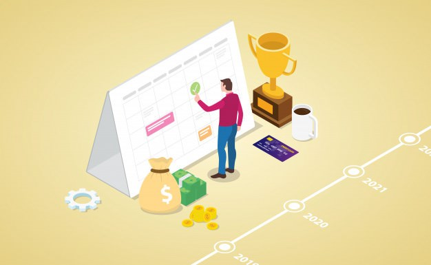
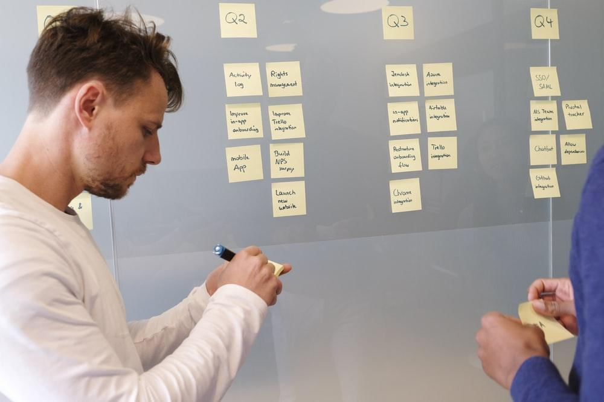

Današnje doba nam, verovatno ćete se složiti, više nego ikada nameće određene standarde kao što su izgled, moda, poslovni uspeh, stanje sreće, broj prijatelja i sviđanja na društvenim mrežama, destinacije u svetu koje su u trendu da se posete, i mnoge druge. 

Neki od tih standarda su nam nedostižni, neki su nepotrebni, neki nas uopšte i ne dotiču, a neki nam mogu biti inspiracija za jasnije definisanje sopstvenih ciljeva. Jedan od njih može biti poslovni uspeh. Uobičajeno je i opšte prihvaćena premisa da čovek ceo život uči, razvija se i napreduje, pa ipak svako od nas dođe do trenutka u životu kada se nalazi ušuškan u komfornoj zoni i sama pomisao izlaska iz nje može da stvori nelagodnost. 

Pomisao da je sutra novi dan može učiniti da se psihički pripremimo na nove izazove poput apliciranja za novi posao ili otpočinjanja novog zadatka koji nikada do sad nismo radili, ali kada sutra postane danas, a osećaj nelagodnosti je i dalje prisutan, u prirodi je čoveka da zadatke odloži ponovo pa čak i da nađe, samo u njegovoj glavi opravdane razloge zašto ih je odložio. 

**Prokrastinacija!**

Šta nas to tera da prokrastiniramo? Svi razlozi se mogu svesti na jedan – **niska tolerancija na frustraciju**.

Da li prokrastinacija zahteva lečenje? Ne, u klasičnom smislu te reči, ali da, u smislu da na njoj itekako treba raditi. 

Iako su prokrastinacija i depresija nešto što ljudi često iskušavaju istovremeno, ova dva stanja ne treba mešati. Prokrastinacija je poteškoća sa kojom se inače psihički zdravi ljudi bore, a odnosi se na odlaganje izvršenja aktivnosti. Depresija je ozbiljna bolest koja negativno utiče na to kako se čovek oseća, misli i dela.

Izdvojili smo za vas sedam načina kako da prokrastinaciju ubuduće zasigurno izbegnete, a time eliminišete i potencijalne probleme koje vam ona može stvoriti.

## Načini razbijanja prokrastinacije

1. **Realan pogled na stvari**

Zapitajte se, ili pitajte neku blisku osobu, **kolika je zapravo složenost zadatka** koji se postavlja kao problem i **koje se to aktivnosti moraju preduzeti** da se on obavi. Detalje oko ovih pitanja pronađite [ovde](https://www.quora.com/Whats-an-efficient-way-to-overcome-procrastination/answers/18077171).
Često se dešava da se susretnemo sa novim ili nejasnim pojmovima i onda izbegavamo da otpočnemo sa zadatkom, iako samo nekoliko poteza istraživanja i shvatanja suštine može da nas podstakne da krenemo. 
Kada su, pak u pitanju aktivnosti, potrebno je da **izbegavamo preduboka razmišljanja** o istima kako bismo izbegli težnju za perfekcionizmom. Takođe treba da pripazimo da ih ne pojednostavljujemo previše, jer će nas to samo podstaći da ih odložimo za kasnije.

2. **Dokažite (pokažite) sebi da vi to možete**

Pokušajte da prihvatite činjenicu da je sve što radite vaš izbor. 

Ako nešto ne želite da radite, treba samo odustati. 

Ako, pak želite da uradite to, treba početi. Da bi dokazali sebi da to možete, krenite sa zadacima koji su vam bliski, ili ste ih već ranije radili.  Već kada završite nekoliko ovakvih zadataka, najverovatnije ćete biti motivisaniji i hrabriji po pitanju daljeg rada.

Tada **pogurajte sebe**! Prijavite se i uplatite taj željeni kurs stranog jezika, objavite na blogu da će se novi blog pojavljivati svakog drugog petka, obećajte nekoj osobi do čijeg vam je mišljenja stalo da će te završiti zadatak do određenog datuma, pošaljite aplikaciju za posao. Tada!

Imajte ipak u vidu da je napredak spor. Negujte strpljenje kod sebe. Prokrastinacija se ne “leči” preko noći. Takođe, ne dozvolite da vas perfekcionizam koči, važno je samo da se napreduje. Korak po korak.

3. **Pronađite ili uključite neke užitke u obavljanje zadataka**

Budimo iskreni, ko još voli da radi? 

Pa, ima takvih. To su oni koji vole svoj posao. Koji uživaju dok rade. 

Zašto ne bi smo svi mi razmislili i zaključili koji su to momenti u kojima uživamo dok radimo, ili koji su to delovi zadatka koji nam baš prijaju? Složićete se, ima poslova ili tipa osoba kojima je to nemoguće da nađu, ali zato postoje pauze za kafu, čaj, ručak, dezert, leškarenje, čitanje. 

Zaustavite se na tren i zaboravite na celokupan zadatak. **Pomislite samo na onaj deo koji volite ili na onaj deo koji treba da odradite do pauze**. Pređite tada na dela. Posao će biti odrađen sa lakoćom. Zanimljivo je pročitati šta pisac eseja [Brenton Weyi](https://www.quora.com/Whats-an-efficient-way-to-overcome-procrastination/answer/Brenton-Weyi) kaže na tu temu. 

4. **Prihvatite vreme pre početka aktivnosti kao pripremu**

Svi mi volimo da odmaramo i uživamo, ali nam je odmor i užitak ujedno i neophodan kako bi smo dali najbolje od sebe i koristili svoje pune kapacitete. 

Da, dajte sebi oduška kad dođete kući sa posla ili iz škole i odmorite se. Ako su u pitanju večernji sati, bolje je da uživate u večeri, zatim u nekoj razonodi koju volite, da legnete na vreme, naspavate se, ustanete 2 sata ranije od uobičajenog vremena i **tada otpočnete sa željenom aktivnošću**.

Čovek ne bi trebalo da oseća grižu savesti zbog aktivnosti pripreme svog tela i mozga za zadatak koji ga čeka. Odmoran i regenerisan mozak služiće vas i neće vam biti neprijatelj, za razliku od umornog, koji će vas vrlo verovatno vući u prokrastinaciju. 

5. **Vizualizujte kuda vas prokrastinacija vodi**

Izvucite zaključke šta ćete sve to propustiti u životu ako ne stanete na kraj prokrastiniranju. 

Zamislite najgori mogući scenario koji će se desiti ako zadatak ne izvršite. 

Fokusirajte se na cilj i zapitajte se koliko želite da ostvarite taj cilj. 

Da li vam je njegovo ostvarenje važnije od leškarenja, ispijanja kafa sa prijateljima, gledanja serija, analiziranja dešavanja na društvenim mrežama? 
Nije? Onda zanemarite cilj i uživajte bez griže savesti. 

Jeste? Ne možete da zamislite vam život prođe, a da ne iskoristite talente kojima obilujete i ne stvorite nešto što ste oduvek želeli? Onda prestanite da se zavaravate. **Strah od lošeg scenarija u ovakvim slučajevima je dobar motivator**. Prizovite ga! Kada pobegne, prizovite ga ponovo! I ponovo! Tako ćete izvežbati svoj mozak i preusmeriti fokus na ono što zaista želite. 

6. **Podstaknite vašu produktivnost**

**Kako biti produktivniji**? Objektivno i realno gledano, promene koje ćete uvesti u svoj život neće vam se dopadati u početku. 

[Prokrastinacija](https://www.smartrecovery.org/smart-articles-draft/addiction-recovery-and-procrastination-habits/) je navika koja ima dosta sličnosti sa bolestima zavisnosti. Prokrastinacija prija. Ne prija ono što se posle desi. Tako će vam mozak slati razne poruke izazova da je ne prekidate. Ona se zato ne prevazilazi preko noći i nije dovoljno izaći kao pobednik iz jedne bitke već iz celog rata. 

Prihvatite to i nađite toleranciju, strpljenje i oprost za sebe. A onda nastavite da radite. Ili krenite opet ispočetka.

**Učinite rast produktivnosti vidljivim**. Ako vam je cilj da čitate i svaki dan uspete da pročitate samo 5 stranica, za godinu dana ćete pročitati 1825 stranica, što je u proseku 4-5 knjiga, za razliku od nečitanja pet stranica dnevno i 0 pročitanih knjiga na godišnjem nivou. 

Iskoristite svoju tablu od plute ili uzmite običan beli papir i ubadajte čiode za svaki odrađen deo zadatka, za svaki dan. Kada određenog dana ne uradite zadatak, izvadite jednu čiodu. Tako ćete lakše videti koliko ste napredovali za nedelju dana. Ali takođe ne zaboravite da vađenjem čioda ne idete samo unazad, već ostavljate i male rupe za sobom. Rupe koje će vas podsetiti gde ste mogli biti da niste posustali.

Odlična stvar je da će vam vremenom to ulaganje energije u obavljanje zadatka početi da **donosi zadovoljstvo**, a to je upravo ono što želimo da postignemo.

7. **Napravite jasan plan aktivnosti za svaki dan**

Prokrastinatori vole planiranje iz prostog razloga što ono nije delanje, a delanje je ono što je njihov problem. Stvarajući plan, u podsvesti prokrastinatora već živi saznanje da ga ostvariti neće nikada.

Međutim, bez jasnog i efikasnog plana nema ni realizacije. Evo predloga kako da ga formirate:

- Sastavite listu aktivnosti; 
- Odredite prioritete;
- Odredite najvažniji prioritet među njima (onaj koji vam najviše znači);
- Označite hitne aktivnosti (one kod kojih ističe neki rok ili se zatvara mogućnost apliciranja i sl.). *Ne upadajte ovde u zamku! Prokrastinatori vole hitne, a nevažne stvari i njima se često obhrle kako bi zauvek odlagali one važne*;
- Ubacite sve aktivnosti u kalendar.

Dakle, uz malo truda, imate plan. On je sazdan od niza malih, jasnih, lako sprovodljivih zadataka. Sada ste spremni ste za akciju! Ali kako sad početi? Kako se naterati?

**Upravo u veličini dnevnih zadataka leži i cela vežba**. Zamislite dva pisca. Oba imaju viziju kako će njihov budući roman da izgleda, ali jedan od njih dvojice je prokrastinator. Obojici prosečan dan do 98% izgleda identično. Ona 2% uloženog rada u pisanje čini da posle možda godinu dana jedan pisac ima napisan roman, dok drugi nema napisano ni slovo.

**Početak “preobražaja”**

Uradivši najvažniji korak, otpočinjanje, slomili ste osnovni otpor i krenuli ka nezaustavljivom putu ostvarenja svog cilja!

Zvuči odlično, ali u praksi baš i nije tako. Šanse su velike da ćete ubrzo naići na niz novih prepreka, od nepoznatih reči ili neugodnih razgovora, odbijanja ili čekanja, i tu će otpor za daljim radom ponovo da se javi. Biće vam potrebna dodatna, možda još veća snaga nego na početku. 

[Evo jedne cake](https://waitbutwhy.com/2013/11/how-to-beat-procrastination.html) kako prebroditi te momente. Imajte na umu da je neugodnost koju doživljavate radeći na zadatku znatno manja od mizerije koju biste doživeli napustivši zadatak. Uostalom, kako je već i navedeno, **malim koracima** dolazi se do cilja, a ostvarenje cilja nam daje osećaj satisfakcije, napretka i podizanja samopouzdanja. 

Danas postoje brojna psihološka savetovanja na ovu temu, koučing sesije (eng. Coaching = podučavanje), pregršt knjiga i prezentacija na internetu počev od tekstova, preko govora, pa do video klipova, podkasta, foruma i slično. To mogu biti stručnjaci iz domena psihologije i sociologije ili ljudi koji svojim ličnim primerima uspešne borbe protiv prokrastinacije žele da pruže pomoć i doprinos ovom svetu. 

Pronađite sebi inspiraciju i metode koje vam najviše odgovaraju prema tipu ličnosti, navikama i okruženju u kom živite. 

Jednog dana, po ostvarenju cilja, možda možete dati svoj doprinos ovoj zajednici i biti primer drugima! 

