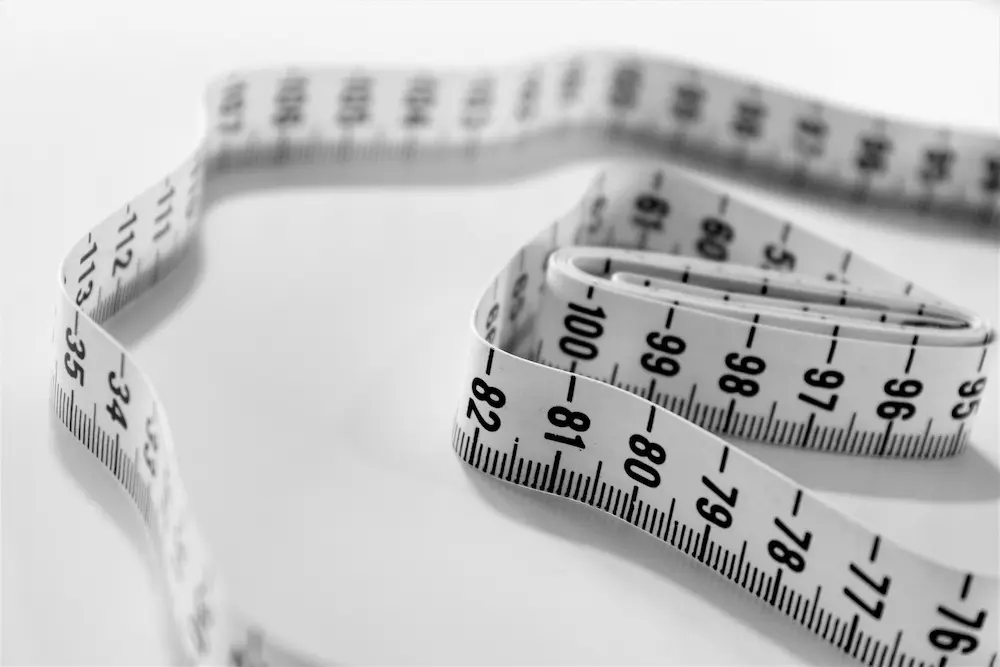

  

	Najbitnije iz teksta:
    <ul class="list list--ul margin-top-sm margin-bottom-0">
      <li>Hobijem protiv dijabetesa.</li>
      <li>Lečenje medikamentima.</li>
      <li>Pravilna ishrana.</li>
			<li>Stres i odmor.</li>
    </ul>
  

Verovatno ste mnogo puta čuli da su zdrava deca krupna i rumena. Živelo se u uverenju da je sreća kada se ima hrane u izobilju. Još veća sreća u porodici je vladala kada bi dete samo tražilo da jede u bilo koje doba dana, te se odrasli nisu mnogo trudili i gubili vreme da ga nahrane. Ako bi takvo dete odbilo da pojede neki slatkiš ili jelo odmah bi se posumnjalo na bolest, te bi sledilo merenje temperature, zagledanje da li je bledo ili pospano. Nikada niko nije govorio o organizmu kao hramu tela, uma i duha. Nakon 20 godina takvog života, to dete, sada već odrasla osoba se suočava sa nizom problema poput: prejedanja, zavisnost od slatkiša i višak telesne mase. To se još uvek u ranim 20-im godinama ne smatra problemom. Mnogi se  ljudi čude kada se odjednom suoče sa dijabetesom, verujući da se bolest pojavila odjednom.  

## Da li osobe obolele od dijabetesa (dijabetes melitus) mogu živeti jednako kvalitetno, kao potpuno zdrave osobe?

Život sa dijabetesom može biti izazovan, ali poštujući određena pravila, ljudi sa dijabetesom mogu da žive zdrav i ispunjen život. U ovom članku ćemo govoriti upravo o pravilima kojih bi trebalo da se pridržavaju ljudi sa dijabetesom.

## Šta je dijabetes?

Dijabetes je bolest koja nastaje zbog nedovoljno lučenja insulina, koji se stvara u gušterači.

Kod obolelih od dijabetesa postoji mogućnost kako naglog porasta (hiperglikemija), tako i pada ([hipoglikemija](http://www.vma.mod.gov.rs/sr-lat/lekarski-saveti/dijabetes)) glukoze u krvi. Postoje određena pravila kojih osobe obolele od dijabetesa moraju da se pridržavaju da bi održali adekvatan nivo šećera u krvi (7,0 mmol/l).

Prema podacima RFZO iz 2020. god. U Srbiji ima 710 000  obolelih od dijabetesa oba tipa, a to je oko 10% stanovništva. Svake godine imamo oko 10,83% novoobolelih ili oko 77 000 u 2021. god. Prema progresivnom rastu već u 2022. godini očekujemo oko 85 000 novoobolelih. 

## Analiza krvi za dijabetes

Samokontrolom glikemije pacijenti se edukuju da sami prate glikemiju aparatom za merenje glukoze u krvi i vode samostalno dnevnik.

1. Pre obroka  < 7
2. Posle obroka < 9.

Novina u našem zdravstvu je to što je Republički fond za zdravstveno osiguranje omogućio od 2020. godine osobama na insulinskoj pumpi da koriste besplatno senzore za merenje šećera u krvi. Ovo važi i za decu sa neregulisanim šećerom. 

Tako je  omogućeno da se na brz i lak način obezbede pouzdani podaci o nivou šećera u krvi za 24 časa. Primena je jednostavna: stavi se na nadlakticu i  nema bockanja.

**Fizička aktivnost - hobi koji pomaže**
 
Preporuka je 3 puta nedeljno vežbati po pola sata, a posebno se preporučuju trčanje, hodanje, plivanje i vožnja biciklom. Time postižemo:

1. Poboljšanje glikemijske kontrole;
2. Unapređenje lipidnog profila;
3. Povećanje mišićne mase;
4. Povećanje kardio-respiratorne sposobnosti;
5. Smanjenje insulinske rezistencije;
6. Povećanje snage;
7. Smanjenje potrebe za lekovima.

Najbitnije su aerobne *vežbe umerenog intenziteta od 150 minuta* nedeljno ili oko 20 minuta dnevno uz maksimalno povećanje pulsa od 60% u odnosu na bazalni.

**Medikamentna terapija je obavezna i bezbolna**

Kod [dijabetes tip 1](https://www.labomedica.net/dijabetes/) se primenjuje isključivo insulin i to:

1. Intezivirana konvencijalna terapija (IKIT) kroz 3 ili 4 dnevne doze.
2. Kontinuirana subkutana insulinska infuzija (KSII) uz pomoć spoljne portabilne insulinske pumpe.

Kod dijabetesa tip 2 primenjuje se inkretinska terapija (DPP4) koju čine 2 grupe lekova: gliptin i mimetici. Oni doprinose usklađivanju odnosa insulina i glukona kod dijabetičara. Doprinose povećanju lučenja insulina, sprečavanju pojačanog lučenja želudačne kiseline, povećanju sitosti i smanjenom unosu hrane. 

Drugu grupu lekova čine inhibitori natrijum nezavisnog glukoznog kontrasportera 2 (SGLT2i). 

Dijabetes tip 2 je izlečiv uz strogu disciplinu i lekarski nadzor. Lek za dijabetes tip 2 je u regulisanju načina ishrane, težine i stila život. 

Dijabetes tip 2 simptomi su: pojačana žeđ, suva usta i obilno mokrenje.

Pored ova dva tipa dijabetesa imamo i gestacijski dijabetes koji se javlja od 24 do 28 nedelje trudnoće i nestaje nakon porođaja. Najčešće 6 nedelja od porođaja se povlači, kada se hormoni vrate u normalu.

Insipidni dijabetes koji nastaje kao posledica nemogućnosti resorpcije vode u bubrežnim kanalima usled nedostatka ADH. Ovaj hormon luči hipofiza, a osnovna uloga je resorpciji vode u bubrezima.
 
## Dijabetes ishrana je ključ uspeha

Dijabetičari uvek imaju i poremećaj masti u organizmu, kao rezultat metaboličkog poremećaja. Preporuka Svetske zdravstvene organizacije da dijabetičari treba da održavaju telesnu masu najviše 10% iznad optimalne.

Najbolji prirodni lek za dijabetes je mediteranska ishrana sa mnogo svežeg povrća, integralnih žitarica (celulozna biljna vlakna) i ribe. Isključiti unos ugljenih hidrata (brašna i šećera), usoljene, dimljene i konzervisane hrane. Unos soli treba da je do 2g dnevno. Obroci bi trebalo da su češći i manji. 

Prirodni lek za dijabetes su biljna vlakna koja doprinose regulisanju metabolizma ugljenih hidrata i masti. Kod dijabetesa tip 2 ishrana je identična kao kod dijabetesa tip 1, zasnovana na mediteranskoj ishrani.

Preporuka  je unosa namirnicama bogatim vitaminima B,C,E, magnezijumom, cinkom i hromom. Od zaslađivača se mogu koristiti fruktoza, saharin, ječmeni i pirinčani slad.
 
**Piće je čistač tela**

Preporučljiva je mineralna voda od 2 litra dnevno.  Nezaslađeni čajevi, kafa, nemasni jogurt i mleko koristi umereno. Isključiti alkohol i gazirana pića, a biti oprezan i umeren kod ceđenih voćnih sokova ( koristiti isključivo citruse razređene sa vodom).

Kod dijabetičara se javlja učestalo mokrenje, što izaziva pojačanu žeđ, koja može dovesti i do dehidracije. Ljudski organizam se sastoji od 80% vode, te je neophodno taj nivo i održavati. Jedan kilogram telesne mase treba biti pokriven sa 30ml tečnosti. Ovo se odnosi samo na čistu vodu. Kafa ili čaj ne nadoknađuju vodu u organizmu, već su diuretici koji podstiču izbacivanje tečnosti. To znači, ako jedna osoba unese 2000 kalorija u toku dana i 2 kafe, znači da mora da unose čiste vode 2,1 l plus 300ml vode za dve kafe.

**Stres je nevidljivi neprijatelj**

Preporučljivo je kontrolisati stres ili uz medikamentnu terapiju svesti ga na minimum. [Stres se može smanjiti](http://bauerfeind.ba/dijabetes-stres/):

1. Kongitivna bihejvioralna terapija - omogućiće opuštanje mišića;
2. Relaksaciona terapija - oko 5 puta nedeljno;
3. Koristiti savete psihologa;
4. Ukoliko je moguće, kloniti se izvora stresa;
5. Izbaciti kofein - povećava nivo hormona stresa;
6. Koristiti propisane lekove protiv anksioznosti;
7. Usredsrediti se na neki hobi - pevanje, pisanje, slikanje...

Visok nivo kortizola (hormon stresa) je znak da smo pod stresom. [Dr. Ričard Vinštajn](http://benjamindesigns.com/weinstein/diet.html) objašnjava da organizam reaguje stresno zbog unosa zapaljenske hrane. Potrebno je unositi 85% posnih proteina, povrća, mahunarki, što može da [dovede do smanjenja kortizola za 14% u roku 24 časa](https://www.stetoskop.info/zdravi-saveti/hormon-stresa).

## San je lek za telo

Odmor i san su veoma bitni u kontroli glikemije, naročito noćni san od 22 časa do 3 časa ujutru kada se luči hormon melatonin, hormon regulacije sna i aktivnosti. Oko 86% ljudi koji imaju dijabetes tipa 2 imaju [opstruktivnu apneu](https://bs.approby.com/sleep-apnea-i-dijabetes/) (OSA). To je stanje u kojem ljudi tokom sna doživljavaju više pauza tokom disanja. Ovo se dešava jer se grlo i usta opuste tokom sna, najčešće zbog dodatnih masti u vratu. Terapija koja doprinosi rešenju ovog problema je CPAP, pomoću CPAP mašine. Ona doprinosi smanjenju glukoze u krvi.

Nedovoljno sna utiče na porast stresa i kortizola, a on na rast šećera u krvi. [Profesor Šahrad Taheri](https://zena.blic.rs/zdravlje/hronicni-manjak-sna-utice-i-na-pojavu-i-razvoj-dijabetesa-i-gojaznosti/xpvb3kt) iz Katara ukazuje da nedostatak sna može biti uzrok gojaznosti i pojave dijabetesa tipa 2.

 

	

		

			<g-image class="" src="~/assets/img/forever_aloe_blossom_herbal_tea.webp" alt="čaj za dijabetes"></g-image>
		
 
		

			

				

					<h2 class="text-lg">Aloe Blossom Herbal Tea - Čaj za dijabetičare</h2>
				

        

					

						<g-image style="width: auto !important;" class="margin-left-important" src="~/assets/img/check.svg"></g-image>
						Reguliše nivo šećera u krvi
					

          

						<g-image style="width: auto !important;" class="margin-left-important" src="~/assets/img/check.svg"></g-image>
						Detoksikuje organizam
					

          

						<g-image style="width: auto !important;" class="margin-left-important" src="~/assets/img/check.svg"></g-image>
						 Niskokaloričan
					

           

						<g-image style="width: auto !important;" class="margin-left-important" src="~/assets/img/check.svg"></g-image>
						Bez kofeina
					

        

			

			

				<g-link to="/napici/aloe-tea/" class="kupiteCTA btn btn--primary flex-grow center-between@lg justify-center btn--md">
					Saznajte više
				</g-link>
				<g-image style="width: auto !important;" class="" src="~/assets/img/logo-futer.png"></g-image>
			

		

	

 

## Dijabetes je stil života

Prema preporuci endokrinologa kada se utvrdi dijabetes bitno je raskrstiti sa starim životnim navikama: prejedanje, preskakanje obroka, uzimanje masne hrane, slatkiša i grickalica. Važno je promeniti navike ishrane, organizovati tako dan da obavezno imate vremena za 5 obroka i neku fizičku aktivnost. Ne zaboraviti uzeti lekarsku terapiju i naravno otići na vreme na spavanje, pre ponoći. Omogućite svom organizmu da se odmori, tako što ćete odspavati najmanje 7h u toku noći. Iako mislite da ste oboleli od preteške bolesti, Vama će najviše pomoći korekcija ishrane, lekarska terapija u život bez stresa. Naravno, neophodno je pratiti dodatna uputstva Vašeg lekara i obavljati redovne lekarske kontrole.

 

_Fotografije: Unsplash, Freepik, Pixabay_

