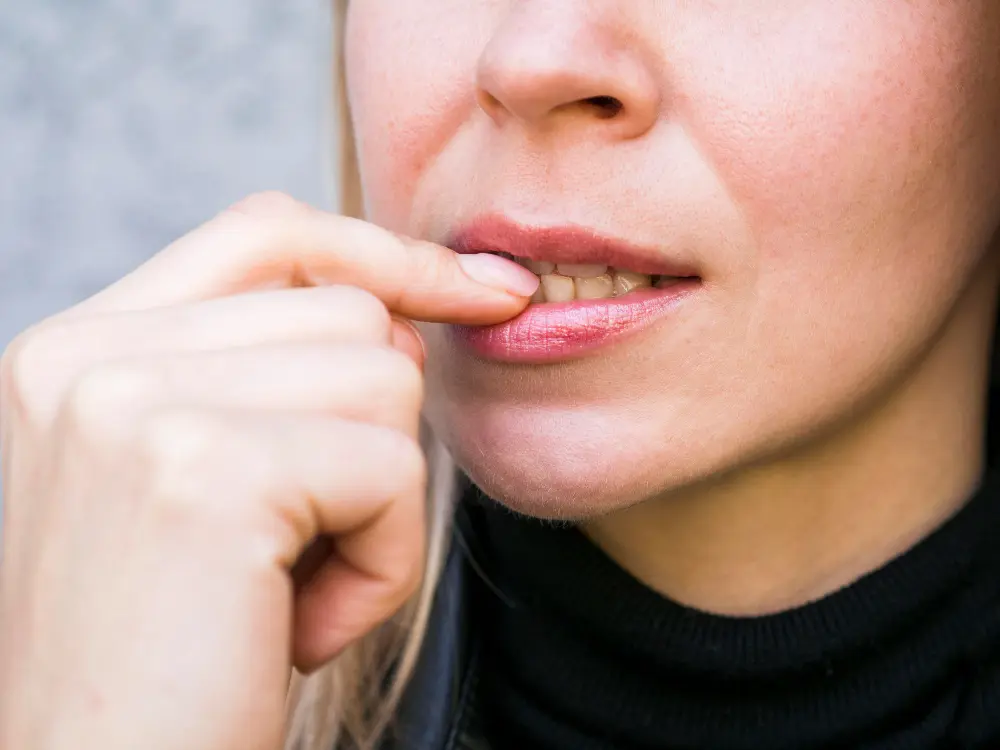

Prirodno lečenje afti
Afte, poznate i kao aftozni čirevi, su male, plitke ranice koje se javljaju u ustima, često na jeziku, unutrašnjim obrazima ili usnama. Afte u ustima su bolne lezije (ulceracije), odnosno ranice bele boje koje nastaju na sluzokoži usne duplje ili jeziku. Češće se javljaju kod dece i žena nego kod muškarca.

## Uzroci nastanka afti
Iako tačan uzrok afte nije poznat, postoji nekoliko faktora koji mogu doprineti njihovom razvoju, uključujući stres, hormonske promene, nedostatke hranljivih materija i određena medicinska stanja.

**Stres**: Stres može oslabiti imuni sistem, čineći ga podložnijim infekcijama i upalama.

**Pad imuniteta**: javlja se usled prolaznih lakših bolesti, i herpesa ali i usled leukemije ili zračenja.

**Povređivanje**: mehaničko povređivanje unutrašnjosti usne ili jezika četkicom za pranje zuba, ugriz za jezik ili obraz, iritacija oštrim predmetom ili protezom ili opekotina od vruće hrane.

**Hormonske promene**: [Hormonske promene]( https://my.clevelandclinic.org/health/articles/11192-hormones-and-oral-health), poput onih koje se javljaju tokom menstruacije, trudnoće ili menopauze, takođe mogu povećati rizik od afti.

**Nedostatak vitamina i minerala**: Nedostatak [vitamina]( https://www.healthdirect.gov.au/mouth-sores-and-ulcers), folne kiseline i gvožđa direktno utiču na pojavu anemije i pada imuniteta.

**Dijabetes**: [Upotreba]( https://www.mayoclinic.org/drugs-supplements/alogliptin-and-metformin-oral-route/side-effects/drg-20060759) leka metformin dovodi do teže apsorpcije vitamina B12, koji je zadužen za stvaranje crvenih krvnih zrnaca.

**Medicinski uslovi**: Neka medicinska stanja, kao što su celijakija i inflamatorna bolest creva, takođe mogu povećati rizik od afti. Bolesti organa za varenje - bolest sluzokoža želuca, bolest, ulcerozni kolitis i glutenska enteropatija dovodi do pojave afte zbog nemogućnosti apsorpcije kompleksa vitamina B, posebno B12.

**Bakterijske, gljivične i virusne infekcije**: Karijes, infekcije zuba, sinusa, grla i nosa direktno utiču na pad imuniteta.

**Genetski faktor**: Većina osoba koja boluje od afti ima nekog u familiji koji često oboljeva od afti, ali nisu zarazne (ne prenose se).

**Alergijske reakcije**: Neke namirnice koje izazivaju alergije, izazivaju pojavu afti kao što su orašasti plodovi, čokolada, jagoda, kravlje mleko
 

## Koji tipovi afti se pojavljuju?
1. **Male ili minor afte** se javljaju kod većine bolesnika. Pojavljuju se u kao površinske lezije crvene boje na jeziku ili usnom obrazu. Veličine su najviše do 1 cm prečnika. Traju od 7 do 14 dana, zarastaju bez ožiljaka. Nazivaju se habitualne afte, jer se kod nekih obolelih ponavljaju nekoliko meseci.
2. **Velike ili major afte** se javljaju retko. Izlaze najčešće na jeziku, sluzokoži obraza, resici, jeziku i mekom nepcu. U odnosu na male, velike afte manje su po brojnosti, ali su veće od 1cm. Izazivaju upalu, povišenu telesnu temperaturu i otoke. Ulaze dublje u tkivo, te ostavljaju ožiljke. Leče se od 3 do 6 nedelja.
3. **Herpetiforme afte** su dobile naziv zbog fizičke sličnosti sa herpesom. Važno je kod lečenja razlikovati ih od herpesa. Herpetiforme afte predstavljaju ranice na ustima, jeziku i sluzokoži obraza od 1 do 2mm. Veoma su male, ali veoma bolne. Praćene su otežanim govorom, gutanjem i pojačanim lučenjem slina. Traju od 7 do 14 dana.

   
## Simptomi afti
Afte se obično pojavljuju kao male, okrugle ili ovalne ranice sa crvenim rubom i žutim ili belim središtem. Mogu se kretati u veličini od male tačke do četvrt inča u prečniku. Afte se najčešće pojavljuju na sluzokoži desni ili jeziku. Javljaju se i na mestima gde je sluzokoža mekana, na zidovima obraza, spoljne i unutrašnje strane usana, jezika, krajnika. Afte su obično bolne i otežavaju žvakanje i gutanje hrane i vode. Oboleli najčešće ne može normalno da komunicira, usled bolnih ranica. Ovaj period obično traje 2 nedelje. Afte nisu zarazne i ne prenose se.

## Lečenje afti
Iako afte mogu biti bolne, one obično zarastaju same od sebe u roku od jedne do dve nedelje. Međutim, postoji nekoliko prirodnih lekova koji mogu pomoći u ublažavanju bolova i ubrzanju procesa zarastanja.

[**Vitamin B**]( https://flpshop.rs/dodaci-ishrani/11635/forever-b12-plus/360000954255/personal.html): Uzimanje dodatka vitamina B12 ili B kompleksa može pomoći u sprečavanju afti smanjenjem količine stresa.

[**Aloe vera**]( https://flpshop.rs/napici/11837/forever-aloe-vera-gelhttps://flpshop.rs/dodaci-ishrani/11635/forever-b12-plus/360000954255/personal.html): Aloe vera gel se može naneti direktno na ranu kako bi se smanjila upala i ubrzalo zarastanje.

**Slana voda**: Ispiranje usta slanom vodom može pomoću da se smanji bol i podstakne zarastanje.

**Ulje čajevca**: Ulje čajevca se može naneti direktno na ranu pomoću pamučnog štapića kako bi se smanjio bol i upala.

**Med**: Med je poznat po svojim antibakterijskim svojstvima i može se nanositi na ranu kako bi ubrzao zarastanje.

 

	

		

			<g-image class="" src="~/assets/img/forever_bee_propolis.webp" alt="propolis u tabletama"></g-image>
		
 
		

			

				

					<h2 class="text-lg">Forever Bee Propolis - Protiv virusa</h2>
				

        

					

						<g-image style="width: auto !important;" class="margin-left-important" src="~/assets/img/check.svg"></g-image>
					Deluje protiv bakterija i virusa
					

          

						<g-image style="width: auto !important;" class="margin-left-important" src="~/assets/img/check.svg"></g-image>
						Prirodni anestetik
					

          

						<g-image style="width: auto !important;" class="margin-left-important" src="~/assets/img/check.svg"></g-image>
							Univerzalni lek 
					

           

						<g-image style="width: auto !important;" class="margin-left-important" src="~/assets/img/check.svg"></g-image>
						 Pozitivno utiče kod kožnih oboljenja
					

        

			

			

				<a href="https://flpshop.rs/dodaci-ishrani/11654/forever-bee-propolis/360000954255/personal.html" class="kupiteCTA btn btn--primary flex-grow center-between@lg justify-center btn--md">
					Kupite danas
				</a>
				<g-image style="width: auto !important;" class="" src="~/assets/img/logo-futer.png"></g-image>
			

		

	

 
 

Iako afte obično nisu ozbiljne, mogu biti prilično bolne i učiniti jelo i govor neprijatnim. Ako imate česte ili teške afte, najbolje je da posetite lekara da biste isključili bilo koje osnovno zdravstveno stanje i da biste dobili odgovarajući tretman. Ako osećate bol ili nelagodnost zbog afti, isprobajte neke od gore navedenih prirodnih lekova kako biste ublažili simptome i ubrzali zarastanje. 

Naravno, ukoliko su afte praćene **visokom telesnom temperaturom i opštom slabošću organizma**, neophodno je **posetiti lekara**.

 

*Foografije: Unsplash, Freepik, Pixabay*

