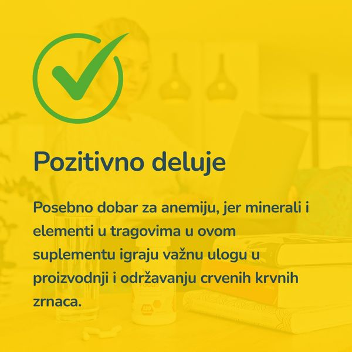

  

	Najbitnije iz teksta:
    <ul class="list list--ul margin-top-sm margin-bottom-0">
      <li>Šta je anemija?</li>
      <li>Lečenje anemije.</li>
      <li>Mineralni suplementi.</li>
    </ul>
  

**Anemija** jeste poremećaj u radu organizma koji pogađa milione ljudi širom sveta. To je veoma ozbiljno stanje koje zahteva adekvatan pristup. U ovom članku ćemo detaljno govoriti o anemiji, uključujući njene uzroke, simptome, dijagnozu i opcije lečenja.

## Šta je anemija?

Anemija je stanje koje se javlja u situacijama kada organizam nema dovoljno crvenih krvnih zrnaca koja bi prenosila kiseonik do tkiva. Najčešći uzrok anemije jeste nedostatak gvožđa u organizmu, koje je esencijalno za proizvodnju hemoglobina – proteina koji se nalazi u crvenim krvnim zrncima i koji prenosi kiseonik. Može izazvati umor, slabost i nedostatak daha, a ako se ne leči, može dovesti do ozbiljnih komplikacija. 

## Tipovi anemije

Postoji nekoliko tipova anemije, svaki sa svojim specifičnim uzrocima i simptomima. Najčešći tip anemije jeste pomenuta anemija uzrokovana nedostatkom gvožđa. Ostali tipovi anemije uključuju anemiju uzrokovanu nedostatkom vitamina, anemiju hroničnih bolesti i hemolitičku anemiju.

## Uzroci anemije

Anemija može biti uzrokovana različitim faktorima, uključujući lošu ishranu, trudnoću, krvarenje i određena medicinska stanja poput bolesti bubrega ili tumora. Anemija uzrokovana nedostatkom gvožđa često je posledica manjka gvožđa u ishrani ili nemogućnošću organizma da apsorbuje gvožđe iz hrane.

## Simptomi anemije

Simptomi anemije mogu varirati u zavisnosti od tipa i ozbiljnosti stanja. Najčešći simptomi anemije uključuju umor, slabost, nedostatak daha, vrtoglavicu i glavobolju. Ostali simptomi mogu uključivati bledu kožu, hladne ruke i noge, i nepravilan srčani ritam.

## Efikasni lekovi za anemiju

Forever Nature-Min je dijetetski dodatak ishrani bogat esencijalnim mineralima i elementima u tragovima dobijenim iz starog i hranljivog zemljišta. Pomaže u održavanju zdrave metaboličke funkcije, održava zdrav imuni sistem i pomaže pravilnom balansu tečnosti u telu. Ovaj suplement takođe promoviše zdrav razvoj i održavanje kostiju, kože, kose i noktiju.

Forever Nature-Min posebno je dobar za anemiju, jer minerali i elementi u tragovima u ovom suplementu igraju važnu ulogu u proizvodnji i održavanju crvenih krvnih zrnaca. Ovaj suplement sadrži gvožđe, kao što smo rekli, mineral koji je esencijalan za proizvodnju hemoglobina, proteina u crvenim krvnim zrncima koji prenosi kiseonik kroz telo. Ostali minerali kao što su bakar i cink su takođe važni za zdravu proizvodnju crvenih krvnih zrnaca.
Uopšteno govoreći, Forever Nature-Min je odličan, prirodan i bezbedan način za dopunu ishrane vitalnim mineralima i elementima u tragovima koji možda nedostaju u vašoj svakodnevnoj ishrani. 

 

	

		

			<g-image class="" src="~/assets/img/nature_min_2.png" alt="prirodni preparat za anemiju"></g-image>
		

		

			

				

					<h2 class="text-lg">Forever Nature-Min sadrži mikroelemente i minerale</h2>
				

        

					

						<g-image style="width: auto !important;" class="margin-left-important" src="~/assets/img/check.svg"></g-image>
							Kalcijum, kalijum, fosfor, natrijum, magnezijum i gvožđe
					

          

						<g-image style="width: auto !important;" class="margin-left-important" src="~/assets/img/check.svg"></g-image>
						  Cink, fluor, jod, selen, hrom i mangan
					

          

						<g-image style="width: auto !important;" class="margin-left-important" src="~/assets/img/check.svg"></g-image>
							Daje ravnotežu između makro i mikro elemenata
					

          

						<g-image style="width: auto !important;" class="margin-left-important" src="~/assets/img/check.svg"></g-image>
							Utiče na pravilno odvijanje životnih funkcija
					

				

			

			

				<g-link to="/dodaci-ishrani/minerali-forever-living/" class="kupiteCTA btn btn--primary flex-grow center-between@lg justify-center btn--md">
					Saznajte više
				</g-link>
				<g-image style="width: auto !important;" class="" src="~/assets/img/logo-futer.png"></g-image>
			

		

	

 

_Fotografije: Freepik, Unsplash, Pixabay_

