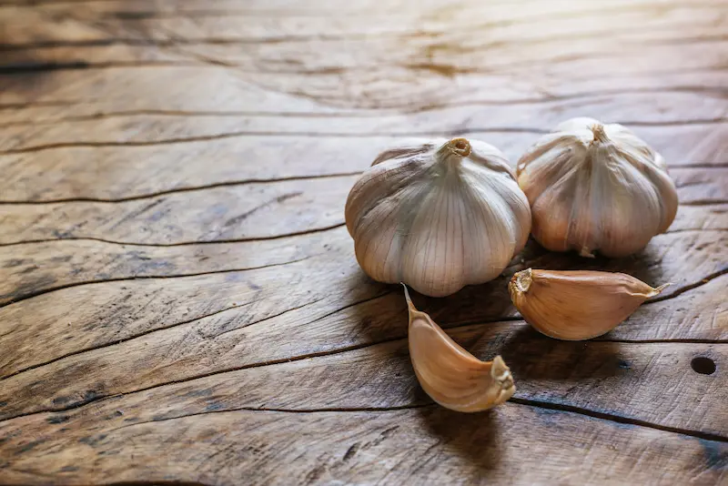

  

	Najbitnije iz teksta:
    <ul class="list list--ul margin-top-sm margin-bottom-0">
      <li>Beli luk kao lek.</li>
      <li>Kako konzumirati beli luk?</li>
      <li>Beli luk i drugi suplementi.</li>
    </ul>
  

Zdravlje prostate jedan je od ključnih aspekata opšteg zdravlja muškaraca. Sa godinama, mnogi muškarci suočavaju se sa različitim problemima u vezi sa prostatom koji mogu značajno uticati na kvalitet života. Iako postoje konvencionalni tretmani, prirodni lekovi mogu igrati značajnu ulogu u unapređenju zdravlja prostate. Jedan takav prirodni lek koji je privukao pažnju zbog svojih potencijalnih prednosti jeste i beli luk.

## Razumevanje zdravlja prostate

Pre nego što se udubimo u prednosti belog luka, važno je razumeti samu prostatu. Prostata je mala žlezda koja se nalazi ispod bešike i ispred rektuma. Ona igra vitalnu ulogu u muškom reproduktivnom sistemu tako što proizvodi tečnost koja hrani i štiti spermu.

Na žalost, zdravlje prostata je vrlo često uzrok određenih zdravstvenih problema, uključujući povećanje prostate (benigna hiperplazija prostate) i prostatitis (upala prostate). Ova stanja mogu dovesti do nelagodnosti, problema sa mokrenjem, pa čak i do seksualne disfunkcije. Razumevanje faktora rizika povezanih sa problemima u vezi sa prostatom jeste ključno za rano otkrivanje i prevenciju.

## Beli luk: Prirodna Superhrana za Prostatu

Beli luk, poznati kulinarski sastojak, vekovima je slavan zbog svojih lekovitih svojstava. Sadrži niz bioaktivnih jedinjenja, kao što su alicin, jedinjenja sumpora i flavonoidi, koji doprinose njegovim potencijalnim zdravstvenim prednostima. Kada je u pitanju zdravlje prostate, beli luk se pojavljuje kao moćan saveznik.

Naučna istraživanja su otkrila da beli luk poseduje antiinflamatorna, antioksidativna, pa čak i antikancerogena svojstva. Ove karakteristike ga čine idealnim kandidatom za unapređenje zdravlja prostate i borbu protiv problema povezanih sa prostatom.

## Ključne prednosti belog luka za zdravlje prostate

 

**Antiupalna svojstva**

Hronična upala prostate česta je pojava. Pokazalo se da beli luk smanjuje takvu upalu, ublažava simptome i doprinosi opštem stanju prostate. Studije su pokazale efikasnost belog luka u inhibiciji upale i smanjenju rizika od problema povezanih sa prostatom.

**Antioksidativni efekti**

Oksidativni stres može oštetiti ćelije prostate i tako izazvati pojavu dodatnih zdravstvenih tegoba. Visok sadržaj antioksidanasa u belom luku pomaže u zaštiti ćelija prostate od oksidativnog oštećenja, potencijalno smanjujući rizik od oboljevanja prostate. Naučna istraživanja su istakla sposobnost belog luka da uklanja štetne slobodne radikale i održava zdravlje ćelija.

**Potencijal protiv tumora**

Tumor prostate je veoma veliki problem za muškarce širom sveta. Beli luk pokazuje obećavajuće efekte protiv ove bolesti, posebno u inhibiciji rasta ćelija tumora prostate. Kliničke studije su pokazale da bioaktivna jedinjenja belog luka mogu sprečiti napredovanje tumora i potencijalno smanjiti rizik od njegovog daljeg razvoja.

**Kako da uključite beli luk u svoju ishranu**

Uključivanje belog luka u vašu svakodnevnu ishranu može biti jednostavan i ukusan način da iskoristite njegove prednosti za zdravlje prostate. Evo nekoliko saveta i tehnika za korišćenje belog luka:

1. Spremanje hrane sa belim lukom

Dodajte svež beli luk u omiljena jela, kao što su čorbe, meso, riba, pomfrit, razni sosevi ili pečeno povrće, kako biste im dali ukus i zdravstvene prednosti. Drobljenje ili seckanje belog luka aktivira njegova korisna jedinjenja.

2. Preporučeni dnevni unos belog luka

Iako ne postoji univerzalna doza, konzumiranje [jednog do dva čena](https://www.aafp.org/pubs/afp/issues/2005/0701/p103.html#:~:text=Dosages%20generally%20recommended%20in%20the,aged%20garlic%20extract%20per%20day) belog luka dnevno se smatra korisnim za opšte zdravlje organizma, samim tim i zdravlje prostate. Međutim, individualne potrebe mogu varirati, pa je najbolje da se konsultujete sa vašim lekarom kako biste odredili pravu količinu za vas.

3. Ukusni recepti

Istražite razne recepte koji sadrže beli luk kao ključni sastojak. Od testenine do ukusnih namaza, opcije su beskrajne. Eksperimentisanje sa receptima može učiniti uključivanje belog luka u vašu ishranu divnim iskustvom.

## Beli luk i timijan - Dobitna kombinacija

Ako tražite pogodan način da uključite beli luk u svoju svakodnevnu ishranu, razmislite o suplementu na bazi belog luka i timijana, [Forever Garlic-Thyme](../../dodaci-ishrani/forever-beli-luk/). Ovaj dodatak nudi prednosti i belog luka i timijana u prikladnom obliku kapsula.

Svaka kapsula Forever Garlic-Thyme sadrži 300 mg koncentrata ulja belog luka, što je ekvivalentno približno 1 g svežeg belog luka. Ovo osigurava da sa svakom kapsulom dobijete snažnu dozu korisnih jedinjenja koje sadrži beli luk.

Timijan, biljka poznata po svojim aromatičnim i lekovitim svojstvima, dopunjava beli luk u ovom dodatku. Zajedno, oni stvaraju moćnu mešavinu koja pozitivno utiče na zdravlje prostate i na opšte zdravstveno stanje organizma.

Jednostavno, uzmite jednu kapsulu dnevno uz obrok. Ova praktična i standardizovana doza osigurava da dobijete optimalnu količinu belog luka bez potrebe za planiranjem ili pripremanjem obroka.

 

	

		

			<g-image class="" src="~/assets/img/forever_garlic_thyme.webp" alt="Beli luk u granulama"></g-image>
		

		

			

				

					<h2 class="text-lg">Forever Garlic-Thyme</h2>
				

        

					

						<g-image style="width: auto !important;" class="margin-left-important" src="~/assets/img/check.svg"></g-image>
							Jak antioksidans
					

          

						<g-image style="width: auto !important;" class="margin-left-important" src="~/assets/img/check.svg"></g-image>
			Bez mirisa
					

          

						<g-image style="width: auto !important;" class="margin-left-important" src="~/assets/img/check.svg"></g-image>
					Uništava patološke mikroorganizme
					

          

						<g-image style="width: auto !important;" class="margin-left-important" src="~/assets/img/check.svg"></g-image>
				Snižava povišeni krvni pritisak
					

					 

						<g-image style="width: auto !important;" class="margin-left-important" src="~/assets/img/check.svg"></g-image>
				Bitan za funkcionisanje sistema za varenje
					

				

			

			

				<a href="https://flpshop.rs/dodaci-ishrani/11631/forever-garlic-thyme/360000954255/personal.html" class="kupiteCTA btn btn--primary flex-grow center-between@lg justify-center btn--md">
					Kupite danas
				</a>
				<g-image style="width: auto !important;" class="" src="~/assets/img/logo-futer.png"></g-image>
			

		

	

 

Forever Garlic-Thyme proizvodi kompanija Forever Living Products. Ova kompanija od poverenja poznata je po svojoj posvećenosti kvalitetu i prirodnim sastojcima. Međutim, važno je napomenuti da, iako suplementi mogu pružiti dodatnu podršku, oni ne bi trebalo da zamene uravnoteženu ishranu ili medicinski savet. Uvek se konsultujte sa vašim lekarom pre nego što započnete bilo koji novi režim suplemenata.

## Dodatni saveti za zdravlje prostate

Kako biste dodatno doprineli zdravlju vaše prostate, pored uključivanja belog luka u svoju ishranu, razmotrite sledeće savete:

**Promene životnih navika**

Održavajte zdrav način života izbegavanjem duvana, ograničavanjem konzumiranja alkohola, upravljanjem stresom i potrudite se da imate dovoljno sna. Ove promene u načinu života mogu pozitivno uticati na zdravlje prostate.

**Redovno vežbanje i uravnotežena ishrana**

Uključite u svoj dan i redovnu fizičku aktivnost, kao što je brzo hodanje ili trčanje, kako biste podržali opšte stanje organizma. Pored toga, konzumiranje uravnotežene ishrane bogate voćem, povrćem, celim žitaricama i nemasnim proteinima dopunjuje prednosti belog luka za zdravlje prostate.

**Drugi prirodni suplementi**

Dok je beli luk moćan saveznik, drugi prirodni dodaci, kao što su palmeto, pigeum ili ekstrakt zelenog čaja, takođe pomažu zdravlju prostate. Konsultujte se sa Vašim doktorom da biste utvrdili koji suplementi mogu biti prikladni za vas.

Beli luk, sa svojim impresivnim nizom zdravstvenih prednosti, pojavljuje se kao prirodna superhrana za zdravlje prostate. Od smanjenja upale i zaštite ćelija od oksidativnog stresa do potencijalnog inhibicije rasta ćelija raka prostate, beli luk nudi sveobuhvatne prednosti. Uključivanjem belog luka u vašu ishranu i usvajanjem određenih promena u životnom stilu, možete preduzeti proaktivne korake ka održavanju zdrave prostate.

Forever Garlic-Thyme suplement sa belim lukom i timijanom pruža zgodan način da uključite beli luk u vašu rutinu, nudeći prednosti belog luka i timijana u jednostavnom obliku kapsula. Međutim, važno je zapamtiti da suplementi ne bi trebalo da zamene uravnoteženu ishranu ili medicinske savete. Uvek se konsultujte sa vašim lekarom pre nego što napravite bilo kakve značajne promene u vašoj ishrani ili planovima lečenja.

Prihvatite beli luk kao aromatičan i moćan prirodni lek za zdravlje prostate i uživajte u prednostima koje on donosi vašem opštem zdravstvenom stanju. Uz pravo znanje i proaktivne korake, veoma jednostavno možete dati prioritet zdravlju prostate.

 

_Fotografije: Freepik_

