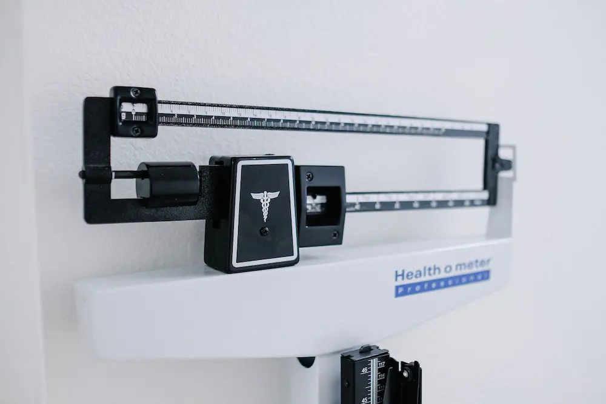
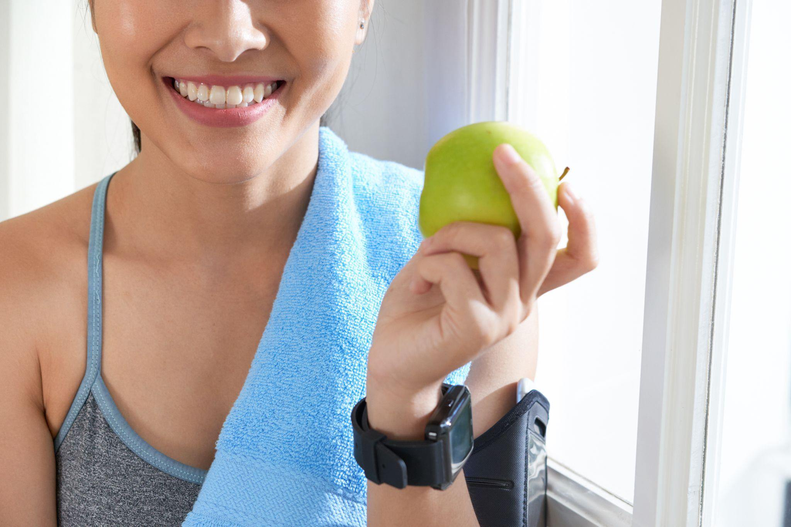

  

	Najbitnije iz teksta:
    <ul class="list list--ul margin-top-sm margin-bottom-0">
      <li>Simptomi dijabetesa.</li>
      <li>Prevencija.</li>
      <li>Lečenje.</li>
    </ul>
  

Termine dijabetes i dijabetes tip 2 vrlo često vezujemo za probleme modernog čoveka i ubrzanog načina života, te smo sve česće upoznati sa posledicama istih. Tamo gde zdrava ishrana postaje luksuz, a brza hrana i velike količine šećera i ugljenih hidrata lako dostupna zamena za hranljive namirnice, gubimo polako kontrolu nad sopstvenim zdravljem.

Dijabetes tip 2 nastaje kao rezultat nedovoljnog lučenja insulina, hormona koji proizvodi pankreas, a koji je ključan u procesu razgradjivanja šećera. Prekomerna količina šećera, odnosno glukoze u krvotoku, dovodi do različitih poremećaja [cirkulatornog, imunog i nervnog sistema](https://www.mayoclinic.org/diseases-conditions/type-2-diabetes/symptoms-causes/syc-20351193).

Pitanje je vremena koliko je naš organizam, kao i svaka dobro nastrojena mašina, spreman da podnese pritisak ukoliko mu je uskraćeno adekvatno gorivo za rad. Ono na šta treba da obratimo pažnju su svakako simptomi koji variraju od osobe do osobe, a najčešće se razvijaju postepeno i u početku, neprimetno.

## Dijabetes tip 2 - simptomi

Najčešći [dijabetes tipa 2 simptomi](https://www.mayoclinic.org/diseases-conditions/type-2-diabetes/symptoms-causes/syc-20351193) su:

- Umor
- Pojačana žedj
- Učestalo mokrenje
- Iznenadni gubitak težine
- Zamagljen vid
- Rane i modrice koje sporo zarastaju
- Pojačana sklonost ka infekcijama
- Povećan apetit
- Utrnulost i trnci u nogama i rukama
- Tamni pečati na koži, najčešće u predelu vrata i ispod pazuha

Nakon što smo se upoznali sa simptomima bolesti, šta je ono što zaista možemo da učinimo kako bismo je sprečili ili kako bismo sebi olakšali svakodnevnicu? 

U nastavku ćemo se upoznati sa **10 načina za prevenciju dijabetesa tip 2**:

1. **Ograničena konzumacija šećera i ugljenih hidrata**

Kao prvo i osnovno rešenje za prevenciju dijabetesa, moramo navesti apstinenciju od slatkih namirnica. Što više zanemarujemo ovu jednostavnu činjenicu, tokom vremena onemogućavamo našem organizmu da reguliše povišene količine glukoze u našem krvotoku koje dovode do stanja insulinske rezistencije i, u budućnosti, dijabetesa tip 2.

2. **Regularna fizička aktivnost**

Bavljenje umerenom fizičkom aktivnošću je imperativ za zdrav i kvalitetan život.
Različite vrste fizičke aktivnosti uključujući aerobik, visoko-intenzivni trening sa intervalima (poznatiji pod terminom [HIIT training](https://www.healthline.com/nutrition/benefits-of-hiit#TOC_TITLE_HDR_8)) i treninge snage, pokazale su se korisnim u regulaciji insulinske rezistencije kod [gojaznih ljudi i ljudi u stanju predijabetesa](https://www.healthline.com/nutrition/prevent-diabetes).

3. **Konzumacija vode i prirodnih sokova bez dodatih šećera**

Od izuzetnog značaja za regulaciju glukoze u našem organizmu je konzumiranje zdravih napitaka koji poboljšavaju varenje i doprinose razvoju dobrih bakterija u crevima. Forever Aloe Vera Gel sadrži jedinstveni [polisaharid acemanan](https://flpshop.rs/napici/11837/forever-aloe-vera-gel/360000954255/personal.html) koji podstiče zdravlje imunog sistema i omogućava bolju apsorpciju hranljivih materija. Forever Aloe Vera Gel vam pruža mogućnost da uživate u svežem ukusu [nerazblaženog gela iz aloje](https://flpshop.rs/napici/11837/forever-aloe-vera-gel/360000954255/personal.html) i podignete svoje zdravlje na zavidan nivo.

4. **Regulacija telesne težine kod gojaznih osoba**

Forever Garcinia Plus je dodatak ishrani baziran na prirodnim sastojcima, koji se pokazao kao veoma koristan prvi korak ka redukciji telesne težine i samim tim, regulaciji dijabetesa tipa 2. Kao glavni sastojak navodi se supstanca iz ploda južnoazijskog drveta [Garcinia Cambogia](https://flpshop.rs/regulacija-telesne-tezine/11656/forever-garcinia-plus/360000954255/personal.html), poznatog i kao [Malabar Tamarind](https://flpshop.rs/regulacija-telesne-tezine/11656/forever-garcinia-plus/360000954255/personal.html), koja je naučno dokazana da [smanjuje proizvodnju masnoća iz ugljenih hidrata u organizmu](https://flpshop.rs/regulacija-telesne-tezine/11656/forever-garcinia-plus/360000954255/personal.html). Prilikom konzumacije Forever Garcinia Plus dodatka ishrani stvara se osećaj sitosti koji utiče na smanjenje potrebe za prejedanjem i unošenjem velikih količina šećera i ugljenih hidrata.

5. **Prestanak pušenja**

Opšte je poznato da pušenje izaziva čitav niz zdravstvenih problema i bolesti, od kancera pluća i koronarnih bolesti, do dijabetesa. U naučnom istraživanju u kom je učestvovalo preko milion ispitanika, ustanovljeno je da [pušenje povećava rizik od dijabetesa](https://www.healthline.com/nutrition/prevent-diabetes) za 44% kod redovnih pušača, a čak za 61% kod ljudi koji puše više od 20 cigareta dnevno.

6. **Konzumiranje namirnica bogatim nutrijentima**

Da bi se sprečila pojava dijabetesa tipa 2, potrebno je preći na režim ishrane koji sadrži dovoljnu količinu namirnica bogatih vlaknima i vitaminima, kao i obilje [mononezasićenh i polinezasićenih masnih kiselina](https://www.healthline.com/health/type-2-diabetes/best-meal-plans). Te namirnice su svakako voće (jabuke, pomorandže, breskve, kruške), povrće (brokoli, karfiol, španat, krastavci), integralne žitarice (ovas, kinoa, integralni pirinač), proteini (živinsko meso bez kože, morski plodovi) kao i zdrave masti (avokado, maslinovo i laneno ulje).

7. **Suplementi i prirodni lekovi za dijabetes**

To su najčešće minerali poput hroma, magnezijuma i vanadijuma koji igraju važnu ulogu u podizanju nivoa insulina u organizmu, kao i u regulaciji metabolizma glukoze. **Fields of Greens** je suplement zasnovan na prirodnoj bazi sastojaka, koji obiluje hranjivim materijama i mineralima neophodnim za uspostavljanje prirodnog balansa antioksidansa u našem organizmu. **Fields of Greens** sačinjava specijalna kombinacija [mlade ječmene i pšenične trave, alfa-alfe i paprike u prahu](https://flpshop.rs/dodaci-ishrani/11632/fields-of-greens/360000954255/personal.html), koji za cilj imaju očuvanje zdravog krvotoka i probave. 

8. **Optimizacija nivoa vitamina D u organizmu**

Od izuzetne važnosti za funkcionisanje našeg organizma su optimalni nivoi vitamina D, koji je neophodan za razvoj skeletnog sistema i stimulaciju lučenja insulina.
Vitamin D, ne samo da utiče na povećanje lučenja insulina u pankreasu, nego takođe deluje na mišiće i masne ćelije tako što [smanjuje insulinsku rezistenciju](https://poliklinikaconsilium.com/vitamin-d-i-secerna-bolest/). On reguliše nivo kalcijuma u ćelijama, što doprinosi boljem delovanju insulina u samoj ćeliji i time učestvuje u prevenciji nastanka dijabetesa tipa 2.

9.  **Konzumacija kafe i čaja**

Svakodnevna konzumacija kafe i čajeva koji sadrže visoke koncentracije kofeina naučno je dokazana preventiva za nastanak dijabetesa tipa 2. Kafa i zeleni čaj takodje sadrže velike količine [polifenola](https://www.healthline.com/nutrition/prevent-diabetes), mikronutrijenata koji sprečavaju nastanak dijabetesa i kardiovaskularnih oboljenja.

10. **Izbegavanje sedentarnog načina života**

Vraćamo se polako na jedan od glavnih načina prevencije nastanka dijabetesa, a to je svakako fizička aktivnost. Sedentarni način života podrazumeva provodjenje većine našeg vremena sedeći, najčešće za računarom. Kako bismo smanjili uticaj sedentarnog načina života na naše zdravlje, preporučuje se [pauza za šetnju na svakih 2 sata sedenja](https://www.health.harvard.edu/blog/move-more-every-day-to-combat-a-sedentary-lifestyle-2018052413913) i bavljenje umerenom fizičkom aktivnošću 2 do 3 puta nedeljno.

I na samom kraju, da li je **dijabetes tip 2 izlečiv**?

 

	

		

			<g-image class="" src="~/assets/img/forever_aloe_blossom_herbal_tea.webp" alt="insulinska rezistencija čaj"></g-image>
		
 
		

			

				

					<h2 class="text-lg">Aloe Blossom Herbal Tea - Čaj za dijabetičare</h2>
				

        

					

						<g-image style="width: auto !important;" class="margin-left-important" src="~/assets/img/check.svg"></g-image>
						Reguliše nivo šećera u krvi
					

          

						<g-image style="width: auto !important;" class="margin-left-important" src="~/assets/img/check.svg"></g-image>
						Detoksikuje organizam
					

          

						<g-image style="width: auto !important;" class="margin-left-important" src="~/assets/img/check.svg"></g-image>
						 Niskokaloričan
					

           

						<g-image style="width: auto !important;" class="margin-left-important" src="~/assets/img/check.svg"></g-image>
						Bez kofeina
					

        

			

			

				<g-link href="/napici/aloe-tea/" class="kupiteCTA btn btn--primary flex-grow center-between@lg justify-center btn--md">
					Saznajte više
				</g-link>
				<g-image style="width: auto !important;" class="" src="~/assets/img/logo-futer.png"></g-image>
			

		

	

 

Pored svih istraživanja, objavljenih naučnih radova i miliona ispitanika koji žive sa dijabetesom i dijabetesom tipa 2, zaključeno je da još uvek [nemamo trajni lek](https://www.webmd.com/diabetes/guide/is-there-a-diabetes-cure) za ovu učestalu bolest današnjice. Dakle, na nama je da preduzmemo korake ka poboljšanju našeg kvaliteta života i da smanjimo faktore rizika koji nas mogu dovesti do povećanog šećera u krvi, insulinske rezistencije i na kraju, dijabetesa tip 2

 

*Fotogradije: Freepik, Unsplash*

