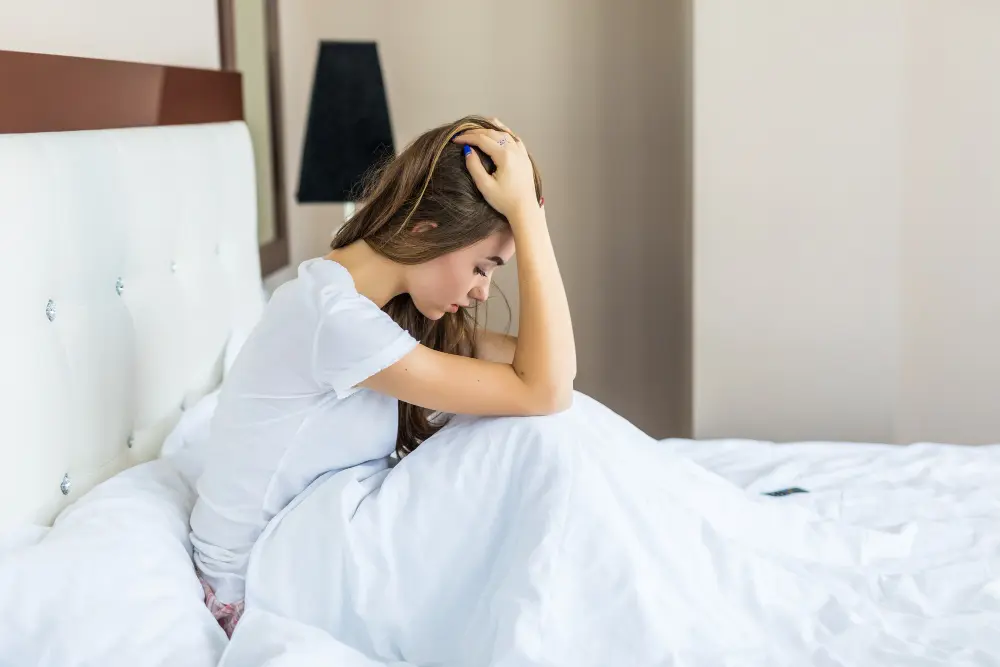
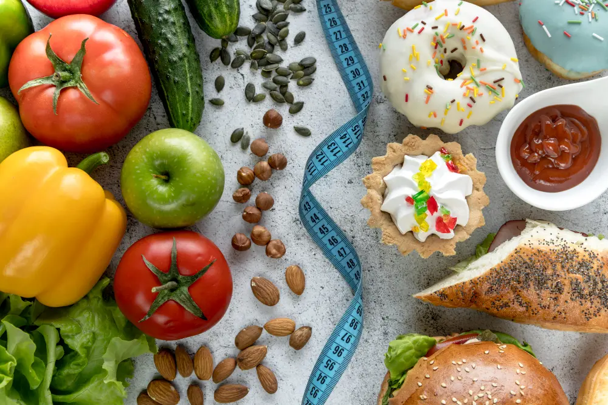

  

	
    <ul class="list list--ul margin-top-sm margin-bottom-0">
      <li>Šta dovodi do insulinske rezistencije?</li>
      <li>Simptomi i lečenje.</li>
      <li>Kako pobediti insulinsku rezistenciju?</li>
    </ul>
  

[Insulinska rezistencija povećava rizik za nastanak dijabetesa tipa 2](https://www.stetoskop.info/hormonski-poremecaji-i-poremecaji-metabolizma/insulinska-rezistencija). Nastaje usled prekomernog unosa šećera, kao vid odbrane organizma. Insulinska rezistencija je metabolički poremećaj u organizmu, kada dolazi do pojačanog lučenja insulina. Organizam postaje otporan na insulin, te dolazi do skoka šećera.

Kako se računa insulinska rezistencija? Utvrđuje se jednostavno, putem OGTT testa (test opterećenja šećerom), tako što se meri insulin i šećer u krvi na prazan stomak, a potom ponovi isto nakon 2 časa, ali uz prekomerni unos ugljenih hidrata (šećera).

Pogađa oba pola podjednako, ali u poslednje vreme sve više i decu. U svetu ima oko 470 milion obolelih, a u Srbiji preko 400 000.

## Faktori koji dovode do insulinske rezistencije su:
 
- Genetski - ako je nekom u porodici dijagnostikovana insulinska rezistencija šanse da nasledite ovu bolest su preko 50%;
- Prekomerna težina - zbog slabe fizičke aktivnosti i prekomernog unosa ugljenih hidrata;
- Rigorozne dijete - koje se baziraju na ugljenim hidratima;
- Nedostatak sna - koji podiže kortizol hormon stresa i izaziva glad;
- [Kušingov sindrom](https://www.stetoskop.info/hormonski-poremecaji-i-poremecaji-metabolizma/kusingov-sindrom-morbus-cushing);
- Visok nivo muških polnih hormona kod žena - [policistični jajnici](https://www.stetoskop.info/bolesti-i-stanja-kod-zena/policisticni-jajnici).

## Simptomi insulinske rezistencije su:

- Nagli **porast telesne mase** (javlja se u pojedinim slučajevima) - imamo i slučajeve sa umerenom telesnom masom;
- Pojačana žeđ;
- Potreba za unosom slatkiša, posle obroka;
- Hronični umor i pospanost - dovode do bezvoljnosti i depresije, kao i otežanog  obavljanje radnih aktivnosti;
- Nagli pad šećera - **hipoglikemija**;
- Pojava gladi nakon obroka - dovodi do čestih obroka u toku dana, koji dovode do povećanja insulina;
- Ciste na jajnicima - dolazi usled povišenih muških hormona;
- Nizak nivo HDL (dobar holesterol).

## Lečenje insulinske rezistencije - ishrana

Lečenje insulinske rezistencije zahteva promenu životnih navika:

1. Ishrana kod insulinske rezistencije podrazumeva zdrave i umerene obroke -  promenu vrste , sastava i količine hrane. Stoga je potrebno:
- Praviti **pauze u ishrani od 12 do 16 časova** - za ovo je najpogodnija keto dijeta, jer u ovom razmaku se ne luči insulin, a troše se masti. Štetan je unos čestih međuobroka koji dovode do konstantnog lučenja insulina. Zato je neophodno uvesti gladovanje, odnosno autofagiju. Postoje tri vrste [autofagije](https://www.imlek.rs/blog/autofagija-sta-je-autofagija): mikroautofagija, makroautofagija i autofagija posredovana šaperonom. Za proces mršavljenja veoma je bitna makroautofagija. Stoga je potrebno gladovati najmanje 12 časova da bi telo ušlo u stanje ketoze i trošilo masti.
- Izbegavati hranu  između obroka - ne unositi grickalice, voće, ni najmanje zalogaje. Na taj način se sprečava lučenje insulina;
- Proteine i masti unositi umereno (mleko). Preporuka je izbaciti kravlje mleko, dok su kefir i jogurt dozvoljeni;
- Povećati unos lisnatog povrća - **zeleno povrće** je izvor minerala, bez glukoze, ugljenih hidrata i lako svarljivo. Povećavaju insulinsku senzitivnost za 25%;
- Preporučuje se koštunjavo voće - badem, lešnik, orah;
- U hranu **uneti obavezno minerale**, B vitamin, Omega 3 masne kiseline (losos, skuša, sardine);
- Koristiti jabukovo sirće, limun i cimet jer povećavaju osetljivost ćelija na glukozu;
- Izbaciti rafinisane uljene hidrate: šećer, beli hleb, sokove (gazirane i domaće), namirnice spremljene na ulju i konzervisanu hranu. Namirnice sa visokim glikemijskim indeksom, a za koje često mislimo da su dozvoljeni, a nisu: banana, kruška, bundeva, ananas, dinja, kukuruz, urme, beli pirinač, smokve, grožđe, lubenica, krompir, musli, margarin i pivo;
2. Od pića isključivo **čistu vodu** unositi oko 2l dnevno ili 30 ml po kg telesne mase; 
3. Redovna fizička aktivnost - šetnja, plivanje, bicikl, vežbe. Sve treba biti umerenog inteziteta, jer u suprotnom dolazi do povećanja kortizola (hormona stresa), a potom insulina što dovodi do gladi. Preporuka je da **fizičke aktivnosti budu oko 150 minuta nedeljno**;
4. Redovan san - usled nedostatka sna povećava se nivo hormona gladi (Grelin), a potom sledi potreba sa hranom i rast insulina.

## Insulinska rezistencija vrednosti:
 
1. U jutarnjim časovima nakon gladovanja od 10h normalan nivo glukoze u krvi je od 4,0 - 6,4 mmol/L.
2. Ukoliko je  nakon 2h  od unosa glukoze, (OGGT test) ona veća od 11,1 mmol/L onda se radi o dijabetesu.
3. Ukoliko je glukoza nakon 2h od OGGT testa od 7,8 - 11,1mmol/L onda je to latentni dijabetes,
4. Ukoliko je glukoza ispod 7,8 mmol/L tada se radi o normalnom metabolizmu glukoze.

 
## Preporuka lekara - kako pobediti insulinsku rezistenciju?

Kako smanjiti insulinsku rezistenciju? Najbolja reč koja opisuje insulinsku rezistenciju je umerenost. Umerenost može pomoći potpunom izlečenju od ovog poremećaja u vremenskom periodu od 3 do 8 meseci. U suprotnom vodi u dijabetes tip2. 

**Preporuke [endokriloga](https://www.rts.rs/page/stories/sr/story/125/drustvo/2694222/insulinska-rezistencija--poremecaj-koji-preti-dijabetesom.html) su:**

- biti umeren u svemu, a posebno sa prirodnim šećerima kao što su  med i voće;
- Imati pravilne i redovne obroke, kao i uredan san od 22 časa uveče. U tom periodu se luče brojni hormoni neophodni za održavanje nivoa insulina.

Umerenost u hrani, piću, fizičkoj aktivnosti i spavanju, uz održavanje BMI (INDEKS TELESNE MASE) od 19 do 25 uz unos namirnica niskog glikemijskog sastava jedini je i pravi put do zdravog organizma, prema  mišljenju endokrinologa. Insulinska rezistencija je samo trenutno stanje, nikako bolest!

<!-- [VIDEO](https://www.youtube.com/watch?v=mSyZ1mgBMfw) -->

 

	

		

			<g-image class="" src="~/assets/img/forever_garcinia_plus.webp" alt="tableta insulinska rezistencija"></g-image>
		

		

			

				

					<h2 class="text-lg">Forever Garcinia Plus pomaže vašem organizmu</h2>
				

        

					

						<g-image style="width: auto !important;" class="margin-left-important" src="~/assets/img/check.svg"></g-image>
						Održava nivo glukoze u krvi
					

          

						<g-image style="width: auto !important;" class="margin-left-important" src="~/assets/img/check.svg"></g-image>
						  Smanjuje umor
					

          

						<g-image style="width: auto !important;" class="margin-left-important" src="~/assets/img/check.svg"></g-image>
				    Podiže nivo energije
					

          

						<g-image style="width: auto !important;" class="margin-left-important" src="~/assets/img/check.svg"></g-image>
							Reguliše apetit
					

				

			

			

				<a href="https://flpshop.rs/dodaci-ishrani/11656/forever-garcinia-plus/360000954255/personal.html" class="kupiteCTA btn btn--primary flex-grow center-between@lg justify-center btn--md">
					Kupite danas
				</a>
				<g-image style="width: auto !important;" class="" src="~/assets/img/logo-futer.png"></g-image>
			

		

	

 

*Fotografije: Freepik, Unsplash, Pixabay*

