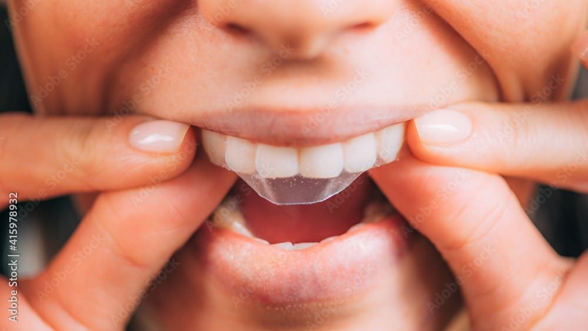
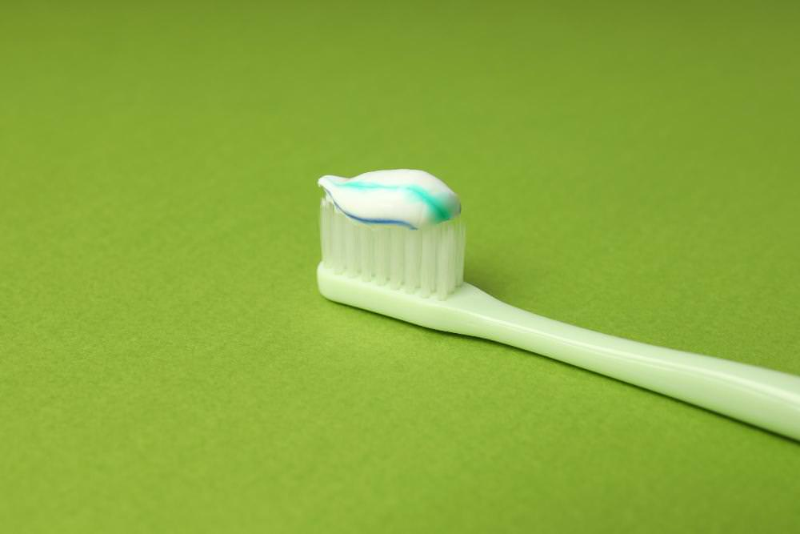
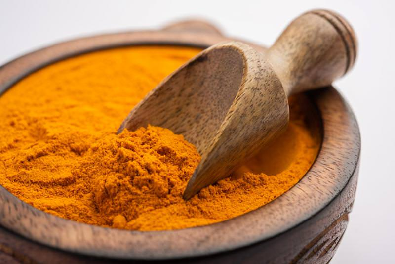

Opušteno je veče, sedite sa prijateljicom u restoranu i neobavezno pričate o događajima od tog dana. U jednom momentu  se na vratima restorana pojavljuje atraktivna devojka, koja se razdragano osmehuje, a Vi u tom trenutku prvo primećujete njene prelepe **bele zube**. Oduševljeni ste prizorom i lepotom njenih zuba i pitate se: „Kako doći do tako lepog osmeha“?

Niste zadovoljni belinom svojih zuba i odlučni ste u nameri da povratite svoj blistav osmeh. 

Postoji više načina da dođete do blistavo belih zuba.

Da li je neophodno posetiti stomatologa ili dobar rezultat **izbeljivanja zuba** možete postići i kod kuće?

## Izbeljivanje zuba

Koliko ste puta do sada čuli: “Zašto su mi ovako žuti zubi kada ih redovno perem” ili mozda pomislili: “Zašto ja nemam ovako bele zube”? Zašto nekome zubi brže žute, a nekome ne? Na sva ta pitanja mi ćemo Vam dati odgovor.

Neizbežno je da tokom godina zubi žute, ali niz preduzetih radnji može usporiti taj proces. Konzumiranjem hrane koja postepeno utiče na boju zubne gleđi je najveći razlog zašto zubi žute. 

Osobe koje imaju bele zube, imaju jaku **zubnu gleđ**, koja je neoštećenja. **Zubna gleđ** je supstanca od koje zavisi boja Vaših zuba. Ispod zubne gleđi nalazi se **dentin**, koji je braon boje. 

Konstantnim i dugotrajnim unosom nezdrave hrane, utičemo na zubnu gleđ, time se ona tanji i oštećuje. Što je veći stepen oštećenja, to je izraženija žuta i tamnija boja koju zubima daje **dentin**. Hrana i piće koji utiči na zubnu gleđ, a time i na boju zuba, jesu: kafa, crno vino, slatkiši, gazirani napici, obojeni napici itd. Takođe, pušenje je jedan od uzročnika tamnijih zuba.

**Trakice za izbeljivanje zuba**

- Trakice predstavljaju preparat za izbeljivanje zuba u vidu tankih i lepljivih najlonskih folija, koje se koriste za uklanjanje žute boje sa površine zubne gleđi. 
- Prozirne su, ne primećuju se tokom nošenja i ne smetaju pri korišćenju.
- Glavni sastojak ovih trakica je gel koji se sastoji od vodonik peroksida (hidrogen), i nalazi se na unutrašnjoj strani trakica. 
- Kako rade ove [trakice](https://www.healthline.com/health/dental-and-oral-health/best-teeth-whitening#about-strips)?
- Pod dejstvom toplote usne duplje, dolazi do razgradnje hidrogena na aktivni koseonik i vodu. Molekuli kiseonika ulaze u zubnu gleđ, potom, oksidacijom se stvaraju mehurići koji izbeljuju i spiraju flekice i mrlje sa zuba.
- Za bolju efikasnost preporuka je da izvršite skidanje kamenca, uklanjanje naslaga i poliranje zuba kod stomatologa, pre samog korišćenja trakica za izbeljivanje zuba.

Fotografija: Adobe Stock

**Napomena:** Koršćenje ovih trakica je uglavnom bezbedno za upotrebu ukoliko sledite uputstvo na pakovanju. Neželjeni efekti su mogući ukoliko ih koristite češće nego što je propisano ili ako ih ostavite duže od preporučenog vremena na zubima. 

**Najčešći neželjeni efekti** su iritacija desni i nelagodnost izazvana preosetljivošću zuba. Drugi mogući neželjeni efekti su: erozija plombi, oštećenje proteza, promena u gleđi kao i povećana hrapavost zuba.

**Pasta za izbeljivanje zuba**

Održavanje higijene zuba i usne duplje se podrazumeva ako želimo da idemo zdrave i blistavo bele zube. Najmanje dva puta u toku dana perite zube, a preporuka je svaki put nakon obroka. 

Pranje zuba je za većinu ljudi dosadan i naporan proces i to je glavni uzrok nedovoljne higijene zuba. Upotreba **paste za izbeljivanje zuba** može imati i psihološki efekat i dodatno uticati na Vas i Vašu upornost u nameri da postignete najbolji rezultat.   

S obzirom da na tržištu postoji veliki broj različitih **pasta za izbeljivanje zuba**, jako je bitno izabrati kvalitetnu pastu čijom upotrebom ćemo postići željeni efekat. 

U liniji **Forever** proizvoda, izdvojila se pasta za izbeljivanje zuba koja postoji na našem tržištu, [Forever Bright Toothgel](https://flpshop.rs/licna-higijena/11668/forever-bright-toothgel/360000954255/personal.html), koja ne sadrži fluor, ima blagotvorno dejstvo na usnu duplju i ne oštećuje zubnu gleđ. Prijatnog je ukusa i mirisa peperminta, koji Vašim ustima daje svežinu i osećaj čistoće. Sadržaj  Aloja Vere i propolisa pomaže kod umirenja desni i sluzokože usne duplje, direktnim korišćenjem na bolno mesto. 

Pogodna je za celu porodicu, kao i za vegeterijance. Za najbolji efekat, prati zube ovom pastom nakon svakog obroka.

*Fotografija: Freepik*

**Izbeljivanje zuba korom banane**

Ovaj način izbeljivanja zuba je potpuno prirodan i bezopasan i nema neželjenih efekata. Kora banane sadrži limunsku i salicilnu kiselinu koje pomažu u izbeljivanju zuba. Limunska kiselina doprinosi izbeljivanju fleka na zubima, a salicilna kiselina uklanja naslage kamenca i na taj način zubi bivaju belji.

**Primena:** Unutrašnjim delom kore od banane trljajte zube 2-3 minuta. Nakon toga operite zube.

S obzirom da je ovaj tretman potpuno prirodan i da nema neželjene efekte, možete ga ponavljati nekoliko puta u toku dana. Rezultati će biti vidljivi za 7 dana.

**Izbeljivanje zuba uz pomoć jagoda**

Jagode sadrže [maličnu kiselinu](https://dentalvortex.rs/2021/01/kako-izbeliti-zube-prirodnim-putem/) i to je razlog zbog kojeg one mogu biti od koristi u izbeljivanju zuba. Zajedno sa jagodom, za bolji efekat, koristi se i **soda bikarbona**.

**Primena:** Izgnječenoj jagodi dodajte kašičicu sode bikarbone i mešajte dok ne dobijete ujednačenu masu. Nakon toga, dobijenu smesu stavite na četkicu za zube i trljajte zube 5 minuta.

Malična kiselina u kombinaciji sa sodom bikarbonom pomaže u uklanjanju fleka i mrlja sa zuba.

**Napomena:** Zbog mogućnosti pojave neželjenih efekata, ovaj metod izbeljivanja zuba primenjivati najviše jednom nedeljno.

**Izbeljivanje zuba sodom bikarbonom**

Paste za pranje zuba često imaju u svom sastavu sodu bikarbonu jer ona ima veliku moć izbeljivanja zuba.

**Primena:** Da bi ste povratili belinu zubima, jednostavno nanesite sodu bikarbonu na četkicu i trljajte zube 2-3 minuta. Takođe, možete posuti sodu bikarbonu preko paste za zube koju ste već naneli na četkicu i tako operite zube.

Uz pomoć sode bikarbone ćete lako skinuti mrlje sa zuba od kafe i crnog vina, kao i naslage kamenca i tako povratiti belinu Vašim zubima.

**Napomena:** Sodu bikarbonu kao preparat za izbeljivanje zuba koristiti 2-3 puta nedeljno, najduže mesec dana. Nakon toga napravite pauzu od nekoliko meseci. Upotrebom sode u dužem vremenskom intervalu možete oštetiti zubnu gleđ i zato budite oprezni.

**Izbeljivanje zuba kurkumom**

Uz pomoć kurkume možete izbeliti zube na potpuno prirodan način. Kurkuma ne sadrži supstance koje Vam mogu oštetiti zubnu gleđ, potpuno je bezbedna i zato ovaj tretman možete ponoviti i nekoliko puta na dan. Već nakon nekoliko tretmana ćete videti boljitak. Kurkuma sa lakoćom skida mrlje sa zuba.

Takodje, kurkuma je jedan od najjačih prirodnih antiseptika i učiniće dosta i za Vašu usnu duplju sprečavajući upalne procese.

**Primena:** Navlaženu četkicu umočite u kurkumu i tako trljajte zube nekoliko minuta. Poželjno je da nakon toga ne ispirate odmah zube, sačekajte 5 minuta.

*Fotografija: Freepik*

Dobrim navikama do belih zuba 

Postoje namirnice koje treba izbegavati što je više moguće ukoliko želite da imate lepe i bele zube.

Na prvom mestu treba **izbegavati slatkiše i gazirane sokove** jer oni oštećuju zubnu gleđ. Takođe, **ostavite pušenje**, umanjeno konzumirajte **obojene sokove**, **crno vino** i **kafu**.

Sa druge strane, postoje namirnice koje će nam pomoći u izbeljivanju zuba.

**Hrskovo voće** i povrće kao što su **jabuke**, **krastavac**, **celer** i **šargarepa**, pored toga što će učiniti dobre stvari za opšte stanje organizma, učiniće i Vaše zube beljim jer ćete njihovim konzumiranjem sa lakoćom skinuti mrlje i nečistoće.

Lepota i belina Vaših zuba zavisi isključivo od Vas samih. Održavajte zube i usta čistim, to je preduslov za blistav osmeh.

