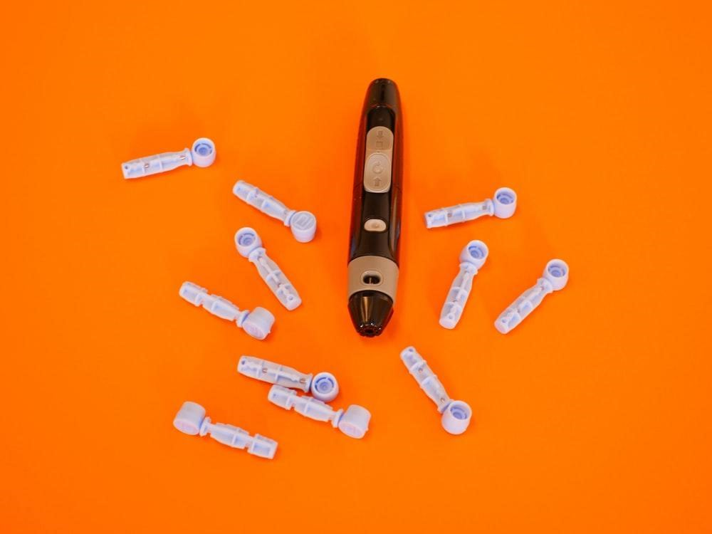

U ovim modernim vremenima interneta, mobilnih telefona i aplikacija, online porudžbina i dostava na kućnu adresu čini se da je mnogo toga olakšano, da se ima više vremena za neke druge obaveze ili razonode. Jeste li se nekada zapitali da li je moguće da ste samo vi večito u tolikoj žurbi? Kao da dan nije dovoljno dugačak. Sve češće se dešava da se nema vremena za kuvanje ručka, a još manje za okupljanje porodice oko stola i laganom uživanju u kvalitetnom obroku.

Još je teži scenario kada je osoba dijabetičar, dobija na kilogramima, a iz dana u dan se neuspešno bori sa izazovom one preukusne čokolade. Čokolade koju svaki dan kupi i pojede, iako je svesna da joj ne čini dobro po zdravlje. Iako zna da će ponovo prolaziti kroz razgovor sa doktorkom i trpeti možda prekoran pogled ili slušati lekcije koje je odavno naučila. Iako zna da će se možda ponovo menjati terapija lekovima. 

Dokle tako? Ima li nekog lakšeg načina da se promeni ovaj ciklus?

Da li bi možda keto dijeta mogla biti od pomoći? Popularna je, mnogima je već pomogla u skidanju suvišnih kilograma i zdravlju uopšte, samo je pitanje koliko je dobra za osobe sa dijabetesom?

Svaka osoba obolela od dijabetesa ima drugačije potrebe i svaka promena u stilu života različito utiče na ljude. Ukoliko se lekar slaže, pre prelaska na keto dijetu u celosti, postepeno smanjivanje unosa ugljenih hidrata može ukazati na to kojim tempom i na koji način organizam reaguje na date promene i time se može bolje pripremiti za samu dijetu.

## Šta je keto dijeta?

Keto dijeta se bazira na veoma malom unosu namirnica bogatih ugljenim hidratima (manje od 50g dnevno, a idealno manje od 20g dnevno) i velikom unosu namirnica bogatih mastima, uz umereni unos proteina. 

Dva su osnovna izvora energije koje koristi ljudski organizam:

- Šećer, odnosno ugljeni hidrati, koje unosimo kroz hleb, testeninu, pirinač, krompir i sl.
- Masti, koje unosimo kroz jaja, meso, orašaste plodove, mlečne proizvode.

Keto dijeta je naziv dobila po ketozi. Ljudi se često pitaju šta je ketoza? 

Ketoza je metabolički proces koji se odvija u organizmu tokom ovog načina ishrane. Kada se unos šećera u organizam praktično eliminiše, organizmu ne preostaje ništa drugo do stvaranja energije korišćenjem masti. Masti se iz jetre konvertuju u energetske molekule koji se zovu ketoni, te oni „hrane“ mozak. 

Kako osoba zna da je u ketozi? Ketoza nastupa 2-7 dana od otpočinjanja dijete. Ovo se može potvrditi kroz test krvi ([ketoni u krvi biće na nivou 0,5-3 milimola po litru](https://www.healthline.com/nutrition/ideal-ketosis-level-for-weight-loss#target-levels)), kroz test urina (postoje trakice za analizu urina) ili kroz testove za analizu daha.

Kada organizam krene da sagoreva masti, dešava se mršavljenje. 

Uticaj keto dijete na organizam ne ogleda se isključivo u mršavljenju. Sledi prikaz dodatnih [pozitivnih ali i negativnih](https://www.medicalnewstoday.com/articles/319196#3-may-reduce-risk-of-certain-cancers) uticaja na organizam koje keto dijeta može stvoriti.

**Pozitivni** su:

- Poboljšanje stanja akni 
- Smanjivanje rizika od određenih vrsta kancera
- Poboljšanje zdravlja srca
- Zaštita funkcije mozga
- Smanjivanje epileptičnih napada
- Poboljšanje stanja sindroma policističnih jajnika.

**Negativni** su:

- Kamenje u bubrezima
- Višak proteina u krvi
- Nedostatak vitamina i minerala
- Masna jetra
- Konstipacija
- Umor i slaba izdržljivost prilikom fizičkih aktivnosti
- Mučnina i povraćanje
- Nizak nivo šećera 

Generalno govoreći, [keto dijetu bi trebalo da izbegavaju](https://www.everydayhealth.com/diet-nutrition/ketogenic-diet/what-are-benefits-risks-keto-diet/) osobe sa poremećajima u ishrani, osobe kojima je eliminisana žučna kesa, osobe sa bubrežnim oboljenjima, oboljenjima pankreasa i tiroidne žlezde, kao i osobe koje imaju dijabetes tipa 1. 

## Odnos keto dijete i dijabetesa prema načinu lečenja

Zdrava ishrana za dijabetes igra neprikosnovenu ulogu. Ona predstavlja **prirodni lek** za dijabetes. U nekim slučajevima čak može da bude **jedini lek** koji se koristi kako bi organizam nesmetano funkcionisao. 

Unos hrane dovodi do promena nivoa šećera u krvi. Kada se jede hrana bogata ugljenim hidratima, šećer u krvi brže, i u većoj meri raste u odnosu na to kada se jede hrana bogata proteinima ili mastima. 

Znajući da se keto dijeta bazira na izuzetno smanjenom unosu ugljenih hidrata logično je, a iskustva i [studije](https://nutritionandmetabolism.biomedcentral.com/articles/10.1186/1743-7075-2-34) i dokazuju, da ona može imati pozitivne efekte na dijabetes. 

### Dijabetes tipa 1 i 2 koji se leči insulinom

Kada je u pitanju ishrana za stanje dijabetes tip 1  keto dijeta nije savet koji će lekar dati. Ukoliko se osoba ipak odluči na nju, potrebno je da se učestalije proverava nivo šećera u krvi i veoma često prilagođavaju količine insulina koje se uzimaju. 

Ketoza je uobičajen korak koji nastaje primenom keto dijete i od izuzetnog je značaja da znate da razlikujete ketozu od [dijabetičke ketoacidoze](https://www.vasezdravlje.com/bolesti-i-stanja/dijabeticka-ketoacidoza-moguci-prvi-pokazatelj-bolesti) (ona predstavlja akutnu, životno ugrožavajuću komplikaciju šećerne bolesti, koja nastaje zbog nedostatka insulina i porasta nivoa stresnih hormona).

**Uz strogi nadzor lekara i prilagođavanje terapije, keto dijeta (sa unosom ugljenih hidrata ne manjeg od 50g dnevno) može svoje benefite pokazati i kod osoba sa dijabetesom tipa 1 *iako se unos insulina kod ovog tipa bolesti ne sme prekidati nikada*.**

Kod velikog broja osoba sa dijabetesom tipa 2 koje koriste insulin, keto dijeta je uticala na potrebu [smanjivanja doze leka između 30% i 50%](https://www.dietdoctor.com/low-carb/with-diabetes-medications) u odnosu na period pre početka dijete.

### Dijabetes tipa 2 koji se leči antidijabeticima derivata Sulfonilureje

U lečenju dijabetesa tipa 2 terapija mogu biti i lekovi koji podstiču proizvodnju insulina - [antidijabetici](https://www.stetoskop.info/odeljci-knjiga/antidijabetici). 

Kada se kroz keto dijetu smanji unos ugljenih hidrata u organizam, potrebno je da lekar prilagodi terapiju lekova kako ne bi došlo do opadanja šećera u krvi na neželjeni nivo. U nekim slučajevima moguće je da će lekar preporučiti potpunu obustavu uzimanja terapije lekovima tokom dijete.

### Dijabetes tipa 2 koji se leči Metforminom

Metformin ne utiče na lučenje insulina, te samim tim osobe koje za lečenje dijabesa koriste Metformin, a odluče se na keto dijetu, ne ulaze u povišen rizik opadanja šećera u krvi.

### Lečenje dijabetesa Inhibitorima alfa-glukozidaze ili Repaglinidima

Postoji potencijalno negativan uticaj primene keto dijete kod dijabetičara na terapiji lekovima koji utiču na lučenje insulina. Obavezna je regulacija terapije i stalni nadzor lekara.

Smanjivanje unosa ugljenih hidrata koji stvara niži nivo šećera u krvi moguće je da dovede do smanjene potrebe za medikamentima. Redovne provere stanja organizma umnogome olakšavaju odluku lekara o terapiji, kao i o samoj ishrani – da li utiče na stanje dijabetesa tog pojedinca i da li pokazuje bilo kakve neželjene efekte. 

Ishrana osoba koje imaju dijabetes svakako zahteva određena prilagođavanja. Međutim, pre nego što osoba sa dijabetesom donese bilo kakvu odluku o primeni keto dijete, neophodno je da se posavetuje se sa lekarom i nutricionistom u cilju adekvatne izmene terapije insulinom ili lekovima. 

Keto dijetom gube se kilogrami, ali se gube i masne naslage. Šećer se i inače nikako ne savetuje osobama dijabetičarima, a u keto dijeti se svodi na minimalne količine. Neke osobe sa stanjem dijabetesa tipa 2 i primenom keto dijete uspešno su uspeli da dovedu stanje organizma do smanjene potrebe za lekovima. U Srbiji je prema [određenim podacima](https://www.zdravlje.gov.rs/vest/342459/srbija-medju-retkim-zemljama-koje-imaju-registar-za-dijabetes.php) preko 700.000 odraslih ljudi obolelo od dijabetesa. Nažalost, nemamo tačan podatak koliki broj od njih ima povišen indeks telesne mase (BMI), ali veruje se da nije mali. Keto dijeta može biti odličan saveznik kako u borbi sa viškom kilograma, tako i u borbi sa samim dijabetesom.

Ovim tekstom su predstavljeni isključivo opšti podaci koji ni u kom slučaju ne daju medicinske savete ili uputstva. 

