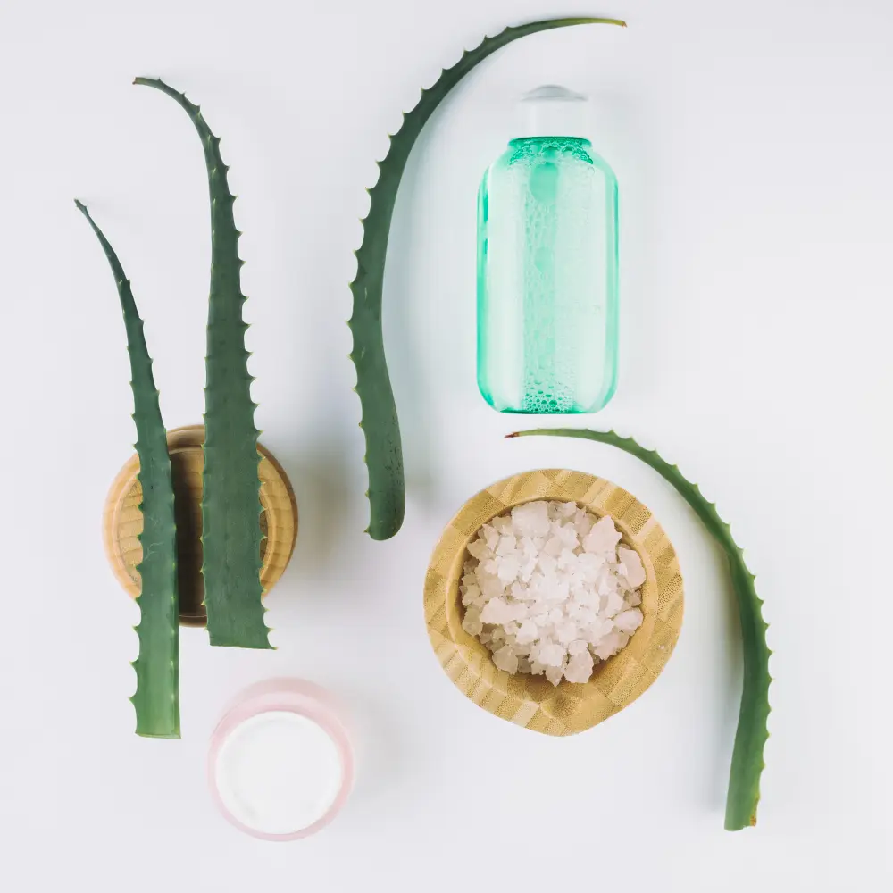
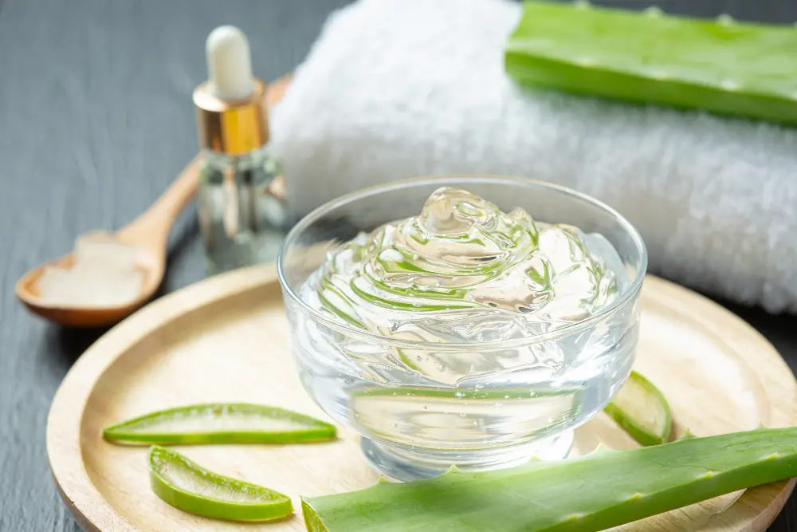

	

Svakodnevno sedenje po više sati dovodi Vas u situaciju da se neredovno hranite ili se često prejedate. Neadekvatna ishrana bez vitamina i minerala vremenom oštećuje kožu i kosu. Instant rešenja su svuda oko nas - kupićete neki hemijski preparat...

Vremenom počinjete osećati malaksalost, umor, žgaravicu ili nadutost. I to ste rešili privremeno lekovima, antacidima. Šta posle, ako lekovi više ne pomažu? U našoj okolini postoje veoma moćne biljke, poput aloje koje mogu pomoći kod svakodnevnih problema sa varenjem, UV zračenjem, hidratacijom kože, pa čak i uslučaju najtežih bolesti.

## Aloja vera biljka se koristi vekovima

**Aloja vera biljka** se spominje još u Starom zavetu 6000. god. p. n. e. Prvi put se spominje u Egiptu u gradu Nipur gde su pronađeni opisi lekovitih svojstava aloje. Doneta je u Aziju oko 400.god. p. n. e., a u Evropu između 10. i 13. veka. Aloja se prvi put primenjuje u Engleskoj kao sredstvo za lečenje spoljnih rana i bolesti. U Americi se koristi za zaštitu kože od 1820 godine, a prve plantaže su nastale 1912. godine na Floridi.

Mnogi naučnici, filozofi, lekari i istoričari su pisali o čudotvornim dejstvima ove biljke. Hipokrat je pisao o aloji kao leku koji leči tumore, dizenteriju i stomačne tegobe. Kleopatra je smatrala da je aloja vera biljka ta koja je činila lepšom, posebno je isticala **aloja vera gel**, a faraoni su verovali da aloja doprinosi dugom životu.
Iz Novog Zaveta imamo podatak da je melasa iz aloje i mirte prelivena na telo Isusa Hrista. Maje su se mazale po licu kako bi bile lepše, a Kristofer Kolumbo nikada nije krenuo na put bez ove čudotvorne biljke. Indijanci su je koristili čak protiv ujeda zmije.

Aloe vera gel ima brojne zdravstvene prednosti, međutim, važno je znati kako pravilno konzumirati gel aloe vere da biste maksimizirali njegove prednosti. U ovom vodiču ćemo pokriti sve što treba da znate o tome kako da pijete gel aloe vere, uključujući prednosti, različite metode konzumiranja i potencijalne rizike.

## Aloja u raznim oblicima

1. **Aloja vera biljka** se koristi u sledećim oblicima:

Kao **lekovito bilje** i to:

- [Aloja vera sok](https://flpshop.rs/napici/12510/forever-aloe-peaches/360000954255/personal.html)
- [Aloja vera gel](https://flpshop.rs/napici/11837/forever-aloe-vera-gel/360000954255/personal.html)
- [Aloja vera sprej](https://flpshop.rs/nega-koze/11689/aloe-first/360000954255/personal.html)
- [Aloja vera krema](https://flpshop.rs/nega-koze/12657/aloe-body-lotion/360000954255/personal.html)

Kao **sobno bilje** ima sledeće uloge:

- Da prečišćava vazduh - neutrališe negativna zračenja kućnih aparata i raznih štetnih materija iz vazduha
- Da održava stalnu svežinu vazduha - otporna je na duvanski dim
- I kao ukrasno bilje ima dekorativnu funkciju.

2. **Aloja vera sok** - sadrži preko 240 hranljivih sastojaka i bogat je izvor vitamina (A, B1, B2, B3, B5, B6, B12, C), minerala (kalcijum, natrijum, bakar, cink, hrom, mangan, kalijum, magnezijum, gvožđe), antioksidanasa, aminokiselina (od toga 8 esencijalnih), antikinona, enzima, saponina i lignina.

 

	

		

			<g-image class="" src="~/assets/img/forever_aloe_berry_nectar.webp" alt="aloja vera napitak"></g-image>
		
 
		

			

				

					<h2 class="text-lg">Aloja vera sok</h2>
				

        

					

						<g-image style="width: auto !important;" class="margin-left-important" src="~/assets/img/check.svg"></g-image>
							Antioksidans - neutrališe slobodne radikale u telu
						

          

						<g-image style="width: auto !important;" class="margin-left-important" src="~/assets/img/check.svg"></g-image>
						 Deluje protivupalno i antikancerogeno
					

          

						<g-image style="width: auto !important;" class="margin-left-important" src="~/assets/img/check.svg"></g-image>
						Čisti organizam
					

           

						<g-image style="width: auto !important;" class="margin-left-important" src="~/assets/img/check.svg"></g-image>
						Odličnog ukusa - brusnica i jabuka
					

        

			

			

				<a href="https://flpshop.rs/napici/12507/forever-aloe-berry-nectar/360000954255/personal.html" class="kupiteCTA btn btn--primary flex-grow center-between@lg justify-center btn--md" target="blank">
					Kupite danas
				</a>
				<g-image style="width: auto !important;" class="" src="~/assets/img/logo-futer.png"></g-image>
			

		

	

 
 

**Sok od aloje vere sadrži:**

- Obilje vitamina - A, B1, B2, B3, B5, B6, B9, B12, C, E. Vitamini imaju veoma bitnu ulogu kod jačanja imuno sistema čoveka. Posebno se ističu vitamini A, C i E jer su značajni u borbi protiv starenja kože;
- Enzime - aloja sadrži čak 16 enzima koji su veoma važni za varenje, protiv upale kože i upalnih procesa oboljenja;
- Minerale - kalcijum, bakar, selen, magnezijum, gvožđe i hrom koji su veoma važni protiv perutanja kože, za jačanje kostiju, protiv mišićnih grčeva, anemije i poboljšanja imuno sistema;
- Aminokiseline - aloja vera sok sadrži 8 amino kiselina koje organizam mora unositi jer ih ne stvara sam;
- Šećere (monosaharde i polisaharide) i biljne hormone - koji su važni i efikasni u borbi protiv akni, ožiljaka i bora.

**Sok od aloje vera** pomaže kod:

- Probavnih smetnji, posebno konstipacije
- Lečenja čira na želucu
- Regulacije nivoa želudačne kiseline
- Regulacije nivoa šećera u krvi
- Održavanja hidriranosti organizma
- Poboljšanja rada jetre
- Upale u organizmu
- Snižavanja nivoa lošeg holesterola
- Ublažavanja simptoma astme i alergije
- Poboljšanja imuniteta.

3. **Aloja vera gel** se nalazi u unutrašnjosti lista aloje i može se koristiti kao sredstvo za nanošenje na kožu ili kao zdrav napitak.

 

	

		

			<g-image class="" src="~/assets/img/forever_aloe_vera_gel.webp" alt="aloja vera u gelu"></g-image>
		
 
		

			

				

					<h2 class="text-lg">Aloja vera gel u formi napitka</h2>
				

        

					

						<g-image style="width: auto !important;" class="margin-left-important" src="~/assets/img/check.svg"></g-image>
							Pozitivno utiče na imuni sistem
					

          

						<g-image style="width: auto !important;" class="margin-left-important" src="~/assets/img/check.svg"></g-image>
						 Poboljšava varenje
					

          

						<g-image style="width: auto !important;" class="margin-left-important" src="~/assets/img/check.svg"></g-image>
						 Deluje protivupalno i antikancerogeno
					

           

						<g-image style="width: auto !important;" class="margin-left-important" src="~/assets/img/check.svg"></g-image>
						 Čisti organizam
					

        

			

			

				<a href="https://flpshop.rs/dodaci-ishrani/11837/forever-aloe-vera-gel/360000954255/personal.html" class="kupiteCTA btn btn--primary flex-grow center-between@lg justify-center btn--md" target="blank">
					Kupite danas
				</a>
				<g-image style="width: auto !important;" class="" src="~/assets/img/logo-futer.png"></g-image>
			

		

	

 
 

4. **Aloja vera sprej** veoma je atraktivan proizvod u vremenu gripa, epidemija i pandemija, jer je veoma efikasno sredstvo za suzbijanje mikroorganizama na koži i sluzokoži. Zbog svog antiseptičkog dejstva veoma je efikasan za smirivanje upala (grla, uha, nosa, ždrela, usne šupljine ili desni).

 

	

		

			<g-image class="" src="~/assets/img/forever_aloe_first.webp" alt="aloja vera first sprej"></g-image>
		
 
		

			

				

					<h2 class="text-lg">Aloe First u spreju</h2>
				

        

					

						<g-image style="width: auto !important;" class="margin-left-important" src="~/assets/img/check.svg"></g-image>
							Umiruje kožu i sluzokožu
					

          

						<g-image style="width: auto !important;" class="margin-left-important" src="~/assets/img/check.svg"></g-image>
						 Veoma širok spektar primene
					

          

						<g-image style="width: auto !important;" class="margin-left-important" src="~/assets/img/check.svg"></g-image>
						 Štiti kosu
					

           

						<g-image style="width: auto !important;" class="margin-left-important" src="~/assets/img/check.svg"></g-image>
						 Može se koristiti kod upale uha ili grla, začepljenja nosa ili infekcijama usne duplje.
					

        

			

			

				<a href="https://flpshop.rs/nega-koze/11689/aloe-first/360000954255/personal.html" class="kupiteCTA btn btn--primary flex-grow center-between@lg justify-center btn--md" target="blank">
					Kupite danas
				</a>
				<g-image style="width: auto !important;" class="" src="~/assets/img/logo-futer.png"></g-image>
			

		

	

 
 

5. **Aloja vera za lice** u formi kreme, tonika ili seruma veoma je efikasna. Hidrira ispucalu i umornu kožu. Pomaže održavanju mekoće i elastičnosti. Deluje antibakterijski i protivupalno.

 

	

		

			<g-image class="" src="~/assets/img/forever_aloe_moisturizing_lotion.webp" alt="prirodna hidratacija kože"></g-image>
		
 
		

			

				

					<h2 class="text-lg">Hidrirajući losion za lice</h2>
				

        

					

						<g-image style="width: auto !important;" class="margin-left-important" src="~/assets/img/check.svg"></g-image>
						Daje koži potrebnu vlažnost
		

          

						<g-image style="width: auto !important;" class="margin-left-important" src="~/assets/img/check.svg"></g-image>
						 Pogodna je za lice, ruke i telo
					

          

						<g-image style="width: auto !important;" class="margin-left-important" src="~/assets/img/check.svg"></g-image>
						 Za glatku, svežu i baršunastu kožu
					

           

						<g-image style="width: auto !important;" class="margin-left-important" src="~/assets/img/check.svg"></g-image>
						Sadrži 100 % stabilizovani gel aloe vere			
					

        

			

			

				<a href="https://flpshop.rs/nega-koze/11696/aloe-moisturizing-lotion/360000954255/personal.html" class="kupiteCTA btn btn--primary flex-grow center-between@lg justify-center btn--md" target="blank">
					Kupite danas
				</a>
				<g-image style="width: auto !important;" class="" src="~/assets/img/logo-futer.png"></g-image>
			

		

	

 
 

## Aloja vera u kozmetici - gel i krema za sunčanje

**Aloja vera biljka** u kozmetici ima široku primenu zbog sadržaja lekovitih i hranljivih sastojaka aloje (minerala, vitamina, enzima, aminokiselina, saponina, lignina i polifenola). Zbog gustine gela primanljiva je za spravljanje maski za lice, tinktura za opekotine, losiona za kosu, krema za sunčanje, krema za zarastanje rana i raznih kožnih bolesti. S obzirom da aloja spada u grupu kaktusa koja sadži u velikoj meri vodu (oko 99%) izvrsna je za **održavanje hidratacije** i čini kožu zategnutijom i svežom. Naziva se još i **“eliksirom mladosti”**. Zbog antioksidativnog svojstva, krema na bazi aloje je veoma efikasno sredstvo **protiv starenja kože**. Zbog visokog sadžaja polisaharida **idealna je za masnu kožu** jer je koža brzo upija. Protivupalno dejstvo aloje svrstava ove kreme u najefikasnije u borbi protiv akni. Idealna krema za rešavanje problema hidratacije, iritacije, zarastanje rana, ekcema, psorijaze ili uboda jeste aloja vera gel.

 

	

		

			<g-image class="" src="~/assets/img/forever_aloe_vera_gelly.webp" alt="aloja vera gel za kožu"></g-image>
		
 
		

			

				

					<h2 class="text-lg">Aloja vera gel umiruje Vašu kožu</h2>
				

        

					

						<g-image style="width: auto !important;" class="margin-left-important" src="~/assets/img/check.svg"></g-image>
						Prva pomoć u slučaju povrede
					

          

						<g-image style="width: auto !important;" class="margin-left-important" src="~/assets/img/check.svg"></g-image>
						 Proziran i gust
					

          

						<g-image style="width: auto !important;" class="margin-left-important" src="~/assets/img/check.svg"></g-image>
						 100 % stabilizovani gel aloe vera
					

           

						<g-image style="width: auto !important;" class="margin-left-important" src="~/assets/img/check.svg"></g-image>
						 Ubrzava zarastanje rana i opekotina
					

        

			

			

				<a href="https://flpshop.rs/nega-koze/11694/aloe-vera-gelly/360000954255/personal.html" class="kupiteCTA btn btn--primary flex-grow center-between@lg justify-center btn--md" target="blank">
					Kupite danas
				</a>
				<g-image style="width: auto !important;" class="" src="~/assets/img/logo-futer.png"></g-image>
			

		

	

 
 

Upotrebljva se čak i kod tretmana kose, kod bojenja i trajne ondulacije. Koža ga u potpunosti upija te ne ostavlja tragove na odeći. Veoma je praktičnog pakovanja te je pogodan u priboru za prvu pomoć.

Zbog sve većeg štetnog uticaja sunčevog zračenja koža je izložena ubrzanom starenju, te postaje suva, meka i opuštena. U slučaju opekotina javlja se crvenilo, a u težim slučajevima plikovi. Sve to isušuje kožu i stvara površinske rane u slučaju pucanja plikova, te koža deluje neugledno i zapušteno. [Losion za sunčanje](https://flpshop.rs/nega-koze/12541/aloe-sunscreen/360000954255/personal.html) na bazi aloje je izvrstan za rešavanje svih ovih problema.

Krema za sunčanje je idealna u borbi protiv visokog UV zračenja i štetnog uticaja vetra. Losion je na bazi gela od aloje koji je lako razmaziv i omogućava održavanje prirodne hidratacije kože. Krema za sunčanje sadrži zaštitni faktor 30, te je pogodna za celu porodicu, kako za odrasle tako i za decu. Ovaj losion je vodootporan i pogodan za dugotrajno očuvanje boje kože.

## Uloga aloje kod rešavanja želudačnih smetnji - žgaravica i probavne smetnje

Poznato je da aloja ima izvrsno dejstvo kad rešavanja želudačnih smetnji. Aloja sadži glikoproteine zvane aktin i sterol koji smanjuju upale i rane na sluznici želuca. S obzirom da sadrži enzime koji su neophodni za varenje veoma je efikasna za sprečavanje zatvora i detoksikaciju organizma. Aloja je poznata kao biljka koja ima protivbakterijsko dejstvo te je pogodna za suzbijanje helikobakterije, uzročnika gastritisa. Poznato je da je aloja alkalna po svom sastavu te je izvrsna u održavanju PH vrednosti želudačne kiseline. Reguliše kako višak, tako i manjak želudačne kiseline. Proizvod koji može zadovoljiti sve vaše potrebe po pitanju želudačnih smetnji je i ovaj [napitak](https://flpshop.rs/napici/12615/forever-aloe-mango/360000954255/personal.html) od gela aloje.

Aloja vera gel sadrži 99,7% čistog gela iz lista aloje te omogućava sistemu za varenje da apsorbuje sve hranljive sastojke iz hrane. Ujedno podstiče i stvaranje dobrih bakterija. Polisaharid acemanan podiže imunitet organizma. Ne sadrži konzervanse i pakovan je u ambalaži od materijala koji je 100% recikliran. Pije se 120 ml dnevno ukupno, podeljeno u 2 ili 3 doze. Nakon otvaranja čuva se u frižideru do 30 dana na temperaturi ne nižoj od 7°C.

## Antioksidativna svojstva aloje koja mogu pomoći kod tumora

Brojni hemijski i biološki agensi koji imaju dokazana kancerogena svojstva (kafa, nikotin, slobodni radikali, pesticidi, konzervansi) doprinose transformaciji zdrave ćelije u malignu. Da li će doći do te transformacije najviše zavisi od imuno sistema organizma. Postoje jasni naučni dokazi istočne medicine koja potvrđuje pozitivno dejstvo aloje na sprečavanje razvoja tumora, kao i jačanju imuno sistema i zdravih ćelija u organizmu. Analizom je ustanovljeno da aloja sadrži veliki broj ugljenihhidrata (polisaharida i oligosaharida) sa imunomodulatornim svojstvom. To znači da aloja direktno doprinosi stvaranju T ćelija koje su osnova imuno sistema čoveka.
U slučaju hemoterapije, **aloja vera biljka** pomaže tako što sprečava oštećenja zdravih ćelija, naročito ćelija imunskog sistema. Dokazano je da aloja sadrži najmanje tri antitumorska sastojka emodin, lecitin i manozu. U slučaju lečenje kancera aloja vera biljka ima sledeća dejstva:

1. Antioksidaciono
2. Detoksiokaciono
3. Imunostimulatorno
4. Antivirusno
5. UV zaštitno

## Mere opreza kada pijete gel od aloe vere

Iako je gel aloe vere generalno bezbedan za konzumiranje, važno je preduzeti neke mere predostrožnosti. Evo nekoliko stvari koje treba imati na umu:

Uvek birajte visokokvalitetni gel aloe vere iz renomiranih izvora.

*Fotografije: Freepik*

  

