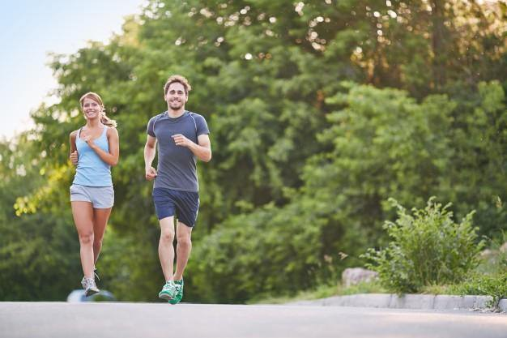
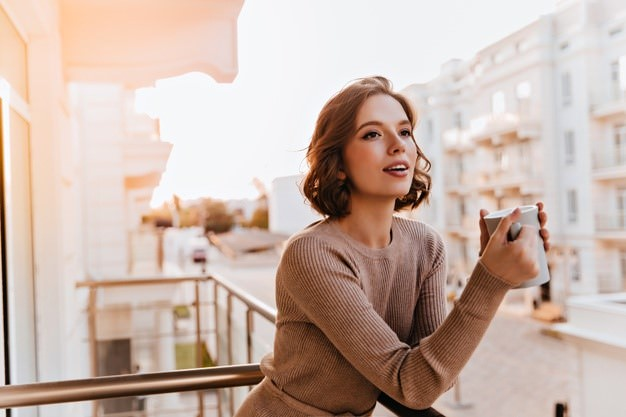

Dan prepun obaveza, problemi na poslu, gužve u saobraćaju, telefon maltene usijan od zvonjenja, godišnji odmor ponovo odložen zbog pandemije, leganje u krevet i buđenje sa brigama u mislima, razočaranja na svakom koraku. 

Ovaj scenario poznat je velikoj većini današnjeg čovečanstva. Okruženje u kojem živimo ne možemo mnogo menjati, sebe i svoj pogled na to okruženje i život kao takav možemo. 

Pobeda u bilo kakvoj borbi odnosi se na savladavanje protivnika. Ako je naš protivnik **anksioznost, moramo biti sigurni da je poznajemo** kako bi smo je uspešno savladali. Kada spoznamo pojam anksioznosti i njene oblike, pronaći ćemo nama najpovoljniji način da se sa njom izborimo. 

## Pojam anksioznosti i simptomi

[Anksioznost](https://ubuntucentar.com/blog/anksioznost-i-anksiozni-poremecaji/sta-je-aksioznost/) je reakcija na stresnu situaciju i sasvim je **normalna, prirodna pojava**. Proživljava se kroz, na primer javne nastupe, intervjue za posao, putovanja u nepoznatu zemlju. 

Telesni **simptomi** anksioznosti koji se često javljaju su:

- Ubrzan rad srca,
- Isprekidano disanje,
- Nemir,
- Znojenje dlanova,
- Problemi sa spavanjem.

Koliko god oni bili neugodni, postoje relativno [laki načini](https://www.webmd.com/anxiety-panic/anxiety-tips) kako se čovek može rešiti anksioznosti. 

## 9 lakih načina kako da se izborite sa anksioznošću

**Ustanovite šta je okidač**

Prisetite se i napravite listu lokacija i vremena kada ste osećali anksioznost.

Sada pokušajte da uočite šta je to što se u tim situacijama ponavlja. Okidač je u tome!

Kada postanete svesni šta vas to čini anksioznim, pronaćićete vama **najzgodniji način da se sa tim situacijama ili ređe srećete ili bolje sebe pripremite** na njih i počnete da ih posmatrate iz jedne druge perspektive koja vas ne pogađa na taj način.  

**Ograničite vreme koje ćete posvetiti problemima koji vas brinu**

Odredite kojih pola sata u toku dana ćete da razmislite o tome šta vas brine i  odlučite šta ćete da postupite po tom pitanju.

Izbegavajte brige oko situacija koje se nisu desile i nemate kontrolu nad njihovim ishodom. Fokusirajte se na brige koje vas zaista čine anksioznim. Svaki dan, u isto vreme, na isti način. 

A ostatak dana uživajte u svojim normalnim aktivnostima. Ukoliko počnete da razmišljate o brigama,  Ukoliko počnete da razmišljate o brigama , pljesnite rukama i glasno izgovorite reč STOP!

**Promenite fokus** 

Život jeste nepredvidiv i mi zaista ne možemo da kontrolišemo sve što se oko nas dešava. Umesto da brinete oko stvari koje se nisu ni desile, pokušajte da primenjujete praksu odavanja zahvalnosti za ono što imate. 

Pred odlazak na spavanje zapišite, možda u formi dnevnika, na čemu ste sve zahvalni. Od krova nad glavom i punog stomaka, do ljubavi partnera i/ili dece, prijateljske pomoći, sunčanog vremena, zdravlja. Svaki dan ponešto napišite i videćete kako se vremenom menja perspektiva i stanje svesti.

**Posvetite više vremena aktivnostima koje vam nisu stresne**

Ono što je kod jednog čoveka okidač za anksioznost, kod drugog može biti izvor za relaksaciju. Nakon što **ustanovite šta vas relaksira**, inicirajte to i sprovodite to češće. 

Bilo da je u pitanju druženje sa dragim ljudima, čitanje knjiga, hobi, meditacija, molitva, pa čak i spremanje kuće ili uređivanje dvorišta i bašte. 

Organizujte svoje vreme i [izdvojte deo za aktivnosti koje relaksiraju](https://www.verywellmind.com/manage-your-anxiety-2584184). Jednostavno je: duži deo dana ćete uživati, a time se kraće stresirati.

**Povežite se sa ljudima u sličnoj situaciji**

Bilo fizički ili virtualno na raspolaganju su vam različite [grupe podrške](https://www.helpguide.org/articles/anxiety/generalized-anxiety-disorder-gad.htm). 

Učestvovanjem u aktivnostima ovih grupa doživećete olakšanje shvativši da niste sami u tome što osećate. Potencijalno ćete dobiti i jasna uputstva kako sebi da olakšate put ka boljem sutra kroz iskustva drugih ljudi koji su prošli kroz šta vi trenutno prolazite.

Deljenjem sopstvenog iskustva možda ćete vi biti u prilici da nekoj trećoj osobi pomognete ili ćete im postati inspiracija, što opet dovodi do porasta nivoa satisfakcije i samopouzdanja. 

**Negujte svoje telo fizičkom aktivnošću**

Idealno, 3 puta nedeljno po 30 minuta bavite se sportskom aktivnošću prema izboru koji vama odgovara. 

Manje idealno, ali dovoljno za vidno poboljšanje psihološkog stanja, vežbajte koliko god stignete, koliko god vam prija. Šetnja, vožnja bicikla, plivanje, sve je dobro. 

Ako vam nedostaje motivacija, pokušajte sa nekom od besplatnih [aplikacija](http://8minuteworkoutapp.com/main.html) za vežbanje. Milionima ljudi su baš one bile od koristi. 

Ako težite nekim mirnijim fizičkim aktivnostima, praktikujte jogu. Osobe kojima je joga nepoznanica mogu pronaći neki besplatan čas ili snimak na internetu gde se mogu upoznati sa jogom. [Joga razmrdava telo](https://www.youtube.com/watch?v=FP0CvofG9mk), učiti tehnikama disanja i umirivanja misli.

**Obezbedite sebi dovoljno kvalitetnog sna**

Nedovoljno sna ili [poremećaji spavanja](https://www.stetoskop.info/savremena-medicina/poremecaj-spavanja) često mogu izazvati nervozu. 

Vredi li zaista ostajati budan do kasno u noć zbog sitnih užitaka, ako ćete narednog dana biti preosetljivi i nervozni zbog sitnica koje vas u naspavanom i odmornom stanju ne bi ni doticale?

Ako imate problem da utonete u san ili se budite tokom noći, možda možete razmotriti opciju čitanja knjiga pred spavanje umesto gledanja u mobilne telefone. Plavo svetlo koje emituje ekran mobilnog telefona ograničava prozivodnju melatonina, hormona koji kontroliše ciklus spavanja i budnosti. 

Najbolje je stvoriti neku rutinu i svaki dan odlaziti na spavanje u isto vreme. Pojačavanje unosa [magnezijuma](https://www.healthline.com/nutrition/magnesium-and-sleep#TOC_TITLE_HDR_3) sat vremena pred odlazak na spavanje pomoći će u opuštanju tela i uma. Takođe određene aromaterapije, konkretno miris lavande mogu biti odličan saveznik kvalitetnom snu zbog svog relaksirajućeg dejstva. 

**Ograničite nivo unosa kofeina i izbegavajte alkohol i duvan**

Bilo da se zbog kofeina osećate energičnije ili zbog alkohola opuštenije, oba stimulansa mogu biti okidači za anksioznost. 

Kofein može dovesti do ubrzanog rada srca, osećaja nemira i pojačanog znojenja, što su sve simptomi identični onima koji se doživljavaju kada je osoba u strahu. Takođe, prema nekim [studijama](https://www.ncbi.nlm.nih.gov/pmc/articles/PMC2257871/) kofein podstiče oslobađanje adrenalina, tzv.hormona stresa.  

Kada se spomene kofein, pored kafe, tu se misli i na određene čajeve, čokolade, energetska pića i tablete za glavobolju.

Konzumiranje alkohola od strane osobe koja već ima problema sa anksioznošću nikako se ne preporučuje. [Alkohol utiče na proizvonju serotonina](https://www.healthline.com/health/alcohol-and-anxiety), tzv. hormona sreće. Kada dejstvo alkohola popušta, osećaj anksioznosti biva veći nego inače.

**Pravilna ishrana i hidratacija**

Redovna hidratacija i konzumiranje češćih, a količinski manjih obroka, uz ravnomerni raspored proteina, masti i ugljenih hidrata i unos svežeg voća i povrća, osnov je, pre svega, fizičkom zdravlju, ali i zdravlju vašeg nervnog sistema.

**Kada je potrebno posetiti lekara**

Ako osećaj anksioznosti traje nekoliko nedelja ili čak duže od šest meseci, moguće je da se osoba susreće sa [anksioznim poremećajem](https://www.healthline.com/health/anxiety#disorders). Anksioznost može da poremeti porodične odnose, efikasnost u obavljanju posla i razne druge oblasti života i tada anksioznost zahteva lečenje.

U pitanju su sledeći poremećaji:

- Panični napadi;
- Ekstremni strah (fobije)  od određenih stvari, situacija ili aktivnosti;
- Fobije od osude društva, od razdvajanja od bliskih osoba, od bolesti (hipohondrija);
- Opsesivno-kompulzivni poremećaj;
- Post-traumatski stresni poremećaj.

Obratite se lekaru ukoliko simptomi anksioznosti traju duže vreme i niste u mogućnosti nijednom od navedenih metoda da ublažite njeno dejstvo. Lekar će vam uz adekvatnu dijagnozu preporučiti metod lečenja bilo putem lekova, bilo kroz neku od oblika psihoterapije, a često i kombinacijom lekova i terapije. Nijedan lek za anksioznost ne uzimajte bez prethodnog saveta sa lekarom. 

Lekovi za anksioznost bez recepta su prirodni preparati. Pravilno doziranje je i kod njih obavezno. Nalaze se u obliku čajeva, tinktura, tableta. Pošto ne deluju isto na svakoga, nekada je potrebno probati više vrsta lekova da bi se znalo koji odgovara datoj osobi, a koji ne.

Anksioznost u blažem obliku lako se tretira. Mnogi ljudi ni ne znaju da pate od anksioznosti iako ih ona sprečava da žive čist, rasterećen, srećan život. Kao i mnoge tegobe, što se duže ostave bez terapije, duži je i period oporavka. 

Ansioznost je svako iskusio u nekom trenutku života i u nekom od njenih pojavnih oblika. Da li će se i kada ponovo javiti niko ne može da zna. Zato čovek treba da je bude svestan i da ume da je prepozna na vreme. Osluškivanje sebe i svog organizma umnogome nam pomaže da pravovremeno reagujemo na sve promene i na adekvatan način prebrodimo situacije koje prete da nam ugroze mir i sigurnost.

Razmislite o zameni jedne kafe dnevno čajem od kamilice. Probajte sa unosom dodatnih suplemenata poput magnezijuma i vitamina i možda kupite sebi difuzor za eteričnih ulja u cilju aromaterapije.

Fizička aktivnost može biti i polusatna šetnja pored reke ili praktikovanje joge u svom domu. Koristi u smislu opuštanja osetićete posle svake vežbe, a svakodnevno praktikovanje doneće umirivanje na duže staze. 

Ako često konzumirate takozvanu brzu hranu, gledajte da se oslobodite te navike. Visok procenat masti i ugljenih hidrata utiču na drastične fluktuacije nivoa šećera u krvi, koji kada postane veoma nizak podstiče stvaranje simptoma anksioznosti. Priprema zdrave hrane ne mora da zahteva puno vremena. Pregršt je recepata na internetu sa predlozima za zdrave obroke u vremenski ograničenim uslovima. Isprobajte neke i vidite koji vam odgovaraju. 

Anksioznost je sveprisutna danas najviše zbog stila života koji vodimo i okruženja u kojem se nalazimo. Prvi možemo da menjamo. Pokušajmo uneti i zdravije opcije u život kako bi smo ubuduće živeli kvalitetnije i srećnije.

