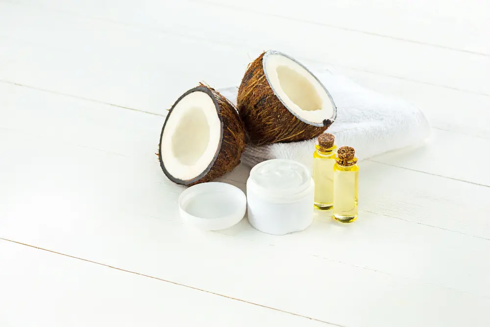
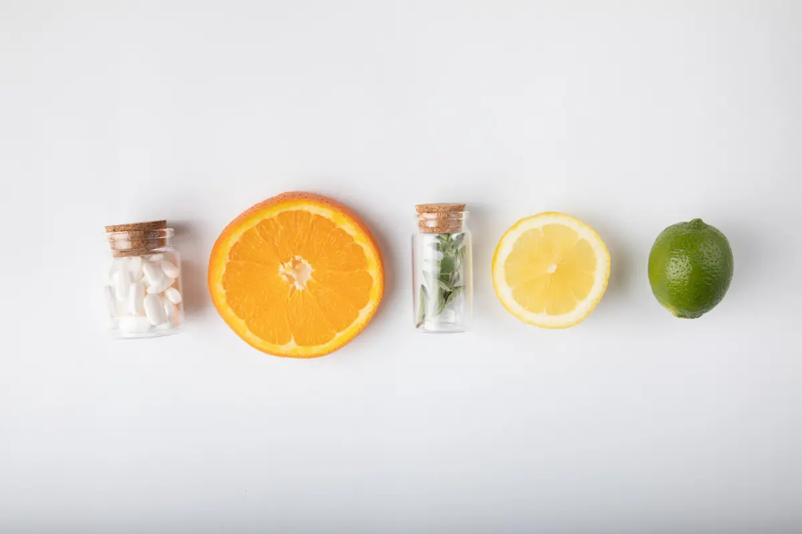

  

	Najbitnije iz teksta:
    <ul class="list list--ul margin-top-sm margin-bottom-0">
      <li>Greške koje pravimo koristeći prirodne lekove.</li>
      <li>Šta uzmati protiv kandide na sluzokoži i crevima?</li>
      <li>Šta protiv kandide na koži?</li>
			<li>Šta protiv kandide u unutrašnjim organima?</li>
    </ul>
  

Kada se ponovo javi osećaj svraba, nadutosti, glavobolje, lošeg raspoloženja, već i sama pomisao na neugodnosti terapije, još više urušava urušava raspoloženje. Raste sumnja i strepnja hoće li ovog puta uspeti? Osoba se pita ima li možda još neki lek iz apoteke koji nije probala, iako zna da nema. Osećaj frustracije i bespomoćnosti u ovim trenucima često izazivaju ljutnju, a onda i odlučnost da se nešto promeni i da se okrene i nekim drugačijim metodama i preparatima koji lečenje mogu upotpuniti i učiniti trajnije efikasnim.

Nažalost, ovakvi scenariji nisu usamljeni i sve je više ljudi koji počinju da koriste prirodne načine tretiranja infekcije kandidom. 

Na pitanje **kako lečiti kandidu**, deo odgovora leži pored nas, u našim domovima. Radi se o određenim **namirnicama** koje svi imamo u kući i **suplementima** koji se mogu nabaviti bez lekarskog recepta. Osim njih, uz neke modifikacije **režima ishrane** i **životnih navika** proces izlečenja infekcije kandidom efikasno se upotpunjuje.

**Pažnja!**

Iako veoma popularizovane od strane ljudi koji su svoja kandida iskustva i probleme rešili uz njihovu pomoć, ukoliko se pogrešno primenjuju, mogu doneti više štete nego koristi.

Prema nekim izvorima, dve najčešće greške koje ljudi prave koristeći prirodne lekove su:

- Upotreba lekova za čiju efektivnost ne postoji dovoljno dokaza, niti sprovedenih ispitivanja;
- Upotreba lekova bez tačne dijagnoze da se radi o infekciji kandidom ili bez tretiranja njenog uzroka nastanka, što dovodi do ponovnog vraćanja simptoma.

## Prirodna terapija za vaginalnu infekciju kandidom

**1. Ozonirano maslinovo ulje** je jedna od prirodnih terapija koja je dublje podržana i kroz [studije](https://pubmed.ncbi.nlm.nih.gov/27548492/). Upotrebljava se na [sledeći način](https://candidaspecialists.com/vaginal-yeast-infection/?data1=symptoms#relief):

- 1-2 kašičice ozoniranog maslinovog ulja staviti u čistu posudu dok ne postane tečno
- Natopiti higijenski tampon ovim uljem
- Vaginu oprati toplom vodom i dobro osušiti
- Staviti uljem natopljen tampon u vaginu i ostati u sedećem ili ležećem položaju 1-2 sata
- Ako se osete iritacije, izvaditi tampon, obrisati vaginu čistim papirnim ubrusom i oprati toplom vodom
- Ako se terapija dobro podnosi i nema nikakvih iritacija, terapiju nastaviti nakon 24 sata i postepeno za 1-2 sata produžavati vreme zadržavanja tampona u vagini, a najduže na celu noć
- Terapiju završiti nakon 7 dana

**2. Kokosovo ulje** je kroz [studije](https://www.ncbi.nlm.nih.gov/pmc/articles/PMC90807/) dokazano kao izvor masnih kiselina koje su prirodni antimikotici i to upravo pomaže kod problema sa Candida Albicans, gljivicom koja najčešće izaziva vaginalne infekcije.
Organsko kokosovo ulje možete  nanositi direktno na područje oko vagine

**3. Borna kiselina** može pomoći izlečenju vaginalne kandidijaze, ali je neophodno znati da se nikako ne sme uzimati oralno, niti ukoliko je koža ispucala ili na drugi način oštećena. 

Takođe, za osobe sa osetljivom kožom ovo možda nije najbolja opcija za terapiju.

**4. Probiotici** pomažu kod stvaranja balansa bakterija i gljivica u telu. 

Uzimanje probiotika ili jogurta koji sadrže sojeve bakterija Lactobacillus acidophilus može pomoći i u lečenju vaginalne infekcije kandidom.

**5. Jabukovo sirće**  pomaže kod svih oblika kandidijaze. Potrebno je sipati oko pola šolje jabukovog sirćeta u mlaku vodu u kadi i ležati u njoj oko 20 minuta. Kiselina iz jabukovog sirćeta pomaže u eliminisanju štetnih mikroorganizama, uključujući gljivice. Takođe je dobro koristiti ga i u ishrani.

**6. Beli luk** kao lek protiv kandide odavno je poznat u narodu. Njegova aktivna komponenta koja mu daje aromu i ukus ima dokazana antibakterijska, antivirusna i antifungalna svojstva. Najbolje je konzumirati ga u svežem stanju.
   
**7. Vitamin C** pomaže jačanju imuniteta, a to je izuzetno značajno, jer slab imuni sistem može na prvom mestu biti osnovni krivac za nastanak infekcije kandidom. 

## Prirodna terapija za infekciju kandidom u ustima i jednjaku

Prirodni lek protiv kandide u ustima su razni rastvori kojima se ispira usna duplja. Usta možete ispirati vodenim rastvorom soli, soda bikarbone, limunovog soka ili jabukovog sirćeta.

Ispiranje možete raditi i tako što ćete par kapi eteričnog ulja čajevca rastvoriti u čaši vode. Budite samo oprezni da ne gutate ovaj rastvor. 

Ulje karanfilića u tretiranju oralne kandide prema nekim [studijama](https://pubmed.ncbi.nlm.nih.gov/19589904/) ima određene pozitivne rezuiltate. 

Jednostavan napitak protiv nabujale kandide možete napraviti tako što ćete jednu kašičicu mlevenog karanfilića potopiti sa 200 ml ključale vode. Posle 5 minuta ga procedite i koristite za ispiranje usta, nakon čega ćete ga ispljunuti.

Takođe, već pomenuti probiotici u ishrani, kao i brisanje usne duplje kokosovim uljem pomoći će bržem izlečenju. 

Nakon završetka terapije stara četkica za zube se obavezno zamenjuje novom, a ako se radi o kandida infekciji kod bebe ili malog deteta, cuclu, kašikicu i sve predmete koje dete stavlja u usta obavezno redovno čistiti.

Kandida u jednjaku simptomi - najčešće su to bele naslage u delu jednjaka ka usnoj duplji i zato ispiranje usta i grla navedenim rastvorima može pomoći čišćenju kandide i iz područja jednjaka.

 

	

		

			<g-image class="" src="~/assets/img/forever_garlic_thyme.png" alt="tableta protiv nabujale kandide"></g-image>
		

		

			

				

					<h2 class="text-lg">Beli luk i timijan - Forever Garlic-Thyme</h2>
				

        

					

						<g-image style="width: auto !important;" class="margin-left-important" src="~/assets/img/check.svg"></g-image>
							Antibiotsko delovanje
					

          

						<g-image style="width: auto !important;" class="margin-left-important" src="~/assets/img/check.svg"></g-image>
							Pozitivno deluje na srce i krvne sudove
					

          

						<g-image style="width: auto !important;" class="margin-left-important" src="~/assets/img/check.svg"></g-image>
							Deluje povoljno na sistem za varenje
					

          

						<g-image style="width: auto !important;" class="margin-left-important" src="~/assets/img/check.svg"></g-image>
							Utiče na poboljšanje stanja disajnih organa
					

				

			

			

				<a href="/dodaci-ishrani/forever-beli-luk/" class="kupiteCTA btn btn--primary flex-grow center-between@lg justify-center btn--md">
					Saznajte više
				</a>
				<g-image style="width: auto !important;" class="" src="~/assets/img/logo-futer.png"></g-image>
			

		

	

 

## Prirodna terapija kod kandide u crevima

Najbolji prirodni lek za kandidu u crevima jeste dijeta. Za slučaj kada je kandida u crevima, ishrana treba da se bazira na izbegavanju šećera, namirnica koje sadrže gluten, povrća sa visokim sadržajem skroba, alkohola, mleka i sireva, veštačkih zaslađivača, kao i namirnica koje sadrže kvasac. 

Od pomoći su dodatni unos probiotika, jabukovog sirćeta i vitamina C.

Kandida u stolici kod dece i odraslih može biti izazvana inflamatornim bolestima creva, imunopresivnim lekovima ili antibioticima i u slučaju njene pojave najbolje je obratiti se lekaru koji će prepisati adekvatnu terapiju antimikoticima i prekinuti ili promeniti terapiju antibioticima, ukoliko su oni izazivači prekomernog rasta kandide.

## Prirodna terapija kod kandide na koži

Ulje divljeg origana za kandidu na koži pokazalo se kao izuzetno efikasan lek.

Koristi se tako što se 3-5 kapi eteričnog ulja razrede u 30 ml kokosovog ili maslinovog ulja i masiraju na inficiranu kožu.

## Prirodna terapija kod kandide u unutrašnjim organima, kostima, krvi

U slučajevima kada se ustanovi kandida u plućima, na srcu, u krvi, mozgu, očima, kostima ili drugim delovima tela radi se o invazivnoj kandidijazi, koja je veoma ozbiljna i zahteva lekarski pregled, dijagnozu i terapiju. Neškodljivost prirodnih terapija daje im prostor za primenu i u ovim slučajevima, ali se ne preporučuje da budu isključiva terapija.

Da bi čovek zaista bio siguran da se oslobodio infekcije kandidom, potrebno je da utvrdi njen uzrok (upotreba antibiotika, slab imuni sistem, hormonalni disbalans, način ishrane i sl.) i učini šta je potrebno da se on eliminiše. 

Time će se odnos bakterija u crevima, ustima, vagini ponovo dovesti u ravnotežu. Tom procesu, iskustva pokazuju, umnogome će pomoći upotreba prirodnih preparata i namirnica, zajedno sa promenama životnih navika.

Još jedna korist prirodnih terapija jeste da se neutrališe rizik od neželjenih dejstava koje kandida lek eventualno može doneti. Ako ih, pak koristite uz lekove, velike su šanse da izlečenje bude brže, potpunije i efektnije. 

Njihova upotreba ne predstavlja udar na kućni budžet, s obzirom da mnoge od njih ljudi već imaju u svojim domovima, pa je vrlo jednostavno isprobati ih i uveriti se na svom primeru. 

A kada se konačno dođe do željenih rezultata oslobađanja infekcije kandidom, sasvim je verovatno da će se uočiti dodatni benefiti u vidu boljeg raspoloženja, smanjenog umora i osećaja lakoće u obavljanju dnevnih aktivnosti.

 
*Fotografije: Freepik, Unsplash, Pixabay*

