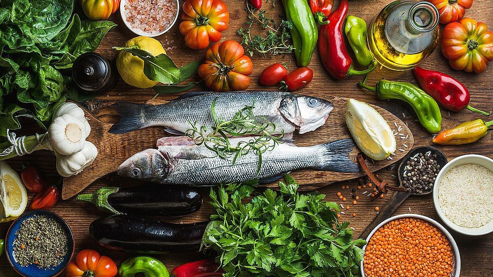

Stiže još jedno vrelo leto i ljudi jednostavno ne znaju koju destinaciju da posete? Agencije nude ekskluzivne aranžmane za Grčku, Kipar, Maroko, Italiju i Španiju. Taj miris mora, maslina i južnog voća podseća na vreme kada su ljudi bili bezbrižni i srećni. Sada je isto to vreme, ali se oseća nesigurnost i umor. Kad se pogledaju u ogledalu ljudi shvate da kilogrami ne moraju i ne smeju  biti uzrok ničije nesigurnosti i nesreće. Upravo ove ponuđene destinacije nude najraznovrsnija i najzdravija  jela koja Vam mogu omogućiti čak i na godišnjem odmoru da smršate.

**Mediteranska ishrana** je ishrana zastupljena u priobalnom Sredozemlju, svojstvena je za Grčku, Italiju, Španiju, Kipar, Portugal, Maroko i Dalmaciju. Izvorno poreklo je sa ostrva Krita. Spada u najprihvatljiviji dijete za mršavljenje u svetu, zbog dugoročno zdravih efekata po zdravlje. Naglašava celu, minimalno obrađenu hranu i zdrave masti poput maslinovog ulja, orašastih plodova i ribe. Takođe uključuje umerene količine mlečnih proizvoda, nemasnih proteina i voća i povrća.

Ljudi često pribegavaju izgladnjivanju da bi smršali, a onda shvate da to ima samo kontra efekat. Kratkoročno posmatrano, ljudi samo izgube vodu iz organizma i par kilograma koji se brzo vrate. Tako se bespotrebno iscrpe i fizički i psihički. Dugoročno, gladovanje ili autofagija mogu znatno poboljšati opšte zdravlje ljudi. Osećaj gladi ponekad zavara čoveka. Veoma često je to lažan osećaj, te se javlja potreba za slatkišima ili slanom hranom. Nekada je dosada uzrok nepotrebnog unošenja hrane i gojaznosti.

Ako tražite zdrav i ukusan način da poboljšate svoje opšte zdravlje, mediteranska dijeta bi mogla biti upravo ono što vam treba. Sa svojim naglaskom na svežu, celovitu hranu i zdrave masti, pokazalo se da ovaj plan ishrane smanjuje rizik od hroničnih bolesti, promoviše gubitak težine i poboljšava mentalno zdravlje.

Prvi put o ovoj dijeti za mršavljenje i ishrani govori [dr. Ancel Keys](https://www.brzadijeta.com/mediteranska-dijeta/) posle Drugog Svetskog rata, pri proučavanju uticaja gladi na čoveka. Takođe je ustanovio da smanjen unos jaja, crvenog mesa i mlečnih proizvoda znatno smanjuje oboljevanje ljudi od kardiovaskularne bolesti.

Mediteranska dijeta podrazumeva unos **tri grupe namirnica**:
- Svakodnevni unos povrća, voća, integralnih žitarica, zdravih masti;
- Nedeljni unos ribe, živinskog mesa i jaja, pasulja i mlečnih proizvoda;
- Povremeni unos crvenog mesa i vina.

## Prednosti mediteranske dijete

[Istraživanja](https://www.everydayhealth.com/mediterranean-diet/scientific-health-benefits-mediterranean-diet/) su pokazala da pridržavanje mediteranske dijete može imati brojne prednosti za vaše zdravlje, uključujući:

- **Smanjenje rizika od srčanih bolesti**

Mediteranska ishrana je bogata namirnicama koje su zdrave za srce kao što su voće, povrće, integralne žitarice i riba. Ove namirnice su bogate hranljivim sastojcima poput vlakana, antioksidanata i omega-3 masnih kiselina, koje mogu pomoći u smanjenju upale i poboljšanju zdravlja srca.

- **Poboljšanje funkcije mozga**

Mediteranska ishrana je povezana sa poboljšanim kognitivnim funkcijama i smanjenim rizikom od Alchajmerove bolesti. Zdrave masti u ovom planu ishrane, kao što su maslinovo ulje i orasi, mogu pomoći u zaštiti moždanih ćelija i poboljšanju pamćenja i učenja.

- **Promovisanje gubitka težine**

Mediteranska dijeta nije strog plan sa ograničenim unosom kalorija, ali naglašava cjelovitu hranu koja je zasitna i zadovoljavajuća. Ovo može pomoći da se smanji prejedanje i podstakne gubitak težine na duži rok.

- **Smanjenje rizika od dijabetesa**

Sprovođenje mediteranske dijete može pomoći u poboljšanju osetljivosti na insulin i smanjenju rizika od razvoja dijabetesa tipa 2.

## Osnovni principi mediteranske ishrane su jednostavni

[Oldways](https://oldwayspt.org/resources/oldways-mediterranean-diet-pyramid) u saradnji sa [Harward School of Public Health](https://www.hsph.harvard.edu/) i [Svetskom zdravstvenom organizacijom](https://www.who.int/) konstruisali su piramidu mediteranske ishrane.

## Preporučene namirnice u mediteranskoj dijeti koje su dostupne na našem podneblju:

- **Povrće** - špargla, brokoli, masline, paprika, paradajz, luk, avokado, kelj, spanać, krastavac, prokelj, karfiol, kupus, zelena salata, blitva, šargarepa,  krompir;
- **Voće** - banane, kruška, narandže, borovnica, jabuke, maline, grejpfrut, nar, breskve, dinje, kruške, jagode, smokve, kupine, lubenica, mandarine;
- **Orašasti plodovi i semenje** -  orah, badem, laneno seme, suncokret, lešnik, golica, susam, muskatni orah, indijski orah, pistaći itd;
- **Suvo voće** - grožđe, urme, kajsije, smokve, brusnica;
- **Mahunarke** - pasulj, boranija, grašak, leblebija, sočivo;
- **Integralne žitarice** - kukuruzno brašno, ražano brašno, smeđa riža, ječam, zob, kukuruz, celo zrno pšenice, te ostale vrste integralnih peciva i testenina, pahuljice (ovsene, heljdine, ječmene, ražene);
- **Živinsko meso** - piletina, ćuretina, pačetina;
- **Jaja** - kokošija, guščija, pačija, prepelice;
- **Mlečni proizvodi** - svež sir, jogurt, grčki jogurt, švapski sir, sirevi sa malo masnoće;
- **Riba i morski plodovi** - sardina, pastrmka, losos, skuša, orada, brancin, škarpina, tuna, školjke, rakovi, lignje, dagnje itd;
- **Začini** - bosiljak, nana, origano, biber, ruzmarin, bijeli luk, cimet, muškatni oraščić, peršun;
- **Piće** - voda, vino, sveže ceđeni sokovi, kafa, čaj;
- **Maslinovo ulje** - devičansko ili ekstra-devičansko. Dozvoljena su još i ulja od šafranike, kinoe i kikirikija.

## Namirnice zabranjene u mediteranskoj dijeti

- **Belo brašno** - hleb i peciva;
- **Šećer** - bombone, sladoled i veštački šećeri;
- **Meso** - svinjetina, meso sa kožuricom, mesne prerađevine, konzervirana mesa, delikatesno meso;
- **Trans masti** - rafinisana ulja (sojino, suncokretovo) i margarin;
- **Grickalice, slatkiši**;
- **Piće** - gazirana pića, alkohol, slatki sokovi;
- Visoko **prerađene** industrijske namirnice;
- **Mleko** - pavlaka, kajmak, punomasni sirevi, sveže mleko;
- Izbegavati **soli i aditive**;
- **Brza hrana**.

**Nepisana, a korisna pravila**

- Svako jelo treba da sadrži **obilje povrća**, što je mogućeg svežeg;
- Princip ishrane je po malo, ali češće. Obroci treba da su **raspodeljeni u 5 porcija**;
- Kalorije se ne broje, a preporuka je da se **unese 1600 - 1700 kcal**;
- Sa **voćem** ne treba preterivati-sasvim je dovoljno uneti **250 - 300g** dnevno. Ono je izvrsna zamena za slatkiše.
- Orašaste plodove, semenke, maslinovo ulje treba unositi svakodnevno u umerenoj količini;
- **Integralne žitarice** treba unositi **6 puta nedeljno**, ali ne u svakom obroku;
- Riba, morski plodovi,  i mlečni proizvodi trebaju se upotrebiti 4 puta nedeljno;
- **Jaja i belo meso** su izvor proteina, ali ih treba unositi **1 - 2 puta nedeljno**;
- Čaša crvenog vina je dozvoljena svakodnevno, ali obavezno uz jelo;
- **Crveno meso i slatkiši** su zabranjeni, sem u izuzetnim situacijama - **2 puta mesečno**.

**Ova dijeta je preporuka lekara**

- Ova dijeta za mršavljenje **nema strog jelovnik** - nije strogo restriktivna, ni oskudna po pitanju raznovrsnosti namirnica;
- Poboljšava **moždanu aktivnost** jer je bogata namirnicama punim antioksidansima;
- Omogućava trajno rešenje problema **suvišnih kilograma** u dužem vremenkom periodu;
- Nema **osećaja gladi** zbog unosa integralnih žitarica i mahunarki u skromnim porcijama;
- Nema **prejedanja** i poremećaja u ishrani jer su porcije male;
- Zasnovana je na povrću i vlaknastoj hrani te **reguliše probavu** i varenje;
- Mogu je primenjivati i **trudnice**, s tim da se isključi vino i povećava broj kalorija;
- Nisu potrebni nikakvi dodatni lekarski pregledi, jer **nije agresivna**;
- Zahteva minimalne fizičke aktivnosti 3-4 puta nedeljno po 30 minuta.

Najčešći kozumenti ove dijete su osobe koje bore sa većim viškom kilograma duže vreme, osobe koje žele da žive zdravim načinom života, osobe koje se leče ili radi preventive od kardiovaskularnih bolest, osobe koje vole jednostavne obroke.

 

	

		

			<g-image class="" src="~/assets/img/forever_lean.webp" alt="dijeta suplementi"></g-image>
		
 
		

			

				

					<h2 class="text-lg">Forever Lean pomaže Vašoj dijeti</h2>
				

        

					

						<g-image style="width: auto !important;" class="margin-left-important" src="~/assets/img/check.svg"></g-image>
							Smanjuje nivo masnoće
					

          

						<g-image style="width: auto !important;" class="margin-left-important" src="~/assets/img/check.svg"></g-image>
						 Podstiče bolje varenje
					

          

						<g-image style="width: auto !important;" class="margin-left-important" src="~/assets/img/check.svg"></g-image>
						 Ubrzava metabolizam
					

           

						<g-image style="width: auto !important;" class="margin-left-important" src="~/assets/img/check.svg"></g-image>
						 Poboljšava opšte zdravstveno stanje organizma
					

        

			

			

				<a href="https://flpshop.rs/dodaci-ishrani/11658/forever-lean/360000954255/personal.html" class="kupiteCTA btn btn--primary flex-grow center-between@lg justify-center btn--md">
					Kupite danas
				</a>
				<g-image style="width: auto !important;" class="" src="~/assets/img/logo-futer.png"></g-image>
			

		

	

 

                
Više od 50% ispitanih lekara preporučuje ovu dijetu, kako iz zdravstvenih, tako i estetskih razloga. [Naučnici sa instituta u Grčkoj](https://www.brzadijeta.com/mediteranska-dijeta/) došli su do zaključka da deca čije su majke u trudnoći bile na mediteranskoj ishrani oboljevaju 4 puta manje od astme i raznih alergija. Bez obzira na broj viška kilograma ovom dijetom ćete ih sigurno skinuti. Jedino što je potrebno je strpljenje. Kilogrami skinuti ovom dijetom se teško vraćaju, a ujedno poboljšavate zdravlje celokupnog organizma. Sve su ovo razlozi zbog kojih je mediteranska dijeta dugi niz godina ubedljivo najpopularnija u svetu.

 
*Fotografije: Freepik, Unsplash, Pixabay*

