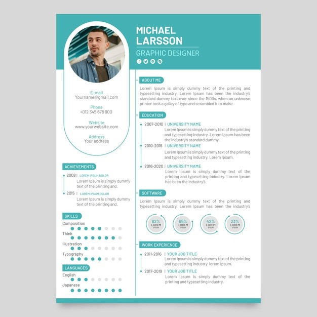

Živimo u modernim vremenima. 

Zvuk alarma me budi, ali ne žurim na posao. Nemam ga. Teškim koracima prilazim računaru, uključujem ga i gledam iznova ima li novih poslovnih oglasa, koju agenciju još da zovem, šta je to što propuštam ili ne radim dobro? 

Prošlo je dva meseca od kako aktivno tražim posao i od tri odgovora koje sam dobila, sva tri su bila njihova zahvalnost za moje interesovanje za rad u njihovoj kompaniji i ujedno obaveštenje da su odlučili da dalje ne procesuiraju moju aplikaciju. 

Uložila sam već toliko truda i snage u traženje posla da jedino što mi pada na pamet jeste da mi CV nije dobar. Ako je CV ulaznica za karijeru, moram da ga usavršim. To što neki drugi kandidati prolaze, a ne ja, ne znači uvek da su oni bolji. Možda samo imaju bolji CV.

## Šta je to moderan CV?

CV (Curriculum Vitae), ili kratka biografija koju predajete prilikom konkurisanja za posao vam omogućuje da prikažete svoja dostignuća, veštine i obrazovanje. Njime predstavljate svoju kvalifikovanost za dati posao, odnosno poziciju.

Moderan CV, pak znači:

- Da je u skladu sa zahtevima modernog vremena u kojem živimo;
- Da je u skladu sa očekivanjima osoba koje odlučuju o zapošljavanju;
- Da ima moderan dizajn.

Iako se CV primerak kojim jedan pravnik konkuriše za posao advokata umnogome razlikuje od onog kojim jedan muzičar aplicira za posao učitelja u školi, postoji nekoliko uopštenih smernica koje vam mogu biti od koristi u sastavljanju moderne i poslodavcu dopadljive biografije.

## Moderan CV – smernice za sastavljanje

**Izbor šablona**

Izaberite ga u moru ponude šablona za CV na internetu. Izuzev ako konkurišete za posao koji zahteva kreativnost ili umetnički duh. Tada ga formirajte sami. Imajte u vidu da želite moderan CV, koji se ističe svojom originalnošću, ali da boje i izgled slova treba da oslikavaju profesionalnost, te izbegavajte šarene podloge ili šaljiv izgled slova. Izborom šablona takođe dobija se i forma za CV. Pregršt detalja i curriculum vitae primer pronaći ćete ovde.

**Dužina biografije**

Jedna do dve stranice. Osobe sa manjim poslovnim iskustvom ili bez njega nemaju ni potrebe za većim prostorom za svoju biografiju. Osobe sa višedecenijskim iskustvom treba da se fokusiraju na skorašnja iskustva, koja su stekli u poslednjih petnaestak godina, ili na iskustva koja su relevantna samo za poziciju na koju konkurišu. Za to je dve stranice takođe sasvim dovoljno. Sa druge strane, što je materijala za čitanje više, osobe koje ga čitaju gube pažnju pa i interesovanje i veće su šanse da taj CV bude odbačen.

**Fotografija**

Iako nije od presudnog značaja, ona može pomoći poslodavcu da vas zapamti i lakše dođe ponovo do vaše biografije. Poželjno je da fotografija odaje neku notu profesionalizma i ozbiljnosti. Ne preporučuje se korišćenje iste fotografije sa profilnih strana društvenih mreža zabavnog karaktera.

**Zaglavlje**

Poželjno je da CV izgleda kao obrazac, da ima svoje zaglavlje u kojem unosite osnovne podatke o sebi kao što su  ime i prezime, telefon, email, mesto prebivališta, linkedin. Značaj ovoga je što poslodavac jednim pogledom na CV može da dođe do vašeg kontakta. 

**Kratak uvod**

Formirajte tri do četiri rečenice o sebi u kojima ćete naglasiti koje su to veštine, znanja ili iskustva koje posedujete najznačajnije za poziciju za koju aplicirate. Na primer:
“Kuvar sa diplomom i više od 15 godina radnog iskustva u istaknutim restoranima Beograda, Rima i Beča. Autor knjige “Pojednostavljeni recepti najtraženijih kuhinja sveta”. Pobednik takmičenja “Talenti stvaranja ukusnih zalogaja” za 2017. godinu. Vredan rad i posvećenost poslu doživljavam kao svoje najjače vrline, uz istaknutu prilagodljivost zahtevima novih trendova.

**Jedinstvenost**

Izbegavajte korišćenje jedne biografije kao generične. Za svaku novu poziciju na koju konkurišete potrebno je da svoj CV prilagodite onome što se na njoj traži. Ovo zahteva vreme, ali će vam se ono pre ili kasnije isplatiti. 
Izvucite koje su to ključne reči u oglasu za posao. Njih ubacite u vaš CV prilikom davanja opisa veština ili iskustava koje posedujete. Time ćete se istaći u očima osoba koje odlučuju o aplikantima, kao i u  ATS (eng. applicant tracking system – sistemu za praćenje podnosilaca zahteva), koji koriste ključne reči za selekciju biografija.  U ATS se ključne reči postavljaju kao obavezne i često se dešava da CV bude odbačen ukoliko ih ne poseduje. Određeni sajtovi nude besplatne provere da li vam je CV u skladu sa zahtevima ATS.

**Redosled navođenja ispisivanja**

1. **Veštine**. One koje se traže na poziciji za koju aplicirate. U svoj CV formular unosite i veštine koje se stiču tokom života, kao što su pouzdanje, komunikativnost, izgradnja međuljudskih odnosa, ali i one veštine koje se stiču učenjem, kroz obuke ili treninge. To su uglavnom tehničke veštine kao što su analiza podataka, korišćenje Excel tabela, znanje Phyton programskog jezika i sl.
2. **Radno iskustvo**. Do 15 godina unazad, samo za poslove koji imaju dodirnih tačaka sa poslom na koji aplicirate. 
Ako ste isti posao radili u nekoliko različitih kompanija, nema potrebe da nabrajajte svoja zaduženja pojedinačno za svaku od njih. 
Ako su vam dostignuća merljiva na bilo koji način, obavezno istaknite to. Na primer, ako ste radili u prodaji i uspeli da za godinu dana povećate prodaju u određenoj meri (procenti)  napišite to i povećajte sebi tako šanse da budete uočeni i/ili izabrani kandidat. 
Ako ste bez radnog iskustva, ovaj deo CV dokumenta možete popuniti ostvarenim iskustvima u volonterskom radu, radu u neprofitnim organizacijama ili nekim individualnim projektima i zadacima koje ste realizovali u prošlosti.
3. **Obrazovanje** može biti u formi nabrajanja. Ističe se naziv edukativne ustanove, godina sticanja diplome ili sertifikata i zvanje koje ste stekli, krenuvši od poslednje ka onoj najstarijoj. 
Ako imate master diplomu, navedite gde ste nju stekli, kao i diplomu fakulteta. Srednja i osnovna škola se izostavljaju u ovom slučaju. 
Ako imate sertifikate iz oblasti koje nisu od značaja za posao za koji konkurišete, te podatke najbolje je izostaviti. 
4. **Dostignuća** je najbolje istaći u posebnom odeljku, ali samo ona koja su iole od značaja za traženi posao. Publikacije, prezentacije, školarine koje ste stekli, nagrade i priznanja, profesionalna članstva, terenski rad, studije u inostranstvu, licence, patenti, seminari koje ste pohađali… Sve to može biti od značaja ili čak presudno da budete izdvojeni iz mnoštva i dobijete priliku za intervju.
5. **Interesovanja i hobiji** u nekim slučajevima mogu pomoći osobi koja odlučuje o zaposlenju da stvori sa vama neki osećaj ličnog povezivanja. Ipak, budite oprezni. Ako konkurišete za menadžera fudbalskog tima, značiće da opišete da se iz hobija bavite i košarkom i plivanjem, ali hobi poput izrade goblena nije nešto što bi ste u ovakvoj situaciji isticali.

## Moderan CV danas nije ono što je bio pre deceniju ili dve

Da bi se smatrao dobrim i modernim on mora biti krojen posebno za svaku poziciju na koju se konkuriše. Koncizan, jasan, iskren, pregledan i sa istaknutim prednostima koje se traže. 

Kako su stručnjaci iz Monster kompanije objasnili, ako konkurišete za medicinsku sestru u hitnoj pomoći, iskustva koja imate neće biti od presudnog značaja. Tu su bitni sertifikati, obuke i obrazovanje koje ste stekli. Ako, pak konkurišete za menadžera projekata, naglasite svoja profesionalna iskustva i veštine, jer će vam baš one potencijalno otvoriti put ka intervjuima. 

Koristite adekvatne izraze kojima se opisujete. Skromnost se može smatrati vrlinom, ali je u poslovnom svetu značajno da se predstavite u punom kvalitetu. Nijedan posao nije za pocenjivanje! Na primer, neka osoba je godinama bila domaćica. U tom poslu je svakodnevno činila srećnim članove svoje porodice praveći im ukusne kolačiće. Ona možda nema radnog iskustva u  restoranima, ali to ne znači da za godinu dve neće postati glavni poslastičar u nekom prestižnom hotelu. Svako relevantno iskustvo, veština i talenat imaće vrednost u CV dokumentu i treba da se istakne. 

S druge strane, nije neuobičajena pojava da poslodavci upravo traže osobe koje nemanju preveliko korporativno iskustvo, jer žele da obuče radnika prema pravilima i politikama njihove kompanije. Osoba sa značajnim radnim stažom iz druge kompanije najverovatnije poseduje ukorenjene stavove, načine rada sa ljudima i određene principe u poslovanju, pa kao takva može biti nepoželjna za zapošljavanje kod novog potencijalnog poslodavca.

Na kraju još jedna činjenica. Kolike god veštine i iskustva imali u svojoj profesiji, pisanje CV dokumenta može se posmatrati kao veština sama za sebe. 
Mnogim ljudima je potrebno bilo učenje, bilo usavršavanje ove veštine. Srećom, danas postoji velika ponuda raznih seminara, webinara, radionica i drugih stručnih savetovališta, koji nam nude mogućnost da naučimo kako da se predstavimo u najboljem svetlu. A u nedostatku vremena ili volje za tim usavršavanjem, postoje i veoma kvalitetna, gotova stručna rešenja koja se uz relativno prihvatljivu cenu nude na tržištu. 

