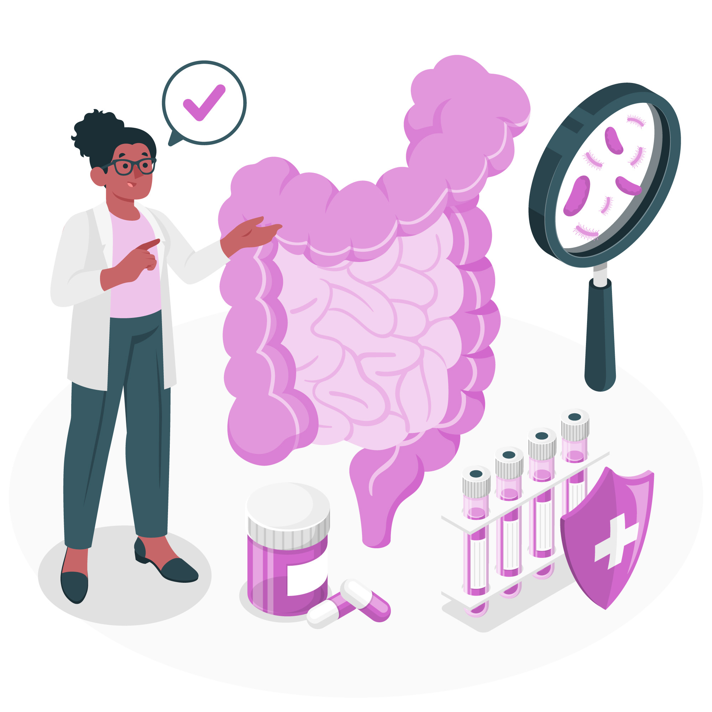

  

	Najbitnije iz teksta:
    <ul class="list list--ul margin-top-sm margin-bottom-0">
      <li>Simptomi nervoznih creva.</li>
      <li>Uzroci pojave nervoznih creva.</li>
      <li>Lečenje nervoznih creva prirodnim načinima.</li>
			<li>Efiksano lečenje suplementima.</li>
		</ul>
  

Da li imate sve ove simptome ili samo neke od njih? 

Neki od ovih simptoma mogu ukazati da bolujete od **sindroma iritabilnog kolona**. Drugi naziv za ovo oboljenje je **sindrom nervoznih creva**.

[Sindrom nervoznih creva je oboljenje koje može biti uobičajena pojava kod nekih ljudi](https://www.healthline.com/health/nervous-stomach). U ovakvo stanje se u medicini ne može dijagnostikovati, a potvrđuje se isključivanjem drugih bolesti. Ovo stanje može imati veze sa Vašim mentalnim zdravljem ili emocionalnim stanjem. Retko može upućivati na nešto ozbiljnije.

*Fotografija: freepik.com*

## Iritabilni kolon

Dijagnoza iritabilnog debelog creva može biti izazovna, jer ne postoji poseban test za to. Lekari se obično oslanjaju na prisustvo određenih simptoma i odsustvo drugih uslova da bi postavili dijagnozu.

**Iritabilni kolon** je najčešće gastroenterološko oboljenje. Manifestuje se bolom u stomaku, grčevima, nadutošću, zatvorom ili dijarejom. Ovi simptomi dolaze i odlaze i mogu trajati danima, nedeljama ili mesecima. 

Neretko, ovaj zdravstveni problem ne može da eliminiše do kraja života. Živeti sa ovim zdravstvenim problemom nije lako i svakako ima uticaj na Vaš svakodnevni život. Žene u odnosu na muškarce češće oboljevaju, i ovaj zdravstveni problem se najčešće javlja u trećoj i četvrtoj deceniji života. 

Kod ovog oboljenja ne postoji upala creva, reč je o zdravim crevima, ovde je uzrok bolesti najčešće **funkcionalni poremećaj komunikacije između mozga i digestivnog trakta**. Ovo oboljenje nije opasno i lekovima kao i promenom u ishrani možete kontrolisati simptome i samim tim sebi olakšati svakodnevnicu.

Uzrok nastanka ovih simptoma može biti **hrana, stres ili nasledni faktor**.

## Iritabilni kolon - simptomi 

Najčešći simptomi ovog oboljenja su:

- Bolovi u stomaku
- Grčevi (najčešće se javljaju nakon jela)
- Nadutost 
- Mučnina
- Dijareja
- Zatvor

Ovi simptomi mogu biti slabiji ili jači. Često se javljaju kao posledica unosa određene hrane ili pića. Ukoliko imate ove ili slične simptome u dužem vremenskom periodu, javite se lekaru. Otkrivanje oboljenja je prvi korak izlečenju. Takođe, postoje **simptomi ovog oboljenja koji se ređe javljaju**, a koji takođe mogu izazvati nelagodu:

- Leptiri u stomaku
- Drhtanje i trzanje stomačnih mišića
- Osećaj sitosti nakon samo nekoliko zalogaja
- Povećano mokrenje

Ovo oboljenje se ne posmatra kao teški i veliki zdravstveni problem. [U retkim slučajevima ovi simptomi mogu biti uzrok nekog crevnog oboljenja](https://www.healthline.com/health/nervous-stomach#_noHeaderPrefixedContent) sa dugotrajnim posledicama.

## Zašto se javlja ovaj zdravstveni problem?

Iako smo naveli da žene češće pate od ovog sindroma, ovaj zdravstveni problem može imati svako, bez obzira na pol. Najčešće se javlja kod osoba srednjih godina.

Ukoliko ste nervozni u dužem vremenskom periodu moguće je i da će Vaša creva postati nervozna. Psiha i mentalno stanje itekako utiču na digestivni trakt.

Creva i mozak su povezani nervom koji se zove vagus, to je jedan od najvećih nerava u telu. Preko ovog nerva mozak šalje signale u creva, i kada je osoba pod stresom ili anksiozna dolazi do nepravilnosti u radu creva i povećava se digestivna razdražljivost.

Fotografija: freepik.com

Ako često imate probleme sa nervoznim crevima, prvo što bi trebali da uradite kako bi se Vaše stanje poboljšalo, jeste da se pozabavite svojim mentalnim stanjem i da što je više moguće smanjite nivo stresa. **Stres i nervoza su glavni uzrok ovog oboljenja**.

Postoje događaji koji izazivaju stresno stanje kod čoveka, a takvo stanje može biti okidač nastanka **iritabilnog kolona**.

Najčešći uzroci koji dovode do stresa kod ljudi su:

- Hronična bolest
- Smrt voljene osobe
- Promena posla
- Finansijski problemi
- Predstojeći događaj
- Problemi u porodici
- Razvod braka

## Lek za nervozna creva

Na početku, važno je istaći da ne postoji jedan, univerzalni lek za lečenje sindroma nervoznih creva. Kao za svako oboljenje, i za ovo je potrebno doći do dijagnoze, uraditi sve potrebne laboratorijske analize i preglede. Ovo je jako bitno jer se na ovaj način eliminiše mogućnost postojanja nekih drugih bolesti. 

Ovo je oboljenje koje se može lečiti sa više uspeha u zavisnosti od saradnje pacijenta i lekara i upornosti i predanosti obolele osobe. Za lečenje nervoznih creva postoje različiti tretmani i promene načina života koji mogu pomoći.

Od lekova koji se koriste u terapiji koriste se **laksativi**, ukoliko pacijent ima zatvor ili **spazmolitici** ukoliko pacijent ima problema sa grčevima.

Ipak, za ublažavanje simptoma nervoznih creva najčešće se koriste **probiotici**, koji imaju pozitivno dejstvo u regulisanju crevne flore.

[Foreverov probiotik FOREVER ACTIVE PRO-B](https://flpshop.rs/dodaci-ishrani/11842/forever-active-pro-b/360000954255/personal.html) sadrži najnovije klinički ispitane probiotske sojeve bakterija. Ovaj preparat sadrži 6 različitih sojeva bakterija koje sinergijski deluju (klinički dokazano) što će blagotvorno delovati na Vaš digestivni trakt i crevnu floru. Takođe, ovom preparatu je dodat cink koji će dati dodatnu potporu Vašem imunom sistemu.

Korišćenjem ovog preparata ćete značajno doprineti poboljšanju ovog zdravstvenog problema i time sebi značajno olakšati svakodnevnicu.

Razgovor sa psihijatrom Vam može pomoći da probleme shvatite na drugačiji način. Takođe, pomoći će Vam da nađete načine za bolje suočavanje sa stresom. Učiniće da, problem koji Vam je izazivao stres, više ne izgleda tako opasno po Vas.

U najtežim slučajevima terapija u lečenju ovog zdravstvenog oboljenja podrazumeva korišćenje **sedativa i antidepresiva**.

 

	

		

			<g-image class="" src="~/assets/img/forever_active_pro_b.jpeg" alt="probiotik za nervozna creva"></g-image>
		

		

			

				

					<h2 class="text-lg">Forever Active Pro-B Probiotik</h2>
				

        

					

						<g-image style="width: auto !important;" class="margin-left-important" src="~/assets/img/check.svg"></g-image>
							Za zdrav sistem za varenje
					

          

						<g-image style="width: auto !important;" class="margin-left-important" src="~/assets/img/check.svg"></g-image>
						  10 milijardi korisnih bakterija
					

          

						<g-image style="width: auto !important;" class="margin-left-important" src="~/assets/img/check.svg"></g-image>
							Poboljšava imunitet
					

          

						<g-image style="width: auto !important;" class="margin-left-important" src="~/assets/img/check.svg"></g-image>
							Podstiče varenje i ubrzava metabolizam
					

				

			

			

				<g-link to="/dodaci-ishrani/probiotik-forever-living/" class="kupiteCTA btn btn--primary flex-grow center-between@lg justify-center btn--md">
					Saznajte više
				</g-link>
				<g-image style="width: auto !important;" class="" src="~/assets/img/logo-futer.png"></g-image>
			

		

	

 

## Prirodni lekovi u lečenju nervoznih creva

Prirodni lekovi za lečenje simptoma nervoznih creva se preporučuju ne samo kao lek kad se oboljenje pojavi, već i **preventivno**.

Prirodni, biljni čajevi će Vam itetako biti od koristi u borbi protiv ovog oboljenja. Za smirivanje creva i stabilizaciju njihovog rada preporučuju se **čajevi od aromatičnih biljaka** sa etarskim uljima. 

U tu grupu biljaka spadaju **nana, majčina dušica, kamilica, hajdučka trava i matičnjak**. Koju god od ovih biljaka da izaberete za pripremu čaja, nećete pogrešiti.

**Mirisni čaj** će umiriti i Vas i Vaša creva. 

## Ishrana u lečenju nervoznih creva

Lečenje nervoznih creva podrazumeva korišćenje određenih zdravih namirnica korisnih za Vaša creva, kao i smanjivanje ili potpuno izbacivanje jednog broja namirnica iz ishrane.

Jako je bitan i broj obroka koji imate dnevno, kao i učestalost istih.

Preporuka je da smanjite obroke i da imate više obroka od uobičajenog. Time ćete pomoći Vašem želucu jer ćete ga značajno rasteretiti. Takođe, izbegavajte bilo kakav obrok **najmanje 2 sata pre nego što odete u krevet**.

**Namirnice koje se preporučuju** u borbi protiv ovog oboljenja su:

- Povrće, posebno se preporučuje kelj, spanać i zelena salata
- Voće, preporučuje se konzumiranje ranije u toku dana
- Zdrave masti, žumance, losos i kokosovo ulje
- Proteini, nedostatak proteina je česta pojava kod ljudi koji boluju od ove bolesti
- Domaća supa
- Sok od svežeg voća i povrća

**Namirnice koje treba izbegavati**:

- Previše začinjenu hranu
- Šećer i slatkiše
- Gazirana i alkoholna pića
- Kafu
- Pasulj, kupus i brokoli
- Testenine od belog brašna

## Nema nervoze nema ni nervoznih creva 

Svakodnevno se susrećemo sa stvarima i događajima koji potencijalno mogu imati uticaj na naše raspoloženje. Nažalost, više je onih događaja koji imaju negativan uticaj.

U takvim okolnostima jako je bitno znati kontrolisati svoje emocije i ne dozvoliti da takve stvari previše utiču na raspoloženje. Na taj način kontrolišete i količinu **stresa** sa kojom se susrećete. 

**Stres i nervoza** su najveći uzročnici nastanka zdravstvenih problema pa tako i **sindroma nervoznih creva**. Potrudite se da poboljšate svoje raspoloženje, to će blagotvorno delovati na opšte zdravstveno stanje.

Vežbajte. Kombinujte mentalne i fizičke vežbe.

**Mentalne vežbe i vežbe disanja** će Vam pomoći da se usredsredite na dah, na trenutak, na sebe, na sadašnjost. To će Vam pomoći da kontrolišete nivo stresa. **Fizičke vežbe** čine čuda za Vaše telo i Vaš um. Pronađite vreme za njih i naučite da uživate u njima. Tada ćete osetiti blagotvornost.

Izbacite sve loše navike iz vaše svakodnevnice, ili bar većinu njih. Izdvojite vreme za druženje, oraspoložiće vas.

Primenite ovo već od sutra. Vremenom će se raspoloženje popraviti, **stres** će nestati a sa njim i simptomi **sindroma nervoznih creva**. 

 

_Fotografije: Freepik, Unsplash, Pixabay_

