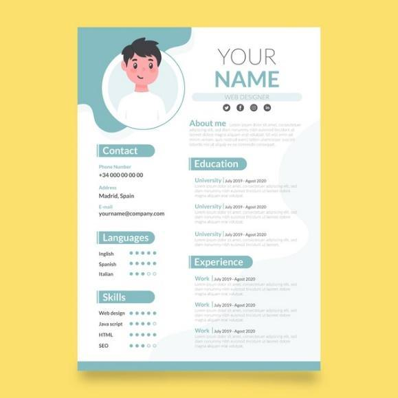

Spremate se u potragu za poslom i nije vam jasno kako to da s jedne strane postoji tako visoka stopa nezaposlenosti, dok su s druge strane rubrike oglasa za poslove prepune.  Pomalo zbunjeno se prisećate koliko ljudi poznajete da godinama neuspešno traže posao u struci. Ne želite da budete jedan od njih.

Počinjete da čitate zahteve iz oglasa i shvatate da su u velikom broju slučajeva teško dostižni. Svuda postoji bar jedna tražena stavka koju vi nemate. Sustiže vas razdražljivost, nemir, pa i ljutnja, jer znate koliko ste napora uložili u sebe da bi danas posedovali ove kvalitete. Pitate se da li se uopšte vaše kvalifikacije i veštine cene u današnjem poslovnom svetu? Polako se javlja sumnja u sebe i strah od neizvesne budućnosti. 

Pa čak i tada, nastavljate da pretražujete oglase i konačno ga nalazite! 

Pravi poslovni oglas za vas. 

Čitate ga pažljivo i uvereni se da zadovoljavate sve zadate kriterijume, šaljete aplikaciju za posao, ali ni posle dve nedelje od isteka oglasa ne dobijate odgovor. U čemu je problem?

Možda je vreme da se proveri koliko dobar CV imate u odnosu na ono šta poslodavci danas traže da vide.

Ukoliko prvi put u životu konkurišete za neki posao ili napuštate trenutni posao i ulazite u potragu za novim, sama aktivnost traženja posla uopšte nije laka i predstavlja posao sama po sebi. 

Pisanje biografije, praćenje oglasa i komunikacija sa agencijama za zapošljavanje nas iscrpljuju, pune su stresa, neizvesnosti i brige. 

Prolazak kroz sve ove aktivnosti, uz saznanje da imate dobro napisan CV, skraćuje vam vreme traženja posla i približava vas potencijalnim poslodavcima kroz brojnije intervjue

## Na čemu se temelji dobar CV?

Dobar CV treba da je koncizan i jasan. Dobar CV čitaocu stavlja do znanja:

- koje je vaše profesionalno zvanje,
- u kojim se veštinama ističete,
- šta je to što ste do sada ostvarili
- kojim narednim dostignućima stremite.

Proverite šta se očekuje u vašoj industriji, obratite pažnju ako je u pitanju posao inostranstvu šta se tamo traži, koja forma, koji jezik i stil izražavanja. 

U nastavku sledi prikaz nekih od uputstava za pisanje dobre biografije datih od strane jednog od istaknutih menadžera za ljudske resurse, kao i od strane profesionalnih kompanija za zapošljavanje poput Indeed ili Monster. 

1. Nakon navođenja osnovnih podataka o sebi **predstavite se u tri do četiri rečenice.** Uvod “nosi” ceo CV. Mnogi potencijalni poslodavci neće stići da pročitaju svaki CV od početka do kraja i zato je važno da CV ima uvod i da on odaje sve vaše najznačajnije odlike.

2. Čak i sa dobrim uvodom, osobe koje čitaju vaš CV i odlučuju o daljim koracima zapošljavanja često u procesu čitanja gube interesovanje zbog dugih rečenica, nepotrebnih atributa i preširokih deskripcija. Izbegavajte ih. **Upotrebite nabrajanja, kratke i konkretne rečenice** koje ističu suštinu. Orijentir za dužinu neka vam bude jedna do dve stranice pisane veličinom slova 10  -  12 i izborom stila slova kao što su Calibri, Arial, Tahoma, Lucida Sans i slično.

3. Kada krenete sa sastavljanjem biografije **vaša najveća dostignuća istaknite na početku.**

4. Izbegavajte nabrajanje zaduženja koje ste obavljali ili opise poslova iz sistematizacije. Potencijalnog poslodavca to najčešće ne zanima. Umesto toga naglasite koja su vaša dostignuća. Još ako su ona merljiva prema nekim statističkim ili numeričkim pokazateljima, imate bonus u rukama. **Prikažite načine ostvarivanja tih dostignuća ili načine rešavanja problema.**

5. Obratite pažnju na **ključne reči** koje sadrži sam oglas za posao i upravo njih upotrebite kada opisujete svoja iskustva i ostvarenja. 

6. Fokusirajte se na **skorašnja i relevantna** iskustva koja ste stekli uz pomoć nabrojanih veština ili znanja stečenih na navedenim kursevima, konferencijama ili seminarima. CV treba da skrojite tako da odgovara opisu posla iz oglasa.

7. U CV ne unosite razloge odlaska sa prethodnog posla ili razloge zašto imate vremenski razmak od prethodnog posla do datuma apliciranja na dati posao. Ne unosite lične podatke poput godina, bračnog statusa, dece, etničkog porekla, veroispovesti i slično.

8. Ukoliko oglas zahteva, napišite **propratno pismo**. Ono je vaš izlog, mesto gde predstavljate sebe i svoje ciljeve i gde dajete do znanja potencijalnom poslodavcu zašto baš vi kao takvi odgovarate traženoj poziciji. Dobro napisano [propratno pismo](https://ie.indeed.com/career-advice/cvs-cover-letters/how-to-write-a-cover-letter) je upravo nešto što može čitaoca da natera da pročita i CV. 

9.  Proverite i osigurajte da CV ne sadrži žargone, pravopisne ili gramatičke greške.

10. Dizajn ili šablon koji izaberete ili sami kreirate za CV trebalo bi da zavisi od vrste posla na koji aplicirate. Ako je u pitanju posao iz oblasti umetnosti, marketinga ili dizajna, kreiranje izgleda biografije može vam ići u prilog jer ističe kreativnost koju posedujete. Za poslove kod kojih kreativnost nije veština koja se posebno ceni, izborom jedne već ponuđenih formi možete biti relativno sigurni da ste koristili nešto što je opšte prihvaćeno i samim tim da niste pogrešili.

## Koje su to još sitne, a bitne stavke koje treba znati kada se kreira dobar CV formular

Stručnjaci iz odeljenja za ljudske resurse posvete [6  -  8 sekundi](https://www.hrdive.com/news/eye-tracking-study-shows-recruiters-look-at-resumes-for-7-seconds/541582/) za svaki CV pre nego što donesu odluku da li će kandidata pozvati na intervju ili će ga odbaciti. 

Prvih 10  -  15 reči u biografiji su najvažnije. Kreirajte ih sa posebnom pažnjom. Toliko reči prosečan čitalac uspe da pročita za 6 - 8 sekundi.

Ono što se pročita u prvoj trećini biografije najčešće je presudno za donošenje odluke o tome da li će se ići sa čitanjem do kraja ili će se CV odbaciti.

Pregled dosadašnje karijere i ostvarenih dostignuća je deo biografije koji će najverovatnije uvek biti pročitan.

Mnoge kompanije danas koriste ATS (sistem za praćenje podnosilaca zahteva) koji CV skenira prema unapred zadatim ključnim rečima navedenim u opisu posla u oglasu.

Ukoliko u CV unesete ključne reči sa bilo kakvim izmenama u odnosu na one definisane u opisu posla u oglasu, poput „menadžment ljudskih resursa“ umesto „menadžer ljudskih resursa“, moguće je da će ga ATS odbaciti kao neadekvatan u odnosu na zadati kriterijum.

ATS takođe može da odbaci CV koji obiluje neuobičajenim oblikom slova, fotografijama, pravopisnim ili greškama u kucanju i zato pronađite bar jednu adekvatnu osobu koja će pročitati finalnu verziju biografije kako bi eventualno uočila greške pre podnošenja aplikacije za posao.

