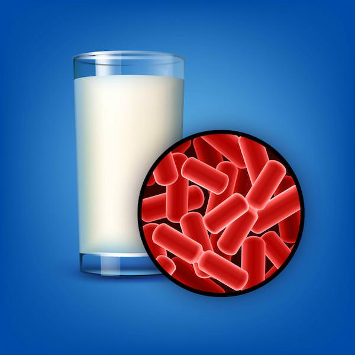

  

	Najbitnije iz teksta:
    <ul class="list list--ul margin-top-sm margin-bottom-0">
      <li>Uzroci prekomernog rasta kandide.</li>
      <li>Medicinsko lečenje kandide.</li>
      <li>Dijeta u slučaju kandide.</li>
		</ul>
  

Jedan od glavnih razloga nastanka prekomernog rasta kandide je ishrana bogata šećerima. Upravo zato, vrlo jednostavne promene u načinu ishrane mogu smanjiti, pa i zaustaviti taj proces.
Prekomerni rast kandide je uobičajen problem koji može izazvati širok spektar simptoma, od problema sa varenjem do osipa na koži ili čak anksioznost i depresiju. Ako sumnjate da imate prekomerni rast kandide, važno je preduzeti korake da rešite problem i vratite svoje telo u ravnotežu. Jedan od najefikasnijih načina da se to uradi jeste i [dijeta]( https://candidaspecialists.com/anti-candida-diet/) za čišćenje kandide.

## Uzroci prekomernog rasta kandide

Kandida je vrsta kvasca koja je prirodno prisutna u telu, ali kada preraste, može izazvati razne probleme. Postoji nekoliko faktora koji mogu doprineti prekomernom rastu kandide, uključujući:

**Upotreba antibiotika**: Antibiotici mogu poremetiti ravnotežu bakterija u crevima, što dovodi do veoma velikog povećanja broja bakterije kandide.

**Hormonski disbalans**: veća je verovatnoća da će kandida nabujati tokom hormonskih promena, kao što je tokom trudnoće ili menopauze.

**Loša ishrana**: Ishrana bogata rafinisanim šećerima i prerađenom hranom može doprineti prekomernom rastu kandide.

**Stres**: Stres može oslabiti imuni sistem i otežati telu da kontroliše rast kandide.

## Simptomi kandidijaze:

- Nadimanje, konstipacija ili dijareja
- Svrab kože
- Česte urinarne infekcije
- Mučnina
- Hronični umor
- Svrab, crvenilo i beličast vaginalni sekret kod žena
- Anksioznost ili depresija
- Glavobolje, nervoza, promene raspoloženja
- Bolovi u mišićima i zglobovima
- Bele naslage na jeziku i usnoj duplji

Osim navedenih, postoji čitav [spektar simptoma]( https://www.kandida.rs/candida-kandida-simptomi/) koji mogu ukazivati na prekomerni rast kandide i dobro je ne zanemarivati ih pri konsultacijama sa lekarom.
Kandidijaza se najčešće ne ispoljava na isti način ili na istom području kod dve različite individue. Osim toga, neki simptomi prekomernog rasta kandide podudaraju se sa simptomima drugih tegoba ili bolesti organizma, te je postavljanje tačne dijagnoze time otežano. Zato je pre uzimanja bilo kakve terapije potrebno utvrditi tačan uzrok simptoma i tek tada ih tretirati.

## Medicinski tretman kandide
Iako postoji veliki broj lekova koji se mogu koristiti za lečenje prekomernog rasta kandide, pristup ishrani je često najefikasniji. To je zato što ishrana sa malo šećera i visokim sadržajem zdravih masti, proteina i povrća bez skroba može pomoći u izgladnjivanju kandide i uspostavljanju ravnoteže bakterija u crevima.

## Dijeta za kandidu
Ključ uspešne dijete za čišćenje kandide jeste izbegavanje hrane koja hrani kandidu i umesto toga fokusiranje na hranu koja podržava rast korisnih bakterija.  Kandida ishrana ogleda se kroz smanjeni unos šećera, alkohola i namirnica koje sadrže kvasac, kao i povećan unos povrća, nemasnih proteina i zdravih masnoća. Ovo uključuje:

**Izbegavanje šećera**: Ovo uključuje rafinisane šećere, kao i prirodne zaslađivače poput meda i javorovog sirupa. Umesto njih možete koristiti steviu ili ksilitol.

**Izbegavanje rafinisanih ugljenih hidrata**: Ovo uključuje belo brašno, beli pirinač i testeninu.

Jedite puno **povrća bez skroba**: To uključuje lisnato povrće, brokoli, karfiol, paradjaz, celer, krastavac, patlidžan, tikvice i špargle.

**Jedite zdrave masti**: Ovo uključuje kokosovo ulje, maslinovo ulje i avokado.

**Jedite fermentisanu hranu**: To uključuje jogurt, kefir ili kiseli kupus.

Pored gore navedenog, važno je da se uverite da unosite dovoljno **proteina** (piletina, ćuretina, jaja, riba) i  kako biste podržali rast korisnih bakterija. 

Od **napitaka** dozvoljeni su voda i nezaslađeni čajevi.

Takođe, danas su na internetu dostupni odlični [recepti za anti kandida dijetu]( https://www.thecandidadiet.com/recipe-type/lunch-dinner/), ali ih uz malo mašte i volje možete i sami spremiti uživajući baš u onim namirnicama koje najviše volite ili su vam najdostupnije.

 

	

		

			<g-image class="" src="~/assets/img/forever_active_pro_b.jpeg" alt="najbolji probiotik za kandidu"></g-image>
		

		

			

				

					<h2 class="text-lg">Forever Active Pro-B Probiotik</h2>
				

        

					

						<g-image style="width: auto !important;" class="margin-left-important" src="~/assets/img/check.svg"></g-image>
							Za zdrav sistem za varenje
					

          

						<g-image style="width: auto !important;" class="margin-left-important" src="~/assets/img/check.svg"></g-image>
						  10 milijardi korisnih bakterija
					

          

						<g-image style="width: auto !important;" class="margin-left-important" src="~/assets/img/check.svg"></g-image>
							Poboljšava imunitet
					

          

						<g-image style="width: auto !important;" class="margin-left-important" src="~/assets/img/check.svg"></g-image>
							Podstiče varenje i ubrzava metabolizam
					

				

			

			

				<g-link to="/dodaci-ishrani/probiotik-forever-living/" class="kupiteCTA btn btn--primary flex-grow center-between@lg justify-center btn--md">
					Saznajte više
				</g-link>
				<g-image style="width: auto !important;" class="" src="~/assets/img/logo-futer.png"></g-image>
			

		

	

 

**Zaključak**

Prekomerni rast kandide može biti frustrirajući i iscrpljujući problem, ali ako pratite dijetu za čišćenje kandide, možete uspostaviti ravnotežu u svom telu i ublažiti simptome. Izbegavajući hranu koja hrani kandidu i umesto toga fokusirajući se na hranu koja podržava rast korisnih bakterija, možete preuzeti kontrolu nad svojim zdravljem i osećati se bolje za kratko vreme.

 

_Fotografije: Freepik, Unsplash, Pixabay._

