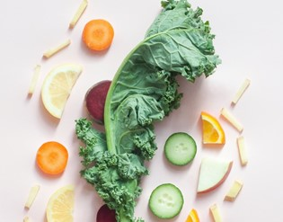

Osećaj umora, manjka energije i entuzijazma sve češći su nam dnevni pratioci. Pripisujemo ih promeni vremenskih uslova, dolasku proleća, ubrzanom tempu rada na poslu, brigama oko porodice i finansijskog stanja, opterećenošću očekivanjima koje ljudi imaju od nas.

Vreme prolazi, ali umor ne. On prerasta u hronični, dok se javljaju i nove tegobe poput nadutosti, otežanog varenja, ili svraba kože, zatim česte promene raspoloženja, pa čak i mučnina.

Zabrinutost i strah, najverovatnije će nas naterati da ove iritirajuće probleme više ne ignorišemo, već da ih lečimo. Međutim, slabe su šanse da lečenje svakog simptoma pojedinačno donese željeni rezultat. Sasvim je moguće da za iza svih pomenutih simptoma stoji jedan uzročnik - prekomerni rast kandide. 

Jedan od glavnih razloga nastanka prekomernog rasta kandide je ishrana bogata šećerima. Upravo zato, vrlo jednostavne promene u načinu ishrane mogu smanjiti, pa i zaustaviti taj proces. 

Kandida ishrana ogleda se kroz smanjeni unos šećera, alkohola i namirnica koje sadrže kvasac, kao i povećan unos povrća, nemasnih proteina i zdravih masnoća. Ovakva ishrana za kandidu potpomaže ponovno uspostavljanje balansa crevne flore, a samim tim i zdravije funkcionisanje celokupnog organizma.

Adekvatna ishrana kod kandide, pored terapije lekovima i eventualno dodatnog unosa vitamina i minerala, može da bude ključni faktor ozdravljenja.

Dijeta je bezbedna, jednostavna, vremenski ograničena, a višestruko učinkovita. Nalazi se pod nazivima [„kandida dijeta“](https://www.thecandidadiet.com/), [„anti kandida dijeta“](https://candidaspecialists.com/anti-candida-diet/), „dijeta za kandidu“ i slično.

**Šta je kandida i šta je kandidijaza?**

Kandida je gljivica koja se uobičajeno nalazi na našoj koži, noktima na nogama, u crevima, ustima, vagini, anusu. Postoji preko 150 vrsta kandida i većina njih nije štetna sama po sebi.

Tek oko 15 vrsta kandide mogu dovesti do kandidijaze, infekcije kandidom nastale njenim prekomernim rastom.

**Simptomi kandidijaze**

- Nadimanje, konstipacija ili dijareja;
- Svrab kože;
- Česte urinarne infekcije;
- Mučnina;
- Hronični umor;
- Svrab, crvenilo i beličast vaginalni sekret kod žena;
- Anksioznost ili depresija;
- Glavobolje, nervoza, promene raspoloženja;
- Bolovi u mišićima i zglobovima;
- Bele naslage na jeziku i usnoj duplji

Osim navedenih, postoji čitav [spektar simptoma](https://www.kandida.rs/candida-kandida-simptomi/) koji mogu ukazivati na prekomerni rast kandide i dobro je ne zanemarivati ih pri konsultacijama sa lekarom. 

Kandidijaza se najčešće ne ispoljava na isti način ili na istom području kod dve različite individue. Osim toga, neki simptomi prekomernog rasta kandide podudaraju se sa simptomima drugih tegoba ili bolesti organizma, te je postavljanje tačne dijagnoze time otežano. Zato je pre uzimanja bilo kakve terapije potrebno utvrditi **tačan uzrok simptoma** i tek tada ih tretirati.  

**Zašto i kada dolazi prekomernog rasta kandide?**

Najčešće su u pitanju sledeći **uzročnici**:

- Upotreba antibiotika;
- Slab imuni sistem;
- Prekomerna konzumacija namirnica bogatih rafinisanim šećerima;
- Prekomerna konzumacija alkoholnih pića;
- Visok nivo stresa;
- Hormonalni disbalans i visok nivo estrogena;
- Dijabetes.

Kod nekih osoba lečenje kandide bez dijete može biti sasvim uspešno.

Mnogi, pak pribegavaju i dijeti, kako zbog njenog pozitivnog uticaja na lečenje kandidijaze, tako i zbog celokupnog pozitivnog delovanja na organizam.

**Dijeta – Opšte napomene**

Cilj dijete je ublažavanje simptoma infekcije kandidom, bilo da je u pitanju kandida u crevima, ustima, vagini ili se radi o bilo kom drugom obliku kandidijaze.

Ne postoji dovoljno naučnih dokaza o njenoj učinkovitosti. Ipak [pojedine studije](https://pubmed.ncbi.nlm.nih.gov/30166063/) donose nam pokazatelje njenog pozitivnog uticaja na borbu protiv kandide.

Ono u čemu se i nauka, ali i zagovornici ove dijete slažu jeste da dijeta nije štetna i da donosi višestruke koristi za organizam uopšte. Bazira se na konzumaciji namirnica koje su potrebne za zdrav rad organizma.

Pre otpočinjanja dijete najbolje je posavetovati se sa lekarom.

„Kandida dijeta“ ili „Anti kandida dijeta“ ima ograničeno trajanje od 4 do 6 meseci. Ovo je neko opšte pravilo. U zavisnosti od težine slučaja, dijeta može da se drži i kraći, ali i duži vremenski period od navedenog.

Dijeta se zasniva na izbacivanju svih oblika šećera, žitarica koje sadrže gluten i namirnica koje sadrže kvasac, kao i određenih mlečnih proizvoda, alkohola i veštačkih zaslađivača. Preporučuju se nemasno meso, povrće sa nižim sadržajem skroba, voće sa nižim sadržajem šećera i tzv. zdrave masnoće. 

Na ovaj način eliminišu se supstance kojima se kandida „hrani“, pa se zaustavlja i njen prekomerni rast, odnosno infekcije koje on izaziva.

## Anti kandida dijeta jelovnik

[**Dozvoljene namirnice i namirnice koje treba izbegavati**](https://www.healthline.com/nutrition/candida-diet#foods-to-avoid)

**PROTEINI**

**Dozvoljeni:** piletina, ćuretina, jaja, riba (losos, haringa, sardina, inćuni; 

**zabranjeni:** mesne prerađevine, svinjetina i riba iz ribnjaka.

**MASNOĆE**

**Dozvoljeni:** avokado, maslinovo, kokosovo, susamovo i laneno ulje; 

**zabranjeni:** margarin, svinjska mast, rafinisana ulja poput suncokretovog.

**ORAŠASTI PLODOVI I SEMENKE**

**Dozvoljeni:** bademi, kokos, lešnici, suncokret, lan; 

**zabranjeni:** kikiriki, indijski orah, pekan i pistaći.

**POVRĆE**

**Dozvoljeni:** brokoli, kelj, prokelj, luk, paradajz, kupus, celer, krastavac, beli luk, patlidžan, spanać, tikvice; 

**zabranjeni:** grašak, pasulj, krompir, kukuruz, batat.

**VOĆE**

**Dozvoljeni:** limun, limeta, masline, bobičasto voće u umerenim količinama; 

**zabranjeni:** banane, urme, grožđe, mango i ostalo voće bogato šećerom.

**ŽITARICE I PSEUDOŽITARICE**

**Dozvoljeni:** kinoa, ovsene mekinje, heljda, proso, pirinač, tef brašno; 

**zabranjeni:** pšenica, raž, spelta i ječam.

**MLEČNI PROIZVODI**

**Dozvoljeni:** jogurt i kefir koji sadrže probiotike; 

**zabranjeni:** sir, mleko i pavlaka.

**ZASLAĐIVAČI**

**Dozvoljeni:** stevia, erythritol i xylitol; 

**zabranjeni:** kukuruzni, javorov i sirup od trske, agava, melasa, med, šećer i aspartam.

**NAPICI**

**Dozvoljeni:** voda, nezaslađeni biljni čajevi; 

**zabranjeni:** kafa, energetska pića, sokovi, vino, pivo.

**DODACI JELIMA**

**Dozvoljeni:** biber, so, cimet, mirođija, đumbir, origano, paprika u prahu, ruzmarin, kurkuma, majčina dušica; 

**zabranjeni:** kečap, majonez, soja sos, sirće i ostali dodaci koji sadrže nepreporučene namirnice.

Danas su na internetu dostupni [odlični recepti](https://www.thecandidadiet.com/recipe-type/lunch-dinner/) za anti kandida dijetu, ali ih uz malo mašte i volje možete i sami stvarati uživajući baš u onim namirnicama koje najviše volite ili su vam najdostupnije.

**Pre same dijete – čišćenje organizma**

Nije neophodno, ali pre otpočinjanja dijete, često se preporučuje takozvano **čišćenje organizma** od nakupljenih toksina (eng. Candida Cleanse). Postoji verovanje da ovaj detoks pomaže i kod oslobađanja stresa na digestivnom traktu. Kada se traži što bolja ishrana za kandidu u crevima, detoks bi mogao da bude ključ koji će značajno da poveća željenu učinkovitost.

Iako se ne smatra da postoji dovoljno naučnih studija koje bi ove tvrdnje podkrepile, ne osporava se verovatnoća da će osoba lakše da se prilagodi novom režimu ishrane nakon sprovedenog čišćenja organizma.

Uobičajeni načini čišćenja su:

- Ispijanje tečnosti, poput vode sa limunom, supe od kostiju, odnosno bujona;
- Konzumiranje povrća svežeg ili spremljenog na pari uz male količine proteina.

Na ovaj način „očistićete“ creva i izbaciti velike količine kandide i njenih toksičnih nusproizvoda.

Čišćenje organizma ne bi trebalo da traje duže od dva do tri dana. Imajte u vidu da su umor, glavobolje, promene raspoloženja i nesanica česti pratioci čišćenja organizma.

**Dodatne prednosti dijete**

Kandida dijeta iskustva su različita. Ono što je zajedničko svima jeste da ishrana bez rafinisanih šećera i belog brašna, bez brze hrane i nezdravih masnoća organizmu donosi višestruku dobrobit:

- Dovodi do mršavljenja;
- Dobra je za očuvanje zdravlja kardio-vaskularnog sistema;
- Pomaže pravilnom radu digestivnog trakta;
- Utiče na smanjenje upalnih procesa u organizmu;
- Pomaže kod gojaznosti, dijabetesa, visokog pritiska i srčanih problema;
- Utiče na bolje opšte psihičko stanje individue.

Kandida ishrana ne broji kalorije, ne izgladnjuje organizam niti dovodi do bilo kakvih drugih neželjenih efekata.

Ako ste voljni da isprobate dijetu, osluškujte svoj organizam, pratite šta vam prija i koje promene doživljavate. Ne dozvolite da vam ishrana postane jednolična, već pronađite recepte sa namirnicama koje volite i uživajte u jelima.

Kandida dijeta nije dijeta koja unosi dodatni stres u život. Proces izlečenja možete učiniti još mirnijim, a rezultate potpunijim, ako uz pravilnu ishranu počnete sa upotrebom adekvatnih suplemenata na prirodnoj bazi, ili biljnih čajeva namenjenih oslobađanju od kandide.

Zašto čekati ponedeljak, kad se sa dijetom može krenuti već sada?
