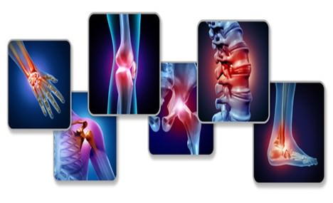

	

Bolovi u kolenu pri penjanju uz stepenice, bolovi u prstima kojima je nemoguće obavljati svakodnevne aktivnosti, otečeni zglobovi, sve to muči kako mlađu, tako i stariju populaciju.

Osećate bol u donjem delu leđa i u vratu koji je intenzivniji u jutarnjim časovima. Često se pitate šta je uzrok koji izaziva mišićnu slabost i gubitak energije.

Nažalost, ovi zdravstveni problemi postaju svakodnevnica sve većeg broja ljudi, kako u Srbiji, tako i u svetu. Redovnim odlascima kod lekara i dijagnostikom možete saznati da li patite od reume ili reumatoidnog artritisa i adekvatnom terapijom ublažiti simptome bolesti.

**Šta je reuma a šta reumatoidni artritis? Postoji li razlika između ove dve bolesti?**

**Reuma** ili **reumatoidni artritis** je autoimuna bolest koja u većini slučajeva izaziva hroničnu upalu u zglobovima, tako što pogađa, tj. napada sluzno tkivo u zglobovima i tako dovodi do upala.

Izraz reuma se prvi put koristi u medicini od 1670.godine, koji opisuje bolna stanja **mišića**, **zglobova** i **kostiju**.

Iako je poznato da reumatoidni artritis napada zglobove, takođe može da izazove upale unutrašnjih organa, upale nervnog sistema i upalu kože.

Ova bolest najčešće napada žene. Prvi simptomi javljaju se u starosnoj dobi od 30 do 60 godina, a ređe muškarce i to u starosnoj dobi posle 45. godine.
U Evropi, 60% od ukupnog broja ljudi kod kojih je dijagnostikovan neki oblik reumatskih oboljenja čine upravo žene. [Preko 100 miliona evropljana je pogođeno reumatskim bolestima](https://www.news-medical.net/health/What-is-Rheumatism.aspx). To je skoro četvrtina stanovništva kontinenta.

**Artritis** je hronična ili akutna “bolest zglobova”, koja karakteriše promene u zglobovima, ukočenost i bol koji su uzrokovani upalom. Ova bolest se može povezati sa starenjem ili sa nekom povredom.

Najčešće se javlja kod starijih osoba, ali se takođe može pojaviti i kod osoba koje opterećuju svoje zglobove. To su osobe sa prekomernom težinom ili profesionalni sportisti.

Fotografija: Adobe Stock

Iz definicije **reume** i definicije **artritisa**, možemo zaključiti da nema razlike u simptomima bolesti, ali da su različiti uzroci nastanka bolesti.

**Šta izaziva reumatoidni artritis?**

Ne može se sa sigurnošću potvrditi šta može biti uzrok nastanka bolesti. Postoje faktori koji mogu povećati rizik od razvoja reumatoidnog artritisa.

To su dva faktora:

- Nasledni faktor
- Biti žena

Postoje i faktori koji mogu da utiču na nastanak reumatoidnog artritisa:

- Postojanje gihta
- Kod pojedinih osoba se može razviti reumatoidni artritis nakon što su preležale lajmsku bolest, ili su imale neku drugu virusnu ili bakterijsku infekciju
- Psorijaza
- Trauma ili povreda
- Iščašenje zgloba
- Pušenje
- Gojaznost
- Ponekad upala može nastati bez ikakvog razloga

## Kako dijagnostikovati artritis i reumu?

[Dijagnostikovanje reumatoidnog artritisa](https://www.healthline.com/health/rheumatoid-arthritis#diagnosis) nije jednostavno i može potrajati. Postoje testovi na osnovu kojih se može ustanoviti postojanje bolesti.

Prvo, lekar će izvršiti fizički pregled zglobova, i to:

- Pokretljivost zglobova
- Da li postoji otok i crvenilo
- Reflekse
- Mišićnu snagu
- Toplinu zglobova 

Ukoliko lekar nakon ovih pregleda utvrdi da potencijalno bolujete od nekog reumatoidnog oboljenja, uputiće Vas kod **lekara specijaliste reumatologa**.

Treba napomenuti da ne postoji test na osnovu kog se može sa sigurnošću potvrditi dijagnoza na ovu bolest. Zato lekari reumatolozi vrše nekoliko testiranja.

Postoji test krvi uz pomoć kog se mogu utvrditi postojanja određenih antitela i to može biti znak postojanja bolesti.

Takođe, mogu se sprovesti i testovi snimanja zglobova, odnosno bolnih mesta.

Još uvek se najčešće koriste tehnike snimanja, kao što su:

- MRI (magnetna rezonanca)
- CTG
- Ultrazvuk

Na osnovu ovih testova snimanja može se ustanoviti da li je došlo do oštećenja zglobova i koliki je stepen oštećenja.

**Najčešći simptomi kod reumatoidnog artritisa**

Reumatoidni artritis je hronična bolest koju najčešće karakterišu bolovi u zglobovima. Ovi bolovi se javljaju u određenim periodima, ali postoje i periodi kad potpuno nestanu.

Neki od uobičajenih simptoma su:

- Upala samog zgloba i deo oko zgloba
- Javlja se bol, osetljivost na dodir i ukočenost
- Ograničena je pokretljivost zgloba
- Deformitet zgloba
- Dolazi do gubitka energije i pokretljivosti samog zgloba 
- Stvara se otok
- Ponekad dolazi do gubitka težine, a u nekim slučajevima i do anemije

Simptomi ove bolesti mogu varirati od blagih do teških. Važno je ne zanemarivati ove simptome, jer ako se bolest otkrije u ranoj fazi, pomoćiće i Vama, a i lekaru u lečenju bolesti.

**Lečenje reumatoidnog artritisa**

Smatra se da se reumatoidni artritis ne može izlečiti i da ne postoji lek, ali se isto tako može reći da se njegovo delovanje može usporiti i ublažiti kod lakših slučajeva odnosno simptoma, dok se kod težih slučajeva preporučuje operacija.

Tretmani, odnosno lečenje, pomažu u upravljanju bolom i kontroli upalnog procesa koji mogu dovesti do smanjenja, a neretko i do potpunog nestanka bola.

Tretmani uključuju:

- Lekove
- Posebne vežbe i fizička kontrola
- Alternativni kućni lekovi
- Pravilna ishrana

**Lekovi**

Jedan od lekova koji se primenjuje u lečenju ove bolesti je [metotreksat](https://www.reumatologija.rs/bolesti/reumatoidni-artritis/). Ovaj lek smanjuje upalu i usporava napredovanje bolesti.

Kod pacijenata kod kojih uzimanje ovog leka ne doprinosi dovoljno u lečenju bolesti, preporuka lekara je da se uzimaju i drugi lekovi, s tim da se ne prekida uzimanje metroteksata.

**Fizička aktivnost**

Fizička aktivnost je preduslov za dobro stanje organizma tako da je i kod ove bolesti preduslov za lakše i uspešno lečenje.

Vežbanje je veoma bitno za očuvanje pokretljivosti zglobova i kondicije i treba da postane svakodnevnica u borbi protiv reumatoidnog artritisa.

Takođe, jako je bitno održavati normalnu telesnu težinu jer se time smanjuje pritisak na zglobove.

 

Fotografija: Adobe Stock

**Alternativni kućni lekovi**

**Čaj od pšenice:**

Ovaj čaj je dobar za opšte stanje organizma, a pogotovo za ljude koji imaju reumatske probleme. Bogat je vitaminima B-kompleksa. 

**Sastojci:** 500 gr pšenice, 200 ml meda i 1 l vode. **Priprema:** Pšenicu oprati, pa osušiti. Kada se osuši pecite je u suvom tiganju sve dok ne počne da pucketa. Pečena zrna pšenice stavite u šerpu i prelijte vrelom vodom. Kuvati na laganoj vatri 15 minuta. Sklonite sa šporeta i nakon što odstoji 5 minuta dodajte med. Promešajte i čaj je spreman za upotrebu.

**Pravilna ishrana kod lečenja bolesti**

Pravilna ishrana podrazumeva unošenje različitih namirnica iz svih grupa.

Pod tim se podrazumeva:

- Ishrana sa obiljem žitarica
- Povrće i voće
- Izbaciti što je više moguće unos šećera i soli
- Mleko i mlečni proizvodi, riba i meso

Izbegavajte što više prženu i pečenu hranu. Barena hrana se preporučuje.

Takođe, pored zdrave i raznovrsne ishrane preporuka je da se uzimaju određeni suplementi koji će ubrzati lečenje i samim tim doprineti da bol nestane.

[Forever Move](https://flpshop.rs/dodaci-ishrani/11800/forever-move-esm-complex/360000954255/personal.html) i [Forever Freedom](https://flpshop.rs/napici/11619/forever-freedom/360000954255/personal.html) su najnoviji klinički ispitani preparati koji se koriste kao dodaci ishrani čijim ćete konzumiranjem i pravilnim korišćenjem  osetiti olakšanje pri kretanju i fleksibilnost pokreta. Forever Freedom sadrži materije koje pospešuju i održavaju bolji rad vezivnog tkiva i daje pokretljivost zglobova. Ima prijatan ukus narandže.  

Jako je bitno imati svest o tome da ćete pravilnom ishranom i izbacivanjem loših navika iz Vašeg života bitno uticati na opšte stanje Vašeg organizma, a samim tim doprineti lečenju reumatskih oboljenja.

Naslovna fotografija: Adobe Stock

  

