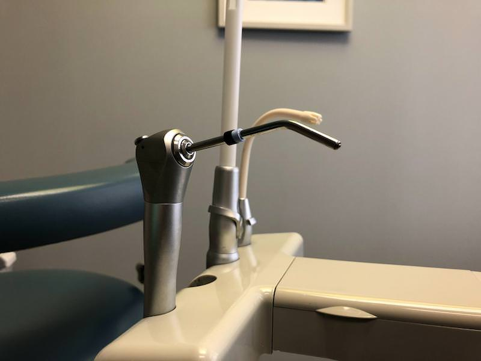

	

**Desni** ili **gingiva** su deo sluzokože koje prekrivaju jedan deo usne duplje. Desni obavijaju zubni vrat sve do udubljenja u gornjoj i donjoj vilici u kojima su smešteni zubi. Obično su svetlo roze boje.

**Roze boja je boja zdravih desni.**

Nedovoljna oralna higijena je jedan od uzroka koji može uticati na pojavu promena na desnima. **Promena boje** desni ili **krvarenje** tokom pranja zuba mogu biti neki od pokazatelja da potencijalno bolujete od **upale desni** ili **gingivitisa**.

Upala desni predstavlja **blago oboljenje** desni i mnogi ga zanemaruju jer i ne znaju da su oboleli. Međutim, jako je važno da se već sa prvim simptomima posvetimo lečenju ovog oboljenja.

Ukoliko se ovo oboljenje zanemaruje i ne leči na vreme može izazvati druge, veće probleme. Prema [Američkom stomatološkom udruženju](https://www.healthline.com/health/gingivitis#types-of-infections), upala desni često može biti uzrok gubitka zuba. Prema jednom istraživanju, Amerikanci su tokom 2017. godine potrošili 129 milijardi dolara na stomatološke usluge.

Fotografija: unsplash.com

## Uzroci nastanka upale desni

Upala desni je najčešće uzrokovana **bakterijskom infekcijom** odnosno formiranjem **zubnog plaka**.

**Zubni plak** je sačinjen od velikog broja bakterija i mikroorganizama. To je nevidljiv i tanak sloj koji se formira na Vašim zubima iznova i iznova.

Usled nesprovođenja oralne higijene, plak se stvrdnjava i postaje **kamenac**. Na stvaranje kamenca utiče i sastav pljuvačke, promena pH vrednosti pljuvačke, kao i stanja zuba kod kojih je otežano samočišćenje. Kamenac se zadržava u donjem delu zuba ili između zuba. Kada kamenac dospe ispod linije desni, javlja se **upala desni** odnosno **gingivitis**.

Faktori rizika za pojavu upale desni mogu biti:

- Pad imuniteta
- Nedostatak vitamina C
- Loša ishrana 
- Pušenje
- Dijabetes
- Krivi zubi
- Trudnoća
- Slomljena plomba
- Uzimanje određenih lekova
- Nasledni faktor

## Simptomi upale desni

Moguće je i da imate **upalu desni**, a da niste ni svesni jer nemate nikakve simptome.

Međutim, ukoliko primetite određene promene u Vašoj usnoj duplji, najbolje je konsultovati se stomatologom koji će dijagnostikovati zdravstveni problem. Sledeći simptomi mogu ukazati da imate problem sa upaljenim desnima:

- Desni crvene boje
- Otečene desni
- Krvarenje desni kod pranja zuba 
- Desni koje su odvojene od zuba
- Gnoj između desni i zuba
- Osetljivi zubi 
- Neprijatan zadah
- Labavi zubi
- Bol pri žvakanju

## Lečenje upale desni

Kao i za svaku bolest, tako je i za ovu najbolje delovati **preventivno** redovnom i pravilnom oralnom higijenom. Ako ipak dođe do **upale desni**, treba istaći da je lečenje upale desni proces koji zahteva posvećenost i strpljenje. 

Lečenje se sprovodi:

- Dubinskim čišćenjem zuba odlaskom kod stomatologa
- Antibioticima

**Dubinsko čišćenje zuba**

Za dubinsko čišćenje zuba neophodno je intervencija stomatologa. Podrazumeva skidanje natalaženog **kamenca** i **zubnog plaka**, uzrok nastanka upale desni. Postoji nekoliko načina uklanjanja kamenca, a najbolji način je uklanjanje kamenca **laserom**. Kada se kamenac ukalanja laserom ne postoji mogućnost da se oštete desni i zubna gleđ.

**Antibiotik za upalu desni**

Antibiotik za upalu desni se preporučuje samo u situacijama kada postoji opasnost od širenja bakterijske infekcije. Antibiotik prepisuje isključivo stomatolog, koji je napravio detaljan plan terapije, određuje koji antibiotik uzimati, koliko dugo i u kojoj količini.

## Kako ublažiti simptome upale desni?

**Gel za upalu desni** je preparat uz pomoć kog možete pomoći sebi i ublažiti simptome upale desni. Glavni sastojak gelova za upalu desni je **hijaluronska kiselina** koja je pogodna za trenutnu pomoć kod ublažavanja simptoma upale desni. Pored ovog, ovaj preparat može pomoći i kod pojave **afti** i **ranica** u usnoj duplji. 

Gel nema neželjene efekte, i postoji veliki izbor istog.

**Prirodom protiv upale desni**

[Biljni čajevi](https://www.probotanic.com/informacije/izborite-se-sa-upalom-desni-na-prirodan-nacin/) su svakako dobar izbor za ublažavanje simptoma upale desni. Jedan od čajeva koji pomaže u borbi protiv upale desni je **čaj od žalfije**, koji je prirodni antiseptik i sadrži sastojke koji su dobri protiv bakterija koje izazivaju upalu desni.

**Priprema:**

2 kašike žalfije preliti sa 200 ml ključale vode, poklopiti, i ostaviti da se ohladi. Ovim čajem nekoliko puta dnevno ispirati usnu duplju i grlo. 

Pored čaja od žalfije za ublažavanje simptoma upale desni preporučuje se i upotreba čaja od **bosiljka** i od **kamilice**.

## Prirodna pasta za zube

Veoma cenjena **pasta za upalu desni** na našem tržištu je pasta [FOREVER BRIGHT® TOOTHGEL](https://flpshop.rs/licna-higijena/11668/forever-bright-toothgel/360000954255/personal.html), proizvod kompanije Forever. Prednost ove paste je što sadrži samo **prirodne sastojke** koji deluju umirujuće na vaše desni i sluzokožu usta, što izbeljuje zube bez oštećivanja zubne gleđi i **ne sadrži fluor**. Prirodna aroma peperminta i spearminta osvežiće Vaš dah i daće Vam osećaj čistoće usne duplje. Pogodna je za celu porodicu.

**Zdravim navikama do zdravih desni**

Kao i kod svakog oboljenja tako je i kod upale desni uvek bolje delovati preventivno nego kasnije sprovoditi lečenje. Redovnom i pravilnom oralnom higijenom smanjićete mogućnost pojave upale desni. Za pravilnu oralnu higijenu jako je bitan izbor kako četkice tako i paste za zube. 

Preporuka je i izbegavanje slatkiša i obojenih sokova, a češća konzumacija zdravih namirnica bogatih vitaminima i mineralima. Najbolji način za održavanje usne duplje zdravom je odlazak kod stomatologa jednom u 6 meseci.

  

