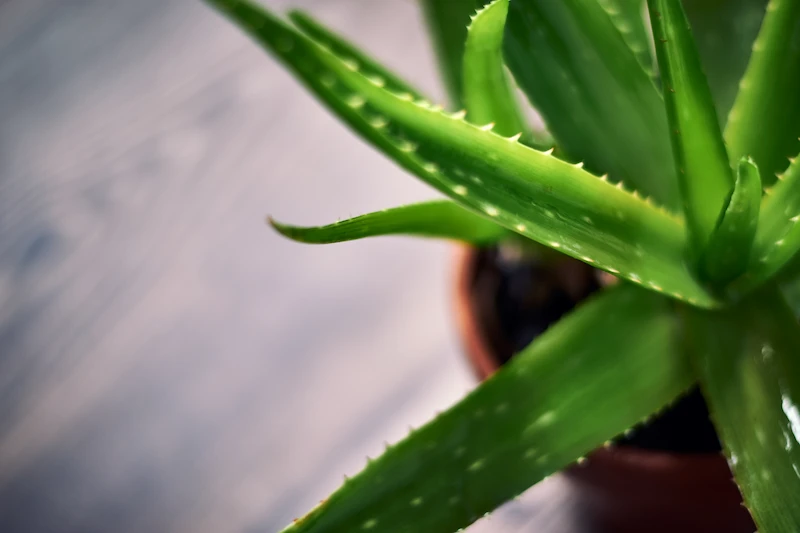

Svakodnevno sedenje po više sati dovodi Vas u situaciju da se neredovno hranite ili se često prejedate. Neadekvatna ishrana bez vitamina i minerala vremenom oštećuje kožu i kosu. Instant rešenja su svuda oko nas - kupićete neki hemijski preparat...

Vremenom počinjete osećati malaksalost, umor, žgaravicu ili nadutost. I to ste rešili privremeno lekovima, antacidima. Šta posle, ako lekovi više ne pomažu? U našoj okolini postoje veoma moćne biljke, poput aloje koje mogu pomoći kod svakodnevnih problema sa varenjem, UV zračenjem, hidratacijom kože, pa čak i uslučaju najtežih bolesti.

Aloja vera biljka se koristi vekovima
-------------------------------------

**Aloja vera biljka** se spominje još u Starom zavetu 6000. god. p. n. e. Prvi put se spominje u Egiptu u gradu Nipur gde su pronađeni opisi lekovitih svojstava aloje. Doneta je u Aziju oko 400.god. p. n. e., a u Evropu između 10. i 13. veka. Aloja se prvi put primenjuje u Engleskoj kao sredstvo za lečenje spoljnih rana i bolesti. U Americi se koristi za zaštitu kože od 1820 godine, a prve plantaže su nastale 1912. godine na Floridi.

Mnogi naučnici, filozofi, lekari i istoričari su pisali o čudotvornim dejstvima ove biljke. Hipokrat je pisao o aloji kao leku koji leči tumore, dizenteriju i stomačne tegobe. Kleopatra je smatrala da je aloja vera biljka ta koja je činila lepšom, posebno je isticala **aloja vera gel**, a faraoni su verovali da aloja doprinosi dugom životu.
Iz Novog Zaveta imamo podatak da je melasa iz aloje i mirte prelivena na telo Isusa Hrista. Maje su se mazale po licu kako bi bile lepše, a Kristofer Kolumbo nikada nije krenuo na put bez ove čudotvorne biljke. Indijanci su je koristili čak protiv ujeda zmije.

## Aloja u raznim oblicima

**Aloja vera biljka** se koristi u sledećim oblicima:

1. Kao lekovito bilje i to:

- Aloja vera sok
- Aloja vera gel
- Aloja vera sprej
- Aloja vera krema

2. Kao sobno bilje ima sledeće uloge:

- Da prečišćava vazduh - neutrališe negativna zračenja kućnih aparata i raznih štetnih materija iz vazduha
- Da održava stalnu svežinu vazduha - otporna je na duvanski dim
- I kao ukrasno bilje ima dekorativnu funkciju.

- **Aloja vera sok** - sadrži preko 240 hranljivih sastojaka i bogat je izvor vitamina (A, B1, B2, B3, B5, B6, B12, C), minerala (kalcijum, natrijum, bakar, cink, hrom, mangan, kalijum, magnezijum, gvožđe), antioksidanasa, aminokiselina (od toga 8 esencijalnih), antikinona, enzima, saponina i lignina.

Sok od aloje vera pomaže kod:

1.  Probavnih smetnji, posebno konstipacije
2.  Lečenja čira na želucu
3.  Regulacije nivoa želudačne kiseline
4.  Regulacije nivoa šećera u krvi
5.  Održavanja hidriranosti organizma
6.  Poboljšanja rada jetre
7.  Upale u organizmu
8.  Snižavanja nivoa lošeg holesterola
9.  Ublažavanja simptoma astme i alergije
10. Poboljšanja imuniteta.

- **Aloja vera gel** se nalazi u unutrašnjosti lista aloje. Zbog svoje gustine veoma je povoljan za spravljanje maski za lice, tinktura za opekotine, losiona za kosu, krema za sunčanje, krema za zarastanje rana i raznih kožnih bolesti.

- **Aloja sprej za grlo i nos** je veoma atraktivan proizvod u vremenu gripa, epidemija i pandemija, te je veoma efikasno sredstvo za suzbijanje bakterija i gljivica. Zbog svog antiseptičkog dejstva veoma je efikasan za smirivanje upala (grla, nosa, ždrela, usne šupljine ili desni).

- **Aloja vera za lice** - kreme su veoma efikasne u hidriranju ispucale i dehidrirane kože. Pomažu održavanju mekoće i elastičnosti. Deluje antibakterijski i protivupalno.

## Aloja vera u kozmetici - gel i krema za sunčanje

**Aloja vera biljka** u kozmetici ima široku primenu zbog sadržaja lekovitih i hranljivih sastojaka aloje (minerala, vitamina, enzima, aminokiselina, saponina, lignina i polifenola). Aloja spada u grupu kaktusa koja sadži u velikoj meri vodu (oko 99%) te samim tim je izvrsna za **održavanje hidratacije**. To čini kožu zategnutijom i svežom. Naziva se još i “eliksirom mladosti”. Zbog antioksidativnog svojstva, krema na bazi aloje je veoma efikasno sredstvo **protiv starenja kože**. Zbog visokog sadžaja polisaharida **idealna je za masnu kožu** jer je koža brzo upija. Protivupalno dejstvo aloje svrstava ove kreme u najefikasnije u borbi protiv akni. Idealna krema za rešavanje problema hidratacije, iritacije, zarastanje rana, ekcema, psorijaze ili uboda je aloja [vera gel](https://flpshop.rs/nega-koze/11694/aloe-vera-gelly/360000954255/personal.html).

Upotrebljva se čak i kod tretmana kose, kod bojenja i trajne ondulacije. Koža ga u potpunosti upija te ne ostavlja tragove na odeći. Veoma je praktičnog pakovanja te je pogodan u priboru za prvu pomoć.

Zbog sve većeg štetnog uticaja sunčevog zračenja koža je izložena ubrzanom starenju, te postaje suva, meka i opuštena. U slučaju opekotina javlja se crvenilo, a u težim slučajevima plikovi. Sve to isušuje kožu i stvara površinske rane u slučaju pucanja plikova, te koža deluje neugledno i zapušteno. [Losion za sunčanje](https://flpshop.rs/nega-koze/12541/aloe-sunscreen/360000954255/personal.html) na bazi aloje je izvrstan za rešavanje svih ovih problema.

Krema za sunčanje je idealna u borbi protiv visokog UV zračenja i štetnog uticaja vetra. Losion je na bazi gela od aloje koji je lako razmaziv i omogućava održavanje prirodne hidratacije kože. Krema za sunčanje sadrži zaštitni faktor 30, te je pogodna za celu porodicu, kako za odrasle tako i za decu. Ovaj losion je vodootporan i pogodan za dugotrajno očuvanje boje kože.

## Uloga aloje kod rešavanja želudačnih smetnji - žgaravica i probavne smetnje

Poznato je da aloja ima izvrsno dejstvo kad rešavanja želudačnih smetnji. Aloja sadži glikoproteine zvane aktin i sterol koji smanjuju upale i rane na sluznici želuca. S obzirom da sadrži enzime koji su neophodni za varenje veoma je efikasna za sprečavanje zatvora i detoksikaciju organizma. Aloja je poznata kao biljka koja ima protivbakterijsko dejstvo te je pogodna za suzbijanje helikobakterije, uzročnika gastritisa. Poznato je da je aloja alkalna po svom sastavu te je izvrsna u održavanju PH vrednosti želudačne kiseline. Reguliše kako višak, tako i manjak želudačne kiseline. Proizvod koji može zadovoljiti sve vaše potrebe po pitanju želudačnih smetnji je [aloe vera gel](https://flpshop.rs/napici/11837/forever-aloe-vera-gel/360000954255/personal.html).
Aloja vera gel sadrži 99,7% čistog gela iz lista aloje te omogućava sistemu za varenje da apsorbuje sve hranljive sastojke iz hrane. Ujedno podstiče i stvaranje dobrih bakterija. Polisaharid acemanan podiže imunitet organizma. Ne sadrži konzervanse i pakovan je u ambalaži od materijala koji je 100% recikliran. Pije se 120 ml dnevno ukupno, podeljeno u 2 ili 3 doze. Nakon otvaranja čuva se u frižideru do 30 dana na temperaturi ne nižoj od 7°C.

## Antioksidativna svojstva aloje koja mogu pomoći kod raka

Brojni hemijski i biološki agensi koji imaju dokazana kancerogena svojstva (kafa, nikotin, slobodni radikali, pesticidi, konzervansi) doprinose transformaciji zdrave ćelije u malignu. Da li će doći do te transformacije najviše zavisi od imuno sistema organizma. Postoje jasni naučni dokazi istočne medicine koja potvrđuje pozitivno dejstvo aloje na sprečavanje razvoja tumora, kao i jačanju imuno sistema i zdravih ćelija u organizmu. Analizom je ustanovljeno da aloja sadrži veliki broj ugljenihhidrata (polisaharida i oligosaharida) sa imunomodulatornim svojstvom. To znači da aloja direktno doprinosi stvaranju T ćelija koje su osnova imuno sistema čoveka.
U slučaju hemoterapije, **aloja vera biljka** pomaže tako što sprečava oštećenja zdravih ćelija, naročito ćelija imunskog sistema. Dokazano je da aloja sadrži najmanje tri antitumorska sastojka emodin, lecitin i manozu. U slučaju lečenje kancera aloja vera biljka ima sledeća dejstva:

1. Antioksidaciono
2. Detoksiokaciono
3. Imunostimulatorno
4. Antivirusno
5. UV zaštitno

## Sadržaj aloja vera soka

**Aloja vera sok sadrži:**

1. Obilje vitamina - A, B1, B2, B3, B5, B6, B9, B12, C, E. Vitamini imaju veoma bitnu ulogu kod jačanja imuno sistema čoveka. Posebno se ističu vitamini A, C i E jer su značajni u borbi protiv starenja kože;
2. Enzime - aloja sadrži čak 16 enzima koji su veoma važni za varenje, protiv upale kože i upalnih procesa oboljenja;
3. Minerale - kalcijum, bakar, selen, magnezijum, gvožđe i hrom koji su veoma važni protiv perutanja kože, za jačanje kostiju, protiv mišićnih grčeva, anemije i poboljšanja imuno sistema;
4. Aminokiseline - aloja vera sok sadrži 8 amino kiselina koje organizam mora unositi jer ih ne stvara sam;
5. Šećere (monosaharde i polisaharide) i biljne hormone - koji su važni i efikasni u borbi protiv akni, ožiljaka i bora.

Ukoliko postoje bilo kakve smetnje sa probavnim traktom (zatvor, gorušica, helikobakterija), sa suvom kožom ili ste osoba čija koža lako izgori na suncu, [aloja vera sok](https://flpshop.rs/napici/11837/forever-aloe-vera-gel/360000954255/personal.html) može pomoći u rešavanju navedenih problema. Veoma je važno konsultovati se sa svojim lekarom koji će odrediti adekvatnu terapiju, a [aloja vera gel](https://flpshop.rs/nega-koze/11694/aloe-vera-gelly/360000954255/personal.html) ili [aloja vera losion](https://flpshop.rs/nega-koze/12541/aloe-sunscreen/360000954255/personal.html) mogu samo ubrzati rešavanje zdravstvenih problema. **Aloja vera biljka** se naziva magičnom biljkom upravo zbog mogućnosti izlečenja i najtežih bolesti poput kancera zbog sadžaja preko 240 hranljivih sastojaka.
